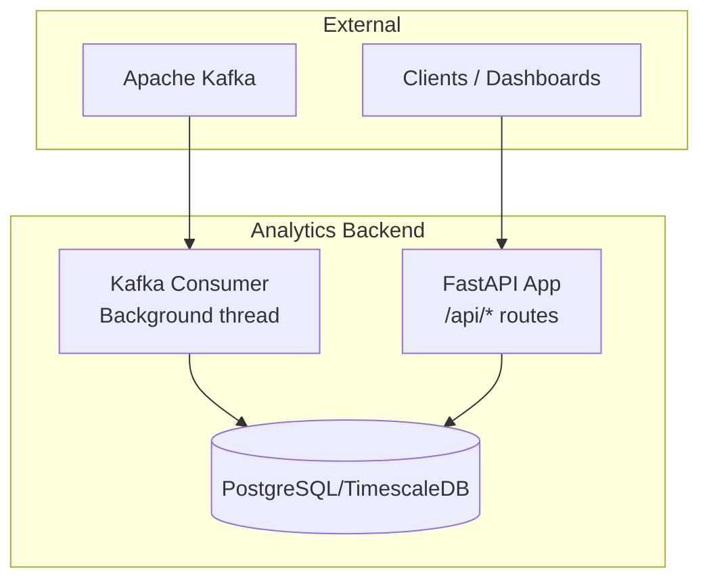
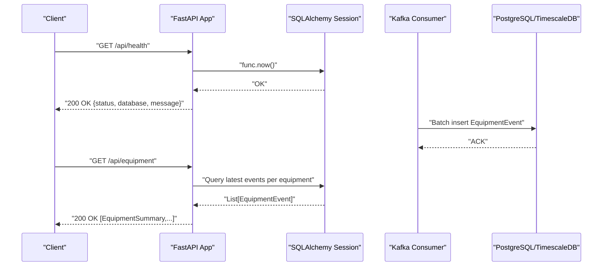
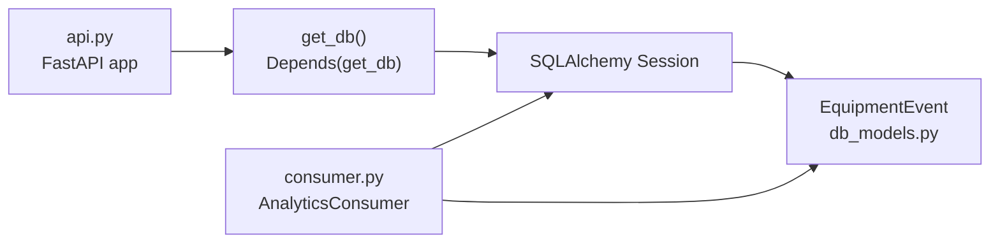

# API Design and Endpoints

<cite>
**Referenced Files in This Document**
- [api.py](file://services/analytics_backend/src/api.py)
- [main.py](file://services/analytics_backend/src/main.py)
- [db_models.py](file://services/analytics_backend/src/db_models.py)
- [consumer.py](file://services/analytics_backend/src/consumer.py)
- [settings.yaml](file://config/settings.yaml)
- [Dockerfile](file://services/analytics_backend/Dockerfile)
- [requirements.txt](file://services/analytics_backend/requirements.txt)
- [README.md](file://README.md)
</cite>

## Table of Contents
1. [Introduction](#introduction)
2. [Project Structure](#project-structure)
3. [Core Components](#core-components)
4. [Architecture Overview](#architecture-overview)
5. [Detailed Component Analysis](#detailed-component-analysis)
6. [Dependency Analysis](#dependency-analysis)
7. [Performance Considerations](#performance-considerations)
8. [Troubleshooting Guide](#troubleshooting-guide)
9. [Conclusion](#conclusion)
10. [Appendices](#appendices)

## Introduction
This document provides comprehensive API documentation for the Analytics Backend REST API. It covers all HTTP endpoints, request/response schemas, status codes, authentication, rate limiting, CORS configuration, content negotiation, and API versioning strategy. It also includes practical curl examples and SDK integration guidelines.

## Project Structure
The Analytics Backend is implemented as a FastAPI application with a Kafka consumer and PostgreSQL/TimescaleDB persistence. The API exposes endpoints for health checks, equipment status, utilization statistics, and latest processed frame data.

**Diagram sources**
- [api.py:24-28](file://services/analytics_backend/src/api.py#L24-L28)
- [main.py:104-122](file://services/analytics_backend/src/main.py#L104-L122)
- [consumer.py:23-78](file://services/analytics_backend/src/consumer.py#L23-L78)
- [db_models.py:70-100](file://services/analytics_backend/src/db_models.py#L70-L100)

**Section sources**
- [README.md:340-384](file://README.md#L340-L384)
- [api.py:24-28](file://services/analytics_backend/src/api.py#L24-L28)
- [main.py:64-149](file://services/analytics_backend/src/main.py#L64-L149)

## Core Components
- FastAPI application with CORS enabled and dependency injection for database sessions.
- SQLAlchemy models for equipment events with TimescaleDB support.
- Kafka consumer that persists events to the database.
- Health check endpoint verifying database connectivity.

Key implementation references:
- Application creation and CORS middleware: [api.py:24-37](file://services/analytics_backend/src/api.py#L24-L37)
- Dependency injection for sessions: [api.py:56-71](file://services/analytics_backend/src/api.py#L56-L71)
- Database initialization and TimescaleDB setup: [db_models.py:70-156](file://services/analytics_backend/src/db_models.py#L70-L156)
- Kafka consumer initialization and background thread: [main.py:104-122](file://services/analytics_backend/src/main.py#L104-L122)

**Section sources**
- [api.py:24-71](file://services/analytics_backend/src/api.py#L24-L71)
- [db_models.py:70-156](file://services/analytics_backend/src/db_models.py#L70-L156)
- [main.py:104-122](file://services/analytics_backend/src/main.py#L104-L122)

## Architecture Overview
The API is served by FastAPI on port 8000. Requests are validated against Pydantic models and persisted via SQLAlchemy. The Kafka consumer continuously ingests events and writes them to the database.

**Diagram sources**
- [api.py:159-177](file://services/analytics_backend/src/api.py#L159-L177)
- [api.py:179-223](file://services/analytics_backend/src/api.py#L179-L223)
- [consumer.py:143-200](file://services/analytics_backend/src/consumer.py#L143-L200)
- [db_models.py:22-67](file://services/analytics_backend/src/db_models.py#L22-L67)

## Detailed Component Analysis

### Endpoint: GET /api/health
- Method: GET
- URL: /api/health
- Authentication: Not required
- Rate limiting: Not enforced
- Request parameters: None
- Response schema:
  - status: string
  - database: string
  - message: string
- Status codes:
  - 200 OK: Service and database are healthy
  - 503 Service Unavailable: Database connection failed
- Validation: Pydantic model HealthResponse
- Notes: Tests database connectivity using a simple query.

Curl example:
- curl -s http://localhost:8000/api/health

SDK integration:
- Use any HTTP client to send GET requests to /api/health.
- Handle 200 OK for success, 503 for unhealthy state.

**Section sources**
- [api.py:159-177](file://services/analytics_backend/src/api.py#L159-L177)
- [api.py:130-135](file://services/analytics_backend/src/api.py#L130-L135)

### Endpoint: GET /api/equipment
- Method: GET
- URL: /api/equipment
- Authentication: Not required
- Rate limiting: Not enforced
- Request parameters: None
- Response schema:
  - Array of EquipmentSummary items:
    - equipment_id: string
    - equipment_class: string
    - current_state: string
    - current_activity: string
    - utilization_percent: number
    - last_seen: string (optional)
- Status codes:
  - 200 OK: Successful retrieval
  - 500 Internal Server Error: Database query failure
- Validation: Pydantic model EquipmentSummary
- Processing logic:
  - Retrieves the latest EquipmentEvent for each equipment_id using a subquery.
  - Converts to EquipmentSummary instances.

Curl example:
- curl -s http://localhost:8000/api/equipment

SDK integration:
- Use any HTTP client to send GET requests to /api/equipment.
- Expect an array of EquipmentSummary objects.

**Section sources**
- [api.py:179-223](file://services/analytics_backend/src/api.py#L179-L223)
- [api.py:77-88](file://services/analytics_backend/src/api.py#L77-L88)

### Endpoint: GET /api/equipment/{equipment_id}/history
- Method: GET
- URL: /api/equipment/{equipment_id}/history
- Path parameters:
  - equipment_id: string (required)
- Query parameters:
  - limit: integer, default 100, min 1, max 1000
- Response schema:
  - Array of EquipmentEventResponse items:
    - id: integer
    - frame_id: integer
    - equipment_id: string
    - equipment_class: string
    - timestamp: string
    - current_state: string
    - current_activity: string
    - motion_source: string
    - total_tracked_seconds: number
    - total_active_seconds: number
    - total_idle_seconds: number
    - utilization_percent: number
    - created_at: string (optional)
- Status codes:
  - 200 OK: Successful retrieval
  - 404 Not Found: No events found for equipment_id
  - 500 Internal Server Error: Database query failure
- Validation: Pydantic model EquipmentEventResponse
- Processing logic:
  - Filters EquipmentEvent by equipment_id.
  - Orders by created_at descending.
  - Limits results by limit parameter.

Curl example:
- curl -s "http://localhost:8000/api/equipment/DT-001/history?limit=100"

SDK integration:
- Use any HTTP client to send GET requests to /api/equipment/{id}/history.
- Handle 404 when no history exists.

**Section sources**
- [api.py:225-284](file://services/analytics_backend/src/api.py#L225-L284)
- [api.py:90-107](file://services/analytics_backend/src/api.py#L90-L107)

### Endpoint: GET /api/utilization/summary
- Method: GET
- URL: /api/utilization/summary
- Authentication: Not required
- Rate limiting: Not enforced
- Request parameters: None
- Response schema:
  - total_equipment: integer
  - active_count: integer
  - inactive_count: integer
  - avg_utilization: number
  - equipment: Array of EquipmentUtilizationSummary:
    - equipment_id: string
    - equipment_class: string
    - total_tracked_seconds: number
    - total_active_seconds: number
    - total_idle_seconds: number
    - utilization_percent: number
    - event_count: integer
- Status codes:
  - 200 OK: Successful retrieval
  - 500 Internal Server Error: Database query failure
- Validation: Pydantic model UtilizationSummaryResponse
- Processing logic:
  - Determines latest event per equipment via subquery.
  - Computes active/inactive counts and average utilization.
  - Counts total events per equipment.

Curl example:
- curl -s http://localhost:8000/api/utilization/summary

SDK integration:
- Use any HTTP client to send GET requests to /api/utilization/summary.
- Expect aggregated utilization metrics.

**Section sources**
- [api.py:286-368](file://services/analytics_backend/src/api.py#L286-L368)
- [api.py:110-128](file://services/analytics_backend/src/api.py#L110-L128)

### Endpoint: GET /api/latest-frame
- Method: GET
- URL: /api/latest-frame
- Authentication: Not required
- Rate limiting: Not enforced
- Request parameters: None
- Response schema:
  - frame_id: integer
  - equipment: Array of LatestFrameEquipment:
    - equipment_id: string
    - equipment_class: string
    - current_state: string
    - current_activity: string
    - motion_source: string
    - utilization_percent: number
    - timestamp: string
    - frame_id: integer
- Status codes:
  - 200 OK: Successful retrieval
  - 500 Internal Server Error: Database query failure
- Validation: Pydantic model LatestFrameResponse
- Processing logic:
  - Finds the maximum frame_id.
  - Returns all EquipmentEvent entries for that frame_id.

Curl example:
- curl -s http://localhost:8000/api/latest-frame

SDK integration:
- Use any HTTP client to send GET requests to /api/latest-frame.
- Use frame_id to synchronize dashboards.

**Section sources**
- [api.py:370-416](file://services/analytics_backend/src/api.py#L370-L416)
- [api.py:137-153](file://services/analytics_backend/src/api.py#L137-L153)

### Additional Endpoint: GET /api/stats
- Method: GET
- URL: /api/stats
- Authentication: Not required
- Rate limiting: Not enforced
- Request parameters: None
- Response schema:
  - total_events: integer
  - unique_equipment: integer
  - frame_range: object with min/max integers
- Status codes:
  - 200 OK: Successful retrieval
  - 500 Internal Server Error: Database query failure
- Processing logic:
  - Counts total events, distinct equipment, and min/max frame_id.

Curl example:
- curl -s http://localhost:8000/api/stats

**Section sources**
- [api.py:419-444](file://services/analytics_backend/src/api.py#L419-L444)

## Dependency Analysis
- FastAPI app depends on SQLAlchemy sessions for database access.
- Sessions are created via dependency injection and bound to a shared engine.
- Kafka consumer initializes its own sessionmaker and writes batches to the database.
- CORS middleware is configured globally for cross-origin requests.

**Diagram sources**
- [api.py:56-71](file://services/analytics_backend/src/api.py#L56-L71)
- [db_models.py:158-168](file://services/analytics_backend/src/db_models.py#L158-L168)
- [consumer.py:62-68](file://services/analytics_backend/src/consumer.py#L62-L68)

**Section sources**
- [api.py:56-71](file://services/analytics_backend/src/api.py#L56-L71)
- [db_models.py:158-168](file://services/analytics_backend/src/db_models.py#L158-L168)
- [consumer.py:62-68](file://services/analytics_backend/src/consumer.py#L62-L68)

## Performance Considerations
- Database pooling: Engine configured with pool_size and max_overflow for concurrency.
- TimescaleDB: Hypertable creation on equipment_events for time-series optimization.
- Kafka batching: Consumer batches writes and commits offsets after successful DB writes.
- Query optimization: Subqueries used to fetch latest records efficiently.

Recommendations:
- Tune pool_size and max_overflow based on workload.
- Monitor TimescaleDB hypertable performance for large datasets.
- Adjust Kafka consumer batch size and timeout for throughput.

**Section sources**
- [db_models.py:85-91](file://services/analytics_backend/src/db_models.py#L85-L91)
- [db_models.py:103-156](file://services/analytics_backend/src/db_models.py#L103-L156)
- [consumer.py:31-33](file://services/analytics_backend/src/consumer.py#L31-L33)
- [consumer.py:195-204](file://services/analytics_backend/src/consumer.py#L195-L204)

## Troubleshooting Guide
Common issues and resolutions:
- Database connectivity errors:
  - Health endpoint returns 503 when database is unreachable.
  - Verify database URI and credentials in configuration.
- Missing equipment history:
  - 404 Not Found indicates no events for the given equipment_id.
  - Confirm equipment_id spelling and that events were produced.
- Internal server errors:
  - 500 errors indicate query failures; check logs for stack traces.
- CORS issues:
  - CORS is enabled for all origins; verify client origin is allowed.

Operational controls:
- Graceful shutdown via SIGTERM/SIGINT handled in main entrypoint.
- Consumer stops gracefully and flushes remaining batch.

**Section sources**
- [api.py:166-176](file://services/analytics_backend/src/api.py#L166-L176)
- [api.py:254-258](file://services/analytics_backend/src/api.py#L254-L258)
- [main.py:110-118](file://services/analytics_backend/src/main.py#L110-L118)
- [consumer.py:230-239](file://services/analytics_backend/src/consumer.py#L230-L239)

## Conclusion
The Analytics Backend provides a robust REST API for equipment monitoring with health checks, equipment status, historical queries, utilization summaries, and latest frame data. It is built with FastAPI, SQLAlchemy, and Kafka, enabling scalable real-time analytics.

## Appendices

### Authentication and Authorization
- No authentication or authorization is enforced by the API.
- Deploy behind a reverse proxy or gateway for access control if needed.

### Rate Limiting
- No built-in rate limiting is implemented.
- Consider adding middleware or external rate limiting in production deployments.

### CORS Configuration
- Enabled for all origins, methods, and headers.
- Suitable for local development and internal dashboards.

**Section sources**
- [api.py:30-37](file://services/analytics_backend/src/api.py#L30-L37)

### Content Negotiation
- Responses are JSON by default.
- FastAPI automatically sets Content-Type to application/json.

### API Versioning Strategy
- API version is included in the application metadata.
- No path-based versioning is used; version can be referenced from app metadata.

**Section sources**
- [api.py:24-28](file://services/analytics_backend/src/api.py#L24-L28)

### Configuration Reference
- Database URI and credentials are loaded from configuration.
- Kafka bootstrap servers and topic are configurable.

**Section sources**
- [main.py:75-84](file://services/analytics_backend/src/main.py#L75-L84)
- [settings.yaml:41-53](file://config/settings.yaml#L41-L53)

### Containerization and Deployment
- Exposed port: 8000
- Requirements include FastAPI, Uvicorn, SQLAlchemy, and Pydantic.

**Section sources**
- [Dockerfile:19-22](file://services/analytics_backend/Dockerfile#L19-L22)
- [requirements.txt:1-8](file://services/analytics_backend/requirements.txt#L1-L8)