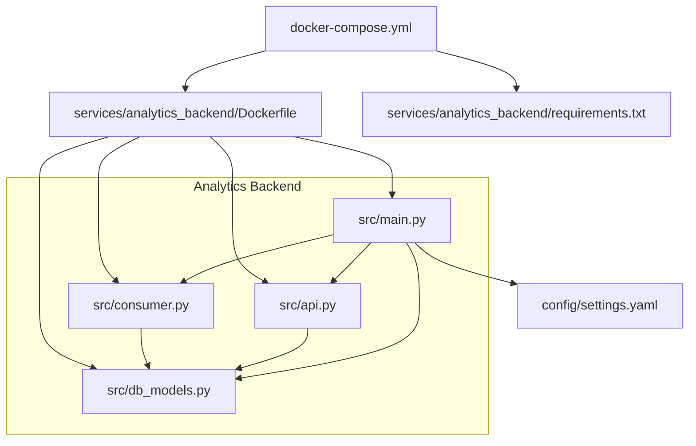
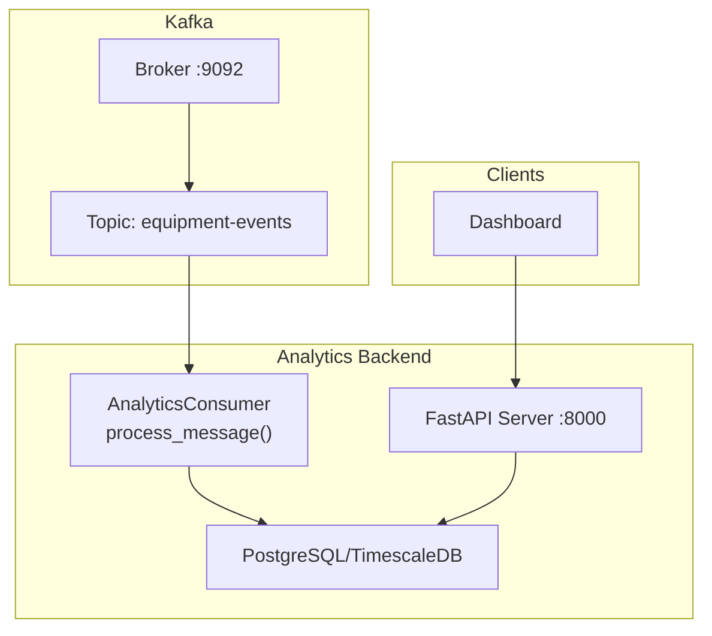
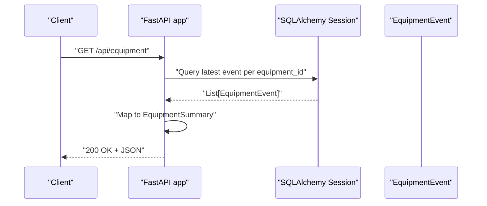
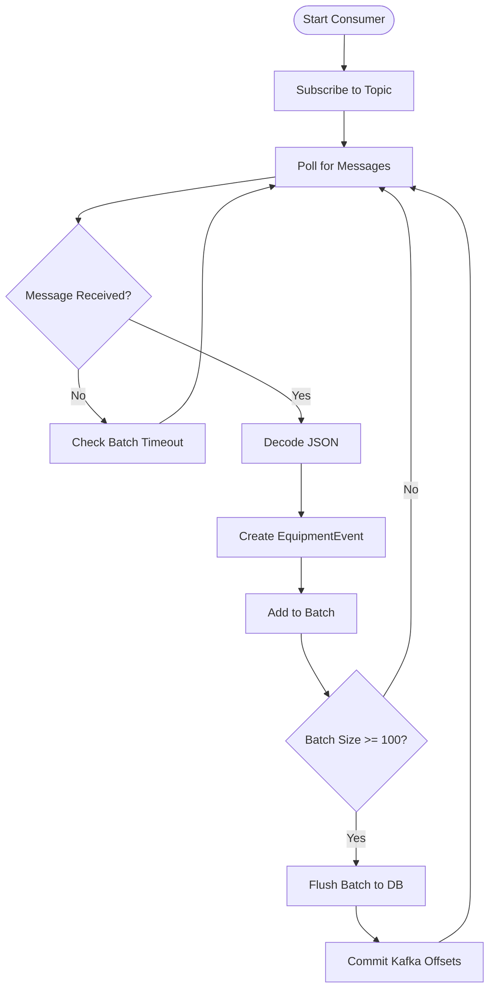
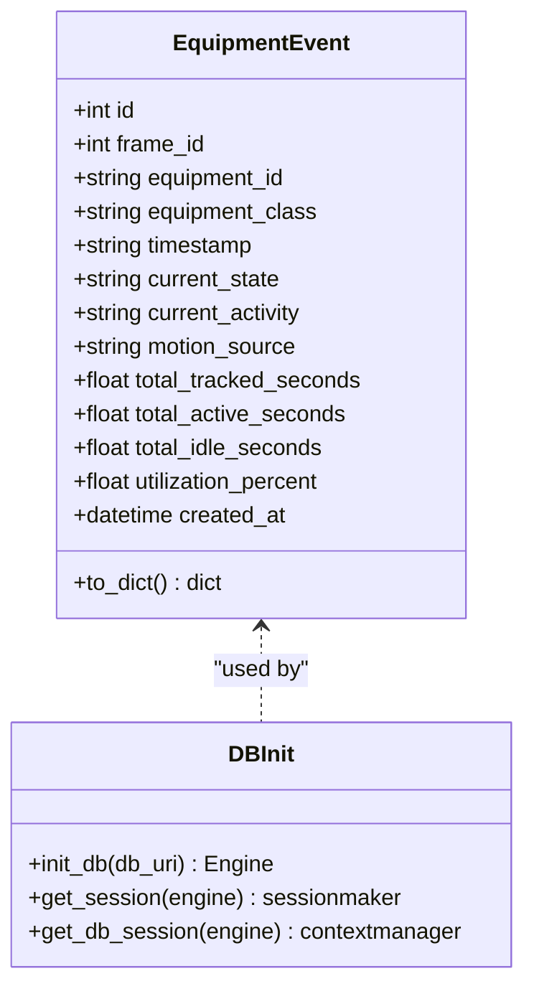
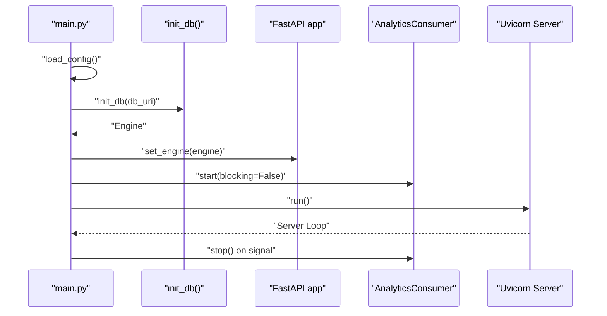
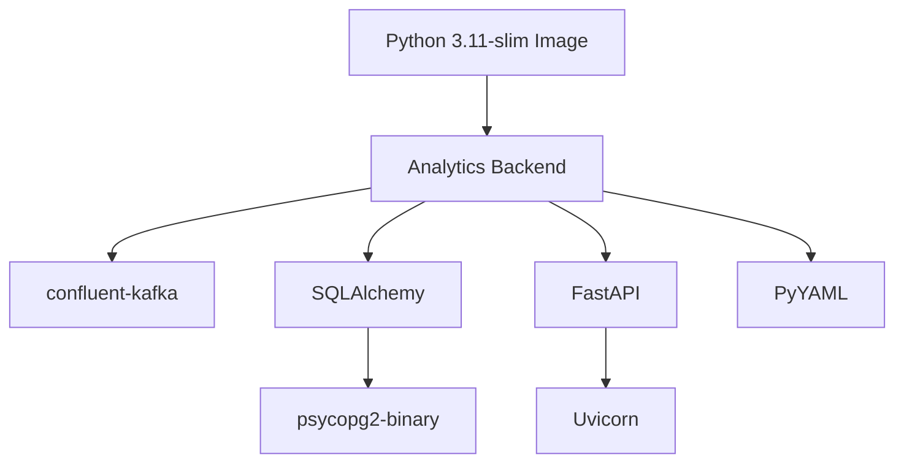

# Analytics Backend

<cite>
**Referenced Files in This Document**
- [main.py](file://services/analytics_backend/src/main.py)
- [api.py](file://services/analytics_backend/src/api.py)
- [consumer.py](file://services/analytics_backend/src/consumer.py)
- [db_models.py](file://services/analytics_backend/src/db_models.py)
- [settings.yaml](file://config/settings.yaml)
- [Dockerfile](file://services/analytics_backend/Dockerfile)
- [requirements.txt](file://services/analytics_backend/requirements.txt)
- [docker-compose.yml](file://docker-compose.yml)
- [README.md](file://README.md)
</cite>

## Table of Contents
1. [Introduction](#introduction)
2. [Project Structure](#project-structure)
3. [Core Components](#core-components)
4. [Architecture Overview](#architecture-overview)
5. [Detailed Component Analysis](#detailed-component-analysis)
6. [Dependency Analysis](#dependency-analysis)
7. [Performance Considerations](#performance-considerations)
8. [Troubleshooting Guide](#troubleshooting-guide)
9. [Conclusion](#conclusion)
10. [Appendices](#appendices)

## Introduction
The Analytics Backend microservice is the REST API gateway and data processing hub for the equipment monitoring pipeline. It consumes Kafka events produced by the Computer Vision service, persists them to PostgreSQL (with optional TimescaleDB time-series optimization), and exposes a FastAPI REST API for clients to query equipment status, utilization summaries, and latest frame data. It coordinates a background Kafka consumer alongside the FastAPI server, ensuring graceful shutdown and robust error handling.

## Project Structure
The Analytics Backend is organized into a small, focused set of modules under services/analytics_backend/src, with configuration managed centrally in config/settings.yaml. Docker and docker-compose define containerization and orchestration.

**Diagram sources**
- [main.py:1-149](file://services/analytics_backend/src/main.py#L1-L149)
- [api.py:1-444](file://services/analytics_backend/src/api.py#L1-L444)
- [consumer.py:1-268](file://services/analytics_backend/src/consumer.py#L1-L268)
- [db_models.py:1-191](file://services/analytics_backend/src/db_models.py#L1-L191)
- [settings.yaml:1-59](file://config/settings.yaml#L1-L59)
- [Dockerfile:1-23](file://services/analytics_backend/Dockerfile#L1-L23)
- [docker-compose.yml:1-95](file://docker-compose.yml#L1-L95)

**Section sources**
- [main.py:1-149](file://services/analytics_backend/src/main.py#L1-L149)
- [api.py:1-444](file://services/analytics_backend/src/api.py#L1-L444)
- [consumer.py:1-268](file://services/analytics_backend/src/consumer.py#L1-L268)
- [db_models.py:1-191](file://services/analytics_backend/src/db_models.py#L1-L191)
- [settings.yaml:1-59](file://config/settings.yaml#L1-L59)
- [Dockerfile:1-23](file://services/analytics_backend/Dockerfile#L1-L23)
- [docker-compose.yml:1-95](file://docker-compose.yml#L1-L95)

## Core Components
- FastAPI application with CORS enabled and dependency injection for database sessions.
- Kafka consumer that subscribes to the equipment-events topic, deserializes JSON messages, batches and persists EquipmentEvent records, and commits offsets after successful writes.
- SQLAlchemy models for EquipmentEvent with TimescaleDB setup attempts for time-series optimization.
- Entry point that initializes the database, starts the consumer in a background thread, and runs the FastAPI server with graceful shutdown handling.

Key responsibilities:
- REST API: health checks, equipment status queries, utilization summaries, latest frame retrieval, and statistics.
- Data ingestion: consume Kafka events, transform to ORM models, batch insert, and commit offsets.
- Persistence: PostgreSQL with optional TimescaleDB hypertable creation; connection pooling and session management.

**Section sources**
- [api.py:24-71](file://services/analytics_backend/src/api.py#L24-L71)
- [consumer.py:23-244](file://services/analytics_backend/src/consumer.py#L23-L244)
- [db_models.py:22-100](file://services/analytics_backend/src/db_models.py#L22-L100)
- [main.py:64-149](file://services/analytics_backend/src/main.py#L64-L149)

## Architecture Overview
The Analytics Backend integrates Kafka, PostgreSQL/TimescaleDB, and FastAPI into a cohesive pipeline. The CV service publishes equipment events to Kafka; the Analytics Backend consumer reads and persists them; the FastAPI server exposes endpoints for querying.

**Diagram sources**
- [consumer.py:93-142](file://services/analytics_backend/src/consumer.py#L93-L142)
- [db_models.py:70-100](file://services/analytics_backend/src/db_models.py#L70-L100)
- [api.py:159-416](file://services/analytics_backend/src/api.py#L159-L416)
- [docker-compose.yml:15-78](file://docker-compose.yml#L15-L78)

## Detailed Component Analysis

### FastAPI Application and Routes
The FastAPI app defines:
- CORS middleware for cross-origin requests.
- Dependency injection for database sessions via get_db().
- Endpoints:
  - GET /api/health: health check validating database connectivity.
  - GET /api/equipment: latest equipment state per equipment_id.
  - GET /api/equipment/{equipment_id}/history: time-series history with pagination.
  - GET /api/utilization/summary: aggregate utilization statistics.
  - GET /api/latest-frame: current frame’s equipment data.
  - GET /api/stats: general database statistics.

Response models encapsulate typed responses for each endpoint.

Processing logic highlights:
- Latest record per equipment achieved via a subquery selecting max id per equipment_id.
- History endpoint supports configurable limit with bounds checking.
- Utilization summary computes active/inactive counts and average utilization from latest events.
- Latest frame endpoint retrieves the maximum frame_id and all associated equipment records.

**Diagram sources**
- [api.py:179-223](file://services/analytics_backend/src/api.py#L179-L223)
- [db_models.py:22-67](file://services/analytics_backend/src/db_models.py#L22-L67)

**Section sources**
- [api.py:24-71](file://services/analytics_backend/src/api.py#L24-L71)
- [api.py:159-416](file://services/analytics_backend/src/api.py#L159-L416)

### Kafka Consumer Implementation
The AnalyticsConsumer:
- Initializes with Kafka configuration (bootstrap servers, topic, consumer group).
- Subscribes to the topic and polls messages with timeouts.
- Deserializes JSON payloads and extracts nested fields (utilization, time_analytics).
- Creates EquipmentEvent instances and accumulates them in a batch.
- Commits batches after reaching BATCH_SIZE or BATCH_TIMEOUT.
- Commits Kafka offsets after successful database writes.
- Supports graceful shutdown via stop() and signal handlers.

Error handling:
- JSON decoding errors, Kafka exceptions, and batch commit failures are logged and handled without crashing the consumer.
- End-of-partition and unknown topic conditions are treated with warnings and retries.

**Diagram sources**
- [consumer.py:93-142](file://services/analytics_backend/src/consumer.py#L93-L142)
- [consumer.py:143-200](file://services/analytics_backend/src/consumer.py#L143-L200)
- [consumer.py:206-228](file://services/analytics_backend/src/consumer.py#L206-L228)

**Section sources**
- [consumer.py:23-244](file://services/analytics_backend/src/consumer.py#L23-L244)

### Database Integration and Models
EquipmentEvent model:
- Table name: equipment_events.
- Columns include identifiers, timestamps, state/activity, motion source, time analytics, and created_at with indexes for equipment_id and created_at.
- Provides to_dict() conversion for serialization.

Initialization and TimescaleDB:
- init_db() creates an Engine with connection pooling (pool_size, max_overflow, pool_pre_ping).
- Creates all tables via Base.metadata.create_all().
- Attempts to enable TimescaleDB extension and convert equipment_events to a hypertable keyed by created_at.

Session management:
- get_session() returns a sessionmaker bound to the engine.
- get_db() yields a scoped session for dependency injection.
- get_db_session() provides a context manager for manual transactions with commit/rollback semantics.

**Diagram sources**
- [db_models.py:22-67](file://services/analytics_backend/src/db_models.py#L22-L67)
- [db_models.py:70-100](file://services/analytics_backend/src/db_models.py#L70-L100)
- [db_models.py:158-191](file://services/analytics_backend/src/db_models.py#L158-L191)

**Section sources**
- [db_models.py:22-67](file://services/analytics_backend/src/db_models.py#L22-L67)
- [db_models.py:70-100](file://services/analytics_backend/src/db_models.py#L70-L100)
- [db_models.py:158-191](file://services/analytics_backend/src/db_models.py#L158-L191)

### Entry Point and Startup Flow
The main entry point:
- Loads configuration from settings.yaml (supports multiple paths).
- Initializes the database and sets the global engine for API dependency injection.
- Starts the AnalyticsConsumer in a background thread.
- Configures and runs Uvicorn server on port 8000.
- Registers signal handlers for SIGTERM/SIGINT to coordinate graceful shutdown.

**Diagram sources**
- [main.py:64-149](file://services/analytics_backend/src/main.py#L64-L149)
- [api.py:44-54](file://services/analytics_backend/src/api.py#L44-L54)
- [consumer.py:79-92](file://services/analytics_backend/src/consumer.py#L79-L92)

**Section sources**
- [main.py:29-62](file://services/analytics_backend/src/main.py#L29-L62)
- [main.py:64-149](file://services/analytics_backend/src/main.py#L64-L149)

## Dependency Analysis
External dependencies and integrations:
- Kafka: confluent-kafka for consumer operations.
- Database: SQLAlchemy ORM with PostgreSQL driver (psycopg2-binary).
- Web framework: FastAPI with Uvicorn ASGI server.
- Configuration: PyYAML for settings loading.
- Containerization: Docker with Python slim base image and system packages for PostgreSQL.

**Diagram sources**
- [requirements.txt:1-8](file://services/analytics_backend/requirements.txt#L1-L8)
- [Dockerfile:1-23](file://services/analytics_backend/Dockerfile#L1-L23)

**Section sources**
- [requirements.txt:1-8](file://services/analytics_backend/requirements.txt#L1-L8)
- [Dockerfile:1-23](file://services/analytics_backend/Dockerfile#L1-L23)

## Performance Considerations
- Kafka batching: Batch size 100 with a 5-second timeout reduces commit overhead and improves throughput.
- Connection pooling: Engine configured with pool_size and max_overflow to handle concurrent sessions efficiently.
- Indexes: EquipmentEvent has indexes on equipment_id and created_at to optimize frequent queries.
- TimescaleDB: Hypertable creation on created_at enables efficient time-series queries and retention policies.
- CPU optimization: While not part of this service, the CV producer’s frame skip and resize settings reduce event volume, indirectly easing backend load.

[No sources needed since this section provides general guidance]

## Troubleshooting Guide
Common issues and resolutions:
- Health check failures: Verify database connectivity and credentials; ensure PostgreSQL is reachable and TimescaleDB extension is available.
- Kafka consumer errors: Check topic existence, consumer group configuration, and broker availability; monitor JSON decode errors and batch commit failures.
- CORS issues: Confirm allow_origins settings in the API middleware for frontend origins.
- Graceful shutdown: Ensure signal handlers are registered; the main entry point stops the consumer and closes the server cleanly.

Operational checks:
- Confirm Kafka topic “equipment-events” exists and is writable by the producer.
- Validate database credentials and network reachability from the backend container.
- Review logs for Kafka poll timeouts, JSON parsing errors, and database session exceptions.

**Section sources**
- [api.py:159-177](file://services/analytics_backend/src/api.py#L159-L177)
- [consumer.py:102-141](file://services/analytics_backend/src/consumer.py#L102-L141)
- [main.py:110-144](file://services/analytics_backend/src/main.py#L110-L144)

## Conclusion
The Analytics Backend provides a robust, scalable foundation for ingesting equipment events from Kafka, persisting them efficiently with SQLAlchemy and TimescaleDB, and serving real-time analytics via a FastAPI REST API. Its modular design, dependency injection, and graceful shutdown mechanisms support reliable operation in production environments.

[No sources needed since this section summarizes without analyzing specific files]

## Appendices

### API Endpoints Reference
- GET /api/health: Health check with database connectivity status.
- GET /api/equipment: Latest equipment states across all tracked equipment.
- GET /api/equipment/{equipment_id}/history: Time-series history for a specific equipment with configurable limit.
- GET /api/utilization/summary: Aggregate utilization statistics including totals, active/inactive counts, and per-equipment summaries.
- GET /api/latest-frame: Current frame’s equipment data for real-time dashboards.
- GET /api/stats: General database statistics (event count, unique equipment, frame range).

**Section sources**
- [api.py:159-416](file://services/analytics_backend/src/api.py#L159-L416)
- [README.md:236-246](file://README.md#L236-L246)

### Kafka Message Schema
Expected message fields include frame_id, equipment_id, equipment_class, timestamp, utilization (current_state, current_activity, motion_source), and time_analytics (total_tracked_seconds, total_active_seconds, total_idle_seconds, utilization_percent).

**Section sources**
- [consumer.py:143-170](file://services/analytics_backend/src/consumer.py#L143-L170)
- [README.md:263-285](file://README.md#L263-L285)

### Configuration Options
Centralized configuration in settings.yaml controls Kafka bootstrap servers, topic, consumer group, database connection URI, and dashboard API URL.

**Section sources**
- [settings.yaml:41-58](file://config/settings.yaml#L41-L58)