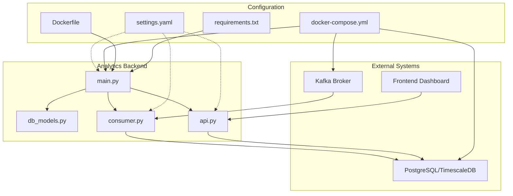
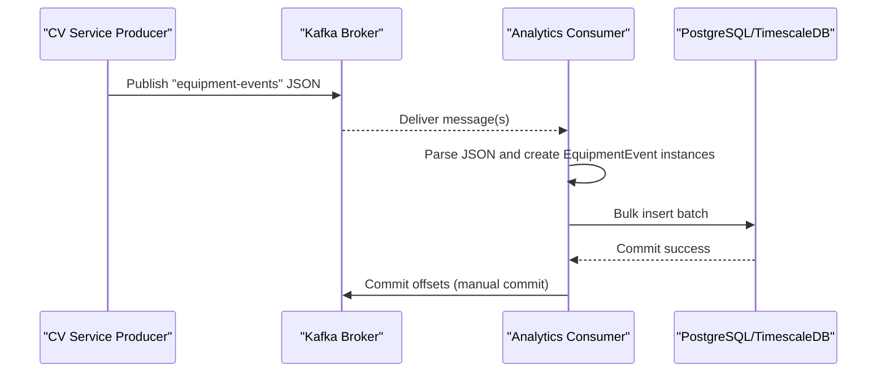
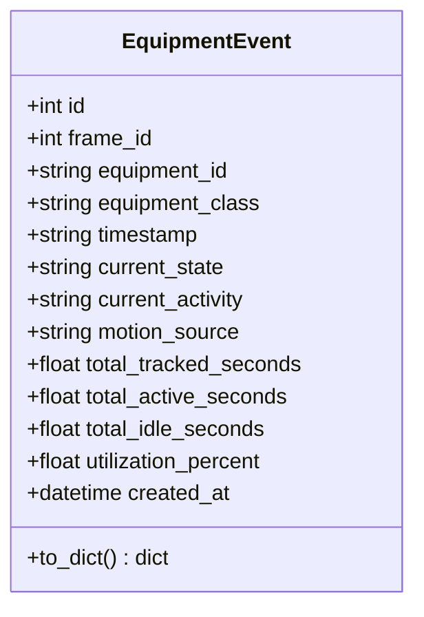
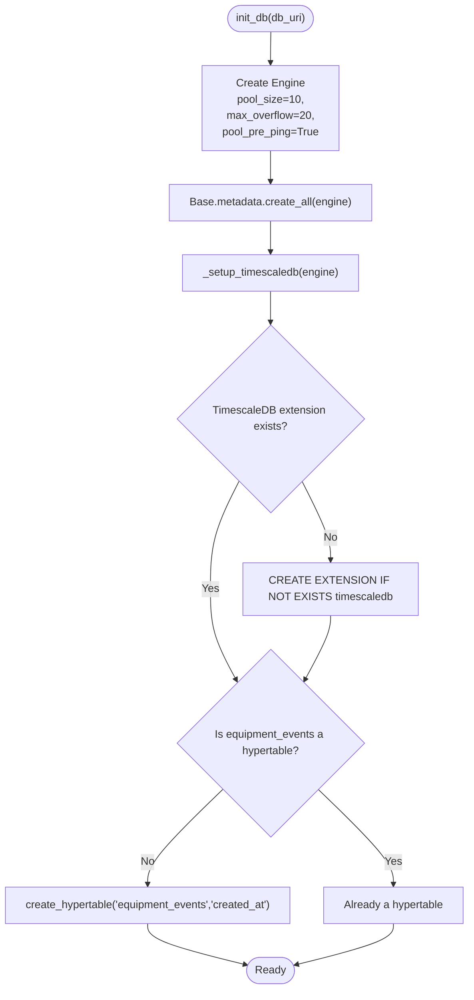
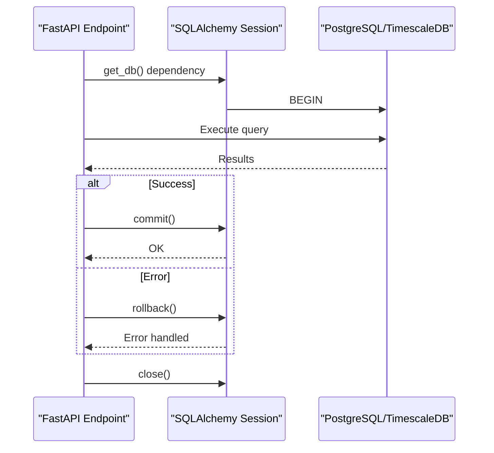
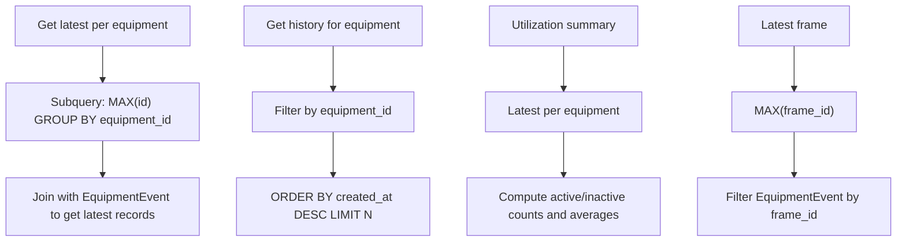
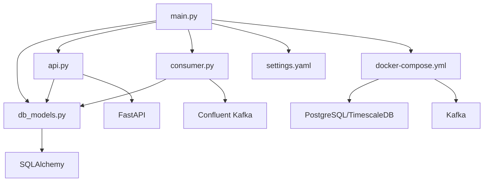

# Database Integration and Models

<cite>
**Referenced Files in This Document**
- [db_models.py](file://services/analytics_backend/src/db_models.py)
- [api.py](file://services/analytics_backend/src/api.py)
- [consumer.py](file://services/analytics_backend/src/consumer.py)
- [main.py](file://services/analytics_backend/src/main.py)
- [settings.yaml](file://config/settings.yaml)
- [docker-compose.yml](file://docker-compose.yml)
- [Dockerfile](file://services/analytics_backend/Dockerfile)
- [requirements.txt](file://services/analytics_backend/requirements.txt)
</cite>

## Table of Contents
1. [Introduction](#introduction)
2. [Project Structure](#project-structure)
3. [Core Components](#core-components)
4. [Architecture Overview](#architecture-overview)
5. [Detailed Component Analysis](#detailed-component-analysis)
6. [Dependency Analysis](#dependency-analysis)
7. [Performance Considerations](#performance-considerations)
8. [Troubleshooting Guide](#troubleshooting-guide)
9. [Conclusion](#conclusion)
10. [Appendices](#appendices)

## Introduction
This document provides comprehensive data model and database integration documentation for the Analytics Backend service. It covers the EquipmentEvent SQLAlchemy model, database initialization and connection pooling, transaction management, query patterns for equipment status and utilization analytics, schema design decisions, indexing strategies, migration and versioning considerations, data validation and consistency measures, and practical tuning recommendations. The Analytics Backend consumes equipment events from Kafka, persists them to PostgreSQL (with optional TimescaleDB hypertable optimization), and exposes a FastAPI REST API for querying equipment status, history, and utilization metrics.

## Project Structure
The Analytics Backend service resides under services/analytics_backend and consists of:
- Database models and initialization: db_models.py
- REST API endpoints: api.py
- Kafka consumer: consumer.py
- Application entrypoint and configuration loading: main.py
- Configuration: config/settings.yaml
- Containerization: Dockerfile and docker-compose.yml
- Python dependencies: requirements.txt

**Diagram sources**
- [main.py:64-149](file://services/analytics_backend/src/main.py#L64-L149)
- [db_models.py:70-191](file://services/analytics_backend/src/db_models.py#L70-L191)
- [api.py:159-444](file://services/analytics_backend/src/api.py#L159-L444)
- [consumer.py:23-268](file://services/analytics_backend/src/consumer.py#L23-L268)
- [settings.yaml:41-59](file://config/settings.yaml#L41-L59)
- [docker-compose.yml:1-95](file://docker-compose.yml#L1-L95)
- [Dockerfile:1-23](file://services/analytics_backend/Dockerfile#L1-L23)
- [requirements.txt:1-8](file://services/analytics_backend/requirements.txt#L1-L8)

**Section sources**
- [main.py:64-149](file://services/analytics_backend/src/main.py#L64-L149)
- [settings.yaml:41-59](file://config/settings.yaml#L41-L59)
- [docker-compose.yml:35-50](file://docker-compose.yml#L35-L50)
- [Dockerfile:1-23](file://services/analytics_backend/Dockerfile#L1-L23)
- [requirements.txt:1-8](file://services/analytics_backend/requirements.txt#L1-L8)

## Core Components
This section documents the EquipmentEvent SQLAlchemy model, database initialization, connection pooling, and transaction management.

- EquipmentEvent model
  - Table: equipment_events
  - Primary key: id (Integer, autoincrement)
  - Fields and constraints:
    - frame_id: Integer, not null
    - equipment_id: String(20), not null, indexed
    - equipment_class: String(50), not null
    - timestamp: String(20), not null ("HH:MM:SS.mmm")
    - current_state: String(10), not null (ACTIVE/INACTIVE)
    - current_activity: String(30), not null (DIGGING/SWINGING_LOADING/DUMPING/WAITING)
    - motion_source: String(20), not null (full_body/arm_only/none)
    - total_tracked_seconds: Float, default 0.0
    - total_active_seconds: Float, default 0.0
    - total_idle_seconds: Float, default 0.0
    - utilization_percent: Float, default 0.0
    - created_at: DateTime, default utcnow, indexed
  - Relationships: None (standalone time-series events)
  - Indexes: equipment_id (explicit), created_at (explicit)
  - Notes: timestamp is stored as string to preserve video frame time semantics; created_at is indexed for time-series queries

- Database initialization and TimescaleDB setup
  - init_db(db_uri):
    - Creates engine with pool_size=10, max_overflow=20, pool_pre_ping=True, echo=False
    - Creates all tables defined in Base.metadata
    - Attempts TimescaleDB extension creation and converts equipment_events to hypertable on created_at
  - _setup_timescaledb(engine): Conditional TimescaleDB setup with safe fallback

- Session management
  - get_session(engine): Returns sessionmaker bound to engine with autocommit=False, autoflush=False
  - get_db_session(engine): Context manager for sessions with commit on success, rollback on exception, and close in finally

**Section sources**
- [db_models.py:22-67](file://services/analytics_backend/src/db_models.py#L22-L67)
- [db_models.py:70-101](file://services/analytics_backend/src/db_models.py#L70-L101)
- [db_models.py:103-156](file://services/analytics_backend/src/db_models.py#L103-L156)
- [db_models.py:158-191](file://services/analytics_backend/src/db_models.py#L158-L191)

## Architecture Overview
The Analytics Backend integrates Kafka, PostgreSQL/TimescaleDB, and FastAPI:
- Kafka producer (CV service) publishes equipment events to the equipment-events topic.
- Analytics Backend consumer subscribes, parses JSON, and batches inserts into PostgreSQL.
- FastAPI serves REST endpoints backed by SQLAlchemy ORM against PostgreSQL (hypertable optimized when available).
- docker-compose provisions Kafka, Zookeeper, PostgreSQL/TimescaleDB, and the backend service.

**Diagram sources**
- [consumer.py:93-142](file://services/analytics_backend/src/consumer.py#L93-L142)
- [consumer.py:143-200](file://services/analytics_backend/src/consumer.py#L143-L200)
- [consumer.py:206-229](file://services/analytics_backend/src/consumer.py#L206-L229)

**Section sources**
- [consumer.py:23-268](file://services/analytics_backend/src/consumer.py#L23-L268)
- [docker-compose.yml:15-34](file://docker-compose.yml#L15-L34)
- [docker-compose.yml:35-50](file://docker-compose.yml#L35-L50)

## Detailed Component Analysis

### EquipmentEvent Model
The EquipmentEvent model encapsulates a single time-stamped equipment state snapshot with utilization metrics. It is designed for efficient ingestion and time-series analytics.

**Diagram sources**
- [db_models.py:22-67](file://services/analytics_backend/src/db_models.py#L22-L67)

Key design notes:
- Timestamp is stored as a string to align with video frame timestamps, simplifying downstream analytics.
- Float fields represent cumulative durations and percentages; defaults ensure safe arithmetic.
- Indexes on equipment_id and created_at optimize frequent queries by equipment and time-series scans.

**Section sources**
- [db_models.py:22-67](file://services/analytics_backend/src/db_models.py#L22-L67)

### Database Initialization and TimescaleDB Setup
Initialization configures connection pooling and attempts TimescaleDB hypertable creation for time-series optimization.

**Diagram sources**
- [db_models.py:70-101](file://services/analytics_backend/src/db_models.py#L70-L101)
- [db_models.py:103-156](file://services/analytics_backend/src/db_models.py#L103-L156)

Operational characteristics:
- Pooling: 10 connections with up to 20 overflow for bursty loads; pool_pre_ping ensures liveness checks.
- TimescaleDB: Automatically enabled if available; otherwise, standard PostgreSQL tables are used.

**Section sources**
- [db_models.py:70-101](file://services/analytics_backend/src/db_models.py#L70-L101)
- [db_models.py:103-156](file://services/analytics_backend/src/db_models.py#L103-L156)

### Transaction Management and Session Lifecycle
The API and consumer use explicit session management with commit/rollback semantics and proper cleanup.

**Diagram sources**
- [api.py:56-71](file://services/analytics_backend/src/api.py#L56-L71)
- [db_models.py:171-191](file://services/analytics_backend/src/db_models.py#L171-L191)

Best practices:
- Autocommit disabled to control transaction boundaries explicitly.
- Session closed in finally block to prevent leaks.
- Consumer uses bulk_save_objects for batch writes and manual Kafka commit after DB commit.

**Section sources**
- [api.py:56-71](file://services/analytics_backend/src/api.py#L56-L71)
- [db_models.py:171-191](file://services/analytics_backend/src/db_models.py#L171-L191)
- [consumer.py:206-229](file://services/analytics_backend/src/consumer.py#L206-L229)

### Query Patterns and Analytics
The API exposes several query patterns for equipment status, history, and utilization.

- Latest equipment states per equipment_id
  - Pattern: Group by equipment_id, join on max(id) subquery to fetch the latest record.
  - Use case: Dashboard equipment list with current state and utilization.

- Equipment history
  - Pattern: Filter by equipment_id, order by created_at desc, limit N.
  - Use case: Drill-down into a specific asset’s time series.

- Utilization summary
  - Pattern: Latest event per equipment, counts of ACTIVE/INACTIVE, average utilization, and per-equipment event counts.
  - Use case: Executive dashboards and site-wide reports.

- Latest frame data
  - Pattern: Find max(frame_id), filter EquipmentEvent by frame_id.
  - Use case: Real-time panel showing current state of all assets in the latest processed frame.

- Statistics
  - Pattern: Count rows, distinct equipment_id, min/max frame_id.
  - Use case: Operational monitoring and data completeness checks.

**Diagram sources**
- [api.py:187-206](file://services/analytics_backend/src/api.py#L187-L206)
- [api.py:246-252](file://services/analytics_backend/src/api.py#L246-L252)
- [api.py:299-317](file://services/analytics_backend/src/api.py#L299-L317)
- [api.py:383-394](file://services/analytics_backend/src/api.py#L383-L394)

**Section sources**
- [api.py:179-223](file://services/analytics_backend/src/api.py#L179-L223)
- [api.py:225-284](file://services/analytics_backend/src/api.py#L225-L284)
- [api.py:286-368](file://services/analytics_backend/src/api.py#L286-L368)
- [api.py:370-416](file://services/analytics_backend/src/api.py#L370-L416)
- [api.py:419-444](file://services/analytics_backend/src/api.py#L419-L444)

### Data Validation and Consistency Measures
- Consumer-side validation:
  - JSON parsing with error handling and logging.
  - Extraction of nested fields (utilization, time_analytics) with defaults to ensure robustness.
  - Batch processing with periodic flush and timeout-based commits.

- Database constraints:
  - Not-null constraints on critical fields enforce data integrity.
  - Indexes on equipment_id and created_at optimize query performance.

- Idempotency considerations:
  - Kafka manual commit after successful DB write reduces duplication risk.
  - Unique primary key on id prevents duplicate rows.

**Section sources**
- [consumer.py:143-200](file://services/analytics_backend/src/consumer.py#L143-L200)
- [consumer.py:206-229](file://services/analytics_backend/src/consumer.py#L206-L229)
- [db_models.py:32-43](file://services/analytics_backend/src/db_models.py#L32-L43)

## Dependency Analysis
The Analytics Backend relies on external systems and internal modules.

**Diagram sources**
- [main.py:90-105](file://services/analytics_backend/src/main.py#L90-L105)
- [api.py:12-19](file://services/analytics_backend/src/api.py#L12-L19)
- [consumer.py:15-18](file://services/analytics_backend/src/consumer.py#L15-L18)
- [db_models.py:12-15](file://services/analytics_backend/src/db_models.py#L12-L15)
- [settings.yaml:41-59](file://config/settings.yaml#L41-L59)
- [docker-compose.yml:35-50](file://docker-compose.yml#L35-L50)

**Section sources**
- [main.py:90-105](file://services/analytics_backend/src/main.py#L90-L105)
- [requirements.txt:1-8](file://services/analytics_backend/requirements.txt#L1-8)

## Performance Considerations
- Connection pooling
  - pool_size=10, max_overflow=20 balances concurrency and resource usage.
  - pool_pre_ping=True ensures stale connections are recycled.

- Indexing strategy
  - equipment_id: supports per-equipment queries and joins.
  - created_at: supports time-range filtering and TimescaleDB hypertable optimization.

- TimescaleDB optimization
  - Hypertable on equipment_events with time partitioning improves long-term retention and query performance for time-series analytics.

- Batch writes
  - Consumer batches up to 100 messages and flushes every 5 seconds to reduce round-trips and improve throughput.

- Query optimization
  - Latest-event-per-equipment uses a subquery pattern to avoid expensive window functions.
  - History queries use ORDER BY with LIMIT to cap result sizes.

[No sources needed since this section provides general guidance]

## Troubleshooting Guide
Common issues and resolutions:
- Database initialization failures
  - Verify PostgreSQL/TimescaleDB availability and credentials.
  - Check logs for TimescaleDB extension errors; service continues with standard tables if extension is unavailable.

- Health check failures
  - The /api/health endpoint executes a simple query to validate connectivity.

- Consumer stalls or backlog growth
  - Inspect Kafka topic/partition health and consumer lag.
  - Confirm manual commit succeeds after DB writes.

- Session leaks or timeouts
  - Ensure sessions are closed in finally blocks and transactions are committed or rolled back.

**Section sources**
- [db_models.py:103-156](file://services/analytics_backend/src/db_models.py#L103-L156)
- [api.py:159-177](file://services/analytics_backend/src/api.py#L159-L177)
- [consumer.py:134-141](file://services/analytics_backend/src/consumer.py#L134-L141)
- [db_models.py:171-191](file://services/analytics_backend/src/db_models.py#L171-L191)

## Conclusion
The Analytics Backend implements a robust, time-series–oriented database integration leveraging SQLAlchemy and TimescaleDB. The EquipmentEvent model captures essential equipment state and utilization metrics, while the consumer and API layers provide reliable ingestion and querying capabilities. Connection pooling, explicit transaction management, and targeted indexing enable scalable performance. The modular design supports straightforward migration and extension for evolving analytics needs.

[No sources needed since this section summarizes without analyzing specific files]

## Appendices

### Database Schema Design Decisions
- Why string timestamp
  - Preserves video frame time semantics without timezone conversions.
- Why float utilization fields
  - Enables incremental accumulation and percentage calculations.
- Why separate time_analytics and utilization sections
  - Keeps event payloads compact and aligns with producer schema.

**Section sources**
- [db_models.py:35-42](file://services/analytics_backend/src/db_models.py#L35-L42)
- [consumer.py:155-167](file://services/analytics_backend/src/consumer.py#L155-L167)

### Migration Procedures and Versioning
- Current state
  - Tables created via Base.metadata.create_all on initialization.
  - TimescaleDB setup is attempted automatically if extension is present.
- Recommendations
  - For production, adopt Alembic for deterministic migrations.
  - Maintain schema versioning in CI/CD to prevent accidental downgrades.
  - Backward compatibility: add new columns as nullable with defaults; populate gradually.

[No sources needed since this section provides general guidance]

### Environment-Specific Settings and Connection Strings
- Connection string precedence
  - Loaded from config.settings.yaml database.uri by default.
  - Overridden by environment variable in deployment contexts if applicable.
- Docker Compose
  - PostgreSQL/TimescaleDB configured with fixed credentials and exposed port.
  - Analytics Backend binds to port 8000 and mounts config volume for settings.yaml.

**Section sources**
- [settings.yaml:47-53](file://config/settings.yaml#L47-L53)
- [docker-compose.yml:35-50](file://docker-compose.yml#L35-L50)
- [main.py:84](file://services/analytics_backend/src/main.py#L84)

### Database Tuning Recommendations
- Connection pool sizing
  - Adjust pool_size and max_overflow based on concurrent API requests and consumer throughput.
- TimescaleDB hypertables
  - Use appropriate chunk time intervals for retention policies and query patterns.
- Index maintenance
  - Monitor index bloat and rebuild if necessary; consider partial indexes for frequently filtered columns.
- Query tuning
  - Use EXPLAIN/ANALYZE for slow queries; ensure proper use of indexes on equipment_id and created_at.

[No sources needed since this section provides general guidance]