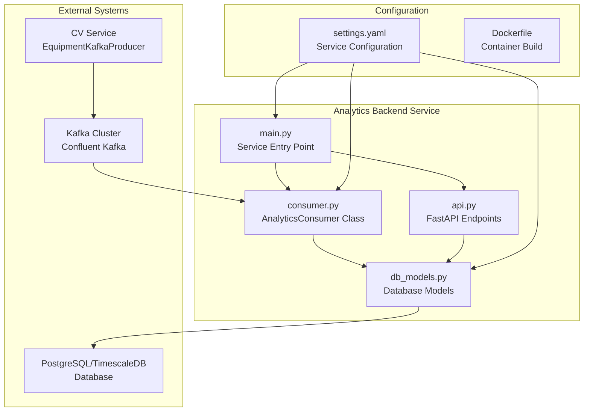
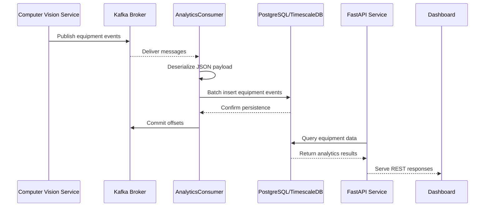
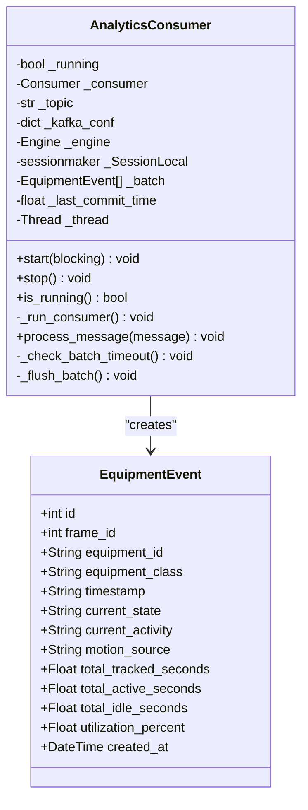
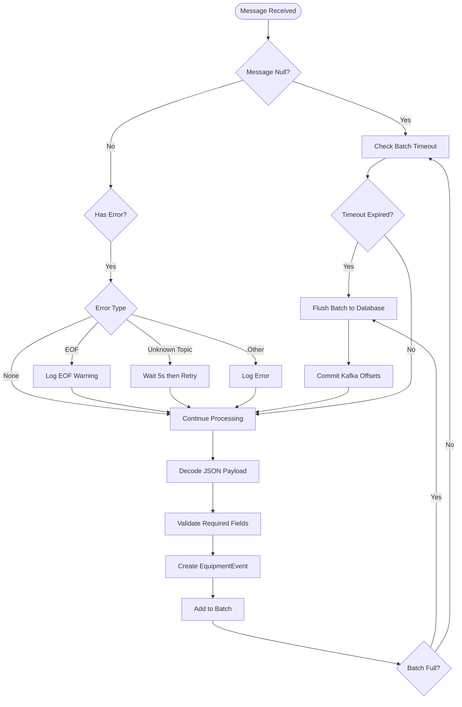
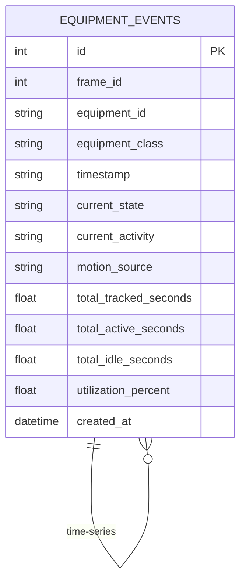
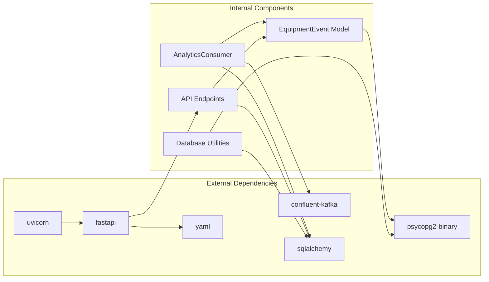

# Kafka Consumer Implementation

<cite>
**Referenced Files in This Document**
- [consumer.py](file://services/analytics_backend/src/consumer.py)
- [main.py](file://services/analytics_backend/src/main.py)
- [db_models.py](file://services/analytics_backend/src/db_models.py)
- [api.py](file://services/analytics_backend/src/api.py)
- [settings.yaml](file://config/settings.yaml)
- [Dockerfile](file://services/analytics_backend/Dockerfile)
- [docker-compose.yml](file://docker-compose.yml)
- [requirements.txt](file://services/analytics_backend/requirements.txt)
- [kafka_producer.py](file://services/cv_service/src/kafka_producer.py)
</cite>

## Table of Contents
1. [Introduction](#introduction)
2. [Project Structure](#project-structure)
3. [Core Components](#core-components)
4. [Architecture Overview](#architecture-overview)
5. [Detailed Component Analysis](#detailed-component-analysis)
6. [Dependency Analysis](#dependency-analysis)
7. [Performance Considerations](#performance-considerations)
8. [Troubleshooting Guide](#troubleshooting-guide)
9. [Conclusion](#conclusion)

## Introduction

The AnalyticsConsumer is a Kafka consumer implementation that processes equipment events from the computer vision pipeline. It consumes messages from the "equipment-events" topic, deserializes JSON payloads, and persists the data to a PostgreSQL database with batch optimization. This consumer serves as a critical component in the EagleVision system, bridging the gap between computer vision analytics and persistent storage for dashboard visualization.

The consumer is designed with production-grade features including graceful shutdown procedures, error handling strategies, batch processing optimization, and integration with the broader analytics ecosystem.

## Project Structure

The analytics backend service follows a modular architecture with clear separation of concerns:

**Diagram sources**
- [consumer.py:1-268](file://services/analytics_backend/src/consumer.py#L1-L268)
- [main.py:1-149](file://services/analytics_backend/src/main.py#L1-L149)
- [db_models.py:1-191](file://services/analytics_backend/src/db_models.py#L1-L191)
- [api.py:1-444](file://services/analytics_backend/src/api.py#L1-L444)

**Section sources**
- [consumer.py:1-268](file://services/analytics_backend/src/consumer.py#L1-L268)
- [main.py:1-149](file://services/analytics_backend/src/main.py#L1-L149)
- [settings.yaml:1-59](file://config/settings.yaml#L1-L59)

## Core Components

### AnalyticsConsumer Class

The AnalyticsConsumer is the central component responsible for Kafka message consumption and database persistence. It implements a robust consumer pattern with the following key characteristics:

#### Configuration Management
- **Bootstrap Servers**: Configurable Kafka broker addresses with default "kafka:9092"
- **Topic Subscription**: Monitors "equipment-events" topic by default
- **Consumer Group**: Uses "analytics-consumer" group ID for coordinated consumption
- **Offset Management**: Manual commit strategy for precise control

#### Message Processing Pipeline
- **JSON Deserialization**: Robust parsing with error handling
- **Batch Processing**: Optimized for throughput with configurable batch sizes
- **Database Persistence**: SQLAlchemy ORM integration with bulk operations

#### Lifecycle Management
- **Background Execution**: Optional threaded operation mode
- **Graceful Shutdown**: Signal handling and resource cleanup
- **Reconnection Logic**: Automatic retry mechanisms for transient failures

**Section sources**
- [consumer.py:23-268](file://services/analytics_backend/src/consumer.py#L23-L268)
- [settings.yaml:41-46](file://config/settings.yaml#L41-L46)

### Database Integration

The consumer integrates with a PostgreSQL database enhanced with TimescaleDB capabilities:

#### EquipmentEvent Model
- **Primary Fields**: Equipment identification, classification, and temporal markers
- **Utilization Metrics**: Comprehensive tracking of operational states
- **Time Series Optimization**: Hypertable support for efficient time-series queries

#### Connection Management
- **Connection Pooling**: Configurable pool size for concurrent operations
- **Automatic Migration**: Schema creation and TimescaleDB setup
- **Session Management**: Proper resource cleanup and transaction handling

**Section sources**
- [db_models.py:22-68](file://services/analytics_backend/src/db_models.py#L22-L68)
- [db_models.py:70-101](file://services/analytics_backend/src/db_models.py#L70-L101)

### API Integration

The consumer operates alongside a FastAPI service that provides REST endpoints for dashboard consumption:

#### Endpoint Architecture
- **Equipment Status**: Real-time equipment state queries
- **Historical Data**: Time-series analysis and reporting
- **Utilization Analytics**: Aggregate statistics and metrics
- **Health Monitoring**: Service health and database connectivity checks

#### CORS Configuration
- **Cross-Origin Support**: Enables dashboard integration from various origins
- **Security Considerations**: Configurable origin policies for production deployment

**Section sources**
- [api.py:159-444](file://services/analytics_backend/src/api.py#L159-L444)

## Architecture Overview

The AnalyticsConsumer participates in a distributed streaming architecture that processes equipment events from computer vision analysis:

**Diagram sources**
- [kafka_producer.py:91-169](file://services/cv_service/src/kafka_producer.py#L91-L169)
- [consumer.py:143-228](file://services/analytics_backend/src/consumer.py#L143-L228)
- [api.py:179-416](file://services/analytics_backend/src/api.py#L179-L416)

The architecture ensures reliable event processing with the following guarantees:
- **Exactly-once semantics**: Manual offset commits prevent duplicate processing
- **Backpressure handling**: Batch processing controls memory usage
- **Fault tolerance**: Graceful shutdown and restart capabilities
- **Scalability**: Partition-based parallelism for high-throughput scenarios

## Detailed Component Analysis

### AnalyticsConsumer Implementation

#### Class Structure and Dependencies

**Diagram sources**
- [consumer.py:23-78](file://services/analytics_backend/src/consumer.py#L23-L78)
- [db_models.py:22-49](file://services/analytics_backend/src/db_models.py#L22-L49)

#### Message Processing Flow

The consumer implements a sophisticated message processing pipeline:

**Diagram sources**
- [consumer.py:93-142](file://services/analytics_backend/src/consumer.py#L93-L142)
- [consumer.py:143-200](file://services/analytics_backend/src/consumer.py#L143-L200)
- [consumer.py:206-228](file://services/analytics_backend/src/consumer.py#L206-L228)

#### Configuration Parameters

The consumer supports extensive configuration through the settings.yaml file:

| Parameter | Default Value | Description |
|-----------|---------------|-------------|
| bootstrap_servers | "kafka:9092" | Kafka broker connection string |
| topic | "equipment-events" | Target topic for consumption |
| consumer_group | "analytics-consumer" | Consumer group identifier |
| auto.offset.reset | "earliest" | Offset reset policy |
| enable.auto.commit | False | Manual commit control |
| max.poll.interval.ms | 300000 | Maximum poll interval |
| session.timeout.ms | 30000 | Consumer session timeout |

**Section sources**
- [consumer.py:35-59](file://services/analytics_backend/src/consumer.py#L35-L59)
- [settings.yaml:41-46](file://config/settings.yaml#L41-L46)

### Database Integration Details

#### EquipmentEvent Model Schema

**Diagram sources**
- [db_models.py:22-49](file://services/analytics_backend/src/db_models.py#L22-L49)

#### TimescaleDB Integration

The database layer includes advanced time-series optimization:

- **Hypertable Creation**: Automatic conversion of equipment_events table
- **Time-based Partitioning**: Efficient storage and querying of time-series data
- **Compression Policies**: Automatic data compression for historical retention
- **Continuous Aggregates**: Pre-computed aggregations for improved query performance

**Section sources**
- [db_models.py:103-156](file://services/analytics_backend/src/db_models.py#L103-L156)

### API Service Integration

#### Endpoint Architecture

The FastAPI service provides comprehensive REST endpoints:

| Endpoint | Method | Purpose |
|----------|--------|---------|
| `/api/health` | GET | Service health check |
| `/api/equipment` | GET | Current equipment states |
| `/api/equipment/{id}/history` | GET | Equipment time-series data |
| `/api/utilization/summary` | GET | Aggregate utilization metrics |
| `/api/latest-frame` | GET | Real-time equipment status |
| `/api/stats` | GET | Database statistics |

**Section sources**
- [api.py:159-444](file://services/analytics_backend/src/api.py#L159-L444)

## Dependency Analysis

The AnalyticsConsumer has well-defined dependencies that ensure modularity and maintainability:

**Diagram sources**
- [requirements.txt:1-8](file://services/analytics_backend/requirements.txt#L1-L8)
- [consumer.py:15-18](file://services/analytics_backend/src/consumer.py#L15-L18)
- [api.py:12-19](file://services/analytics_backend/src/api.py#L12-L19)

### External Dependencies

The service relies on several key external libraries:

- **Confluent Kafka**: High-performance distributed streaming platform
- **SQLAlchemy**: Object-relational mapping for database operations
- **PostgreSQL Driver**: Native PostgreSQL database connectivity
- **FastAPI**: Modern asynchronous web framework for API endpoints
- **Uvicorn**: ASGI server for production deployment

**Section sources**
- [requirements.txt:1-8](file://services/analytics_backend/requirements.txt#L1-L8)

## Performance Considerations

### Batch Processing Optimization

The consumer implements sophisticated batch processing strategies:

#### Batch Configuration
- **Size-based Commit**: Every 100 messages trigger batch flush
- **Time-based Commit**: Maximum 5-second intervals for partial batches
- **Memory Management**: Controlled memory usage through batch boundaries
- **Throughput Optimization**: Reduced database round-trips through bulk operations

#### Database Performance Tuning

- **Connection Pooling**: Configurable pool size for concurrent operations
- **Bulk Operations**: SQLAlchemy bulk_save_objects for efficient inserts
- **Index Optimization**: Strategic indexing on frequently queried fields
- **TimescaleDB Benefits**: Specialized time-series optimizations

### Concurrency and Threading

The consumer supports flexible execution modes:

- **Blocking Mode**: Runs in main thread for simple deployments
- **Non-blocking Mode**: Background thread execution for production
- **Signal Handling**: Graceful shutdown on SIGTERM/SIGINT signals
- **Resource Cleanup**: Proper thread joining and resource deallocation

**Section sources**
- [consumer.py:31-33](file://services/analytics_backend/src/consumer.py#L31-L33)
- [consumer.py:79-92](file://services/analytics_backend/src/consumer.py#L79-L92)
- [main.py:110-119](file://services/analytics_backend/src/main.py#L110-L119)

## Troubleshooting Guide

### Common Kafka Connectivity Issues

#### Connection Problems
- **Symptom**: Consumer fails to connect to Kafka brokers
- **Diagnosis**: Verify bootstrap_servers configuration matches running Kafka instances
- **Solution**: Check network connectivity and ensure Kafka service is healthy

#### Topic Not Found
- **Symptom**: "Topic not found" warnings during consumption
- **Diagnosis**: Confirm topic existence and proper naming
- **Solution**: Create topic manually or rely on auto-create configuration

#### Consumer Group Rebalancing
- **Symptom**: Frequent rebalancing causing processing interruptions
- **Diagnosis**: Monitor consumer group membership and partition distribution
- **Solution**: Adjust session.timeout.ms and heartbeat configurations

### Message Processing Failures

#### JSON Deserialization Errors
- **Symptom**: "Failed to decode JSON message" errors
- **Diagnosis**: Validate producer message format and encoding
- **Solution**: Ensure consistent message schema across producers

#### Database Persistence Issues
- **Symptom**: Batch commit failures or database connection errors
- **Diagnosis**: Check database connectivity and schema consistency
- **Solution**: Implement retry logic and proper error handling

### Performance and Resource Issues

#### Memory Leaks
- **Symptom**: Increasing memory usage over time
- **Diagnosis**: Monitor batch accumulation and session management
- **Solution**: Ensure proper batch flushing and session cleanup

#### Throughput Bottlenecks
- **Symptom**: Slow message processing rates
- **Diagnosis**: Analyze batch sizes and database performance
- **Solution**: Optimize batch configuration and database indexing

### Container and Deployment Issues

#### Docker Configuration
- **Symptom**: Service fails to start in container environment
- **Diagnosis**: Verify configuration mounting and environment variables
- **Solution**: Check docker-compose volume mounts and service dependencies

#### Health Check Failures
- **Symptom**: Kubernetes readiness/liveness probes failing
- **Diagnosis**: Monitor service logs and dependency health
- **Solution**: Implement proper health check endpoints and dependency management

**Section sources**
- [consumer.py:110-133](file://services/analytics_backend/src/consumer.py#L110-L133)
- [consumer.py:212-226](file://services/analytics_backend/src/consumer.py#L212-L226)
- [main.py:110-119](file://services/analytics_backend/src/main.py#L110-L119)

## Conclusion

The AnalyticsConsumer implementation provides a robust, production-ready solution for processing equipment events from the computer vision pipeline. Its architecture balances performance, reliability, and maintainability through:

- **Structured Design**: Clear separation of concerns with modular components
- **Production Features**: Graceful shutdown, error handling, and resource management
- **Performance Optimization**: Batch processing, connection pooling, and time-series optimization
- **Integration Capabilities**: Seamless coordination with FastAPI services and dashboard applications

The consumer's design supports scalability through partition-based parallelism and provides comprehensive monitoring through structured logging and health check endpoints. The implementation demonstrates best practices for distributed streaming applications while maintaining simplicity for deployment and maintenance.

Future enhancements could include advanced metrics collection, enhanced monitoring integration, and support for dynamic configuration reloading to further improve operational visibility and flexibility.