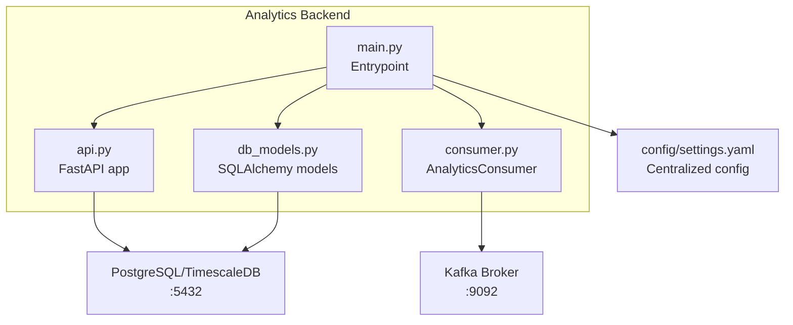
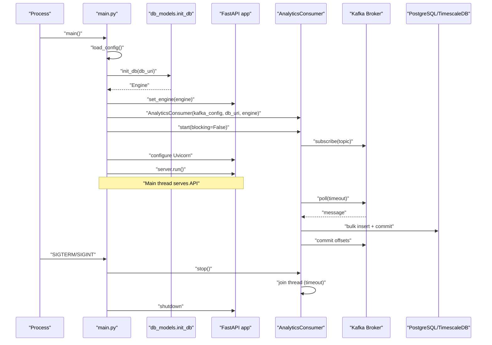
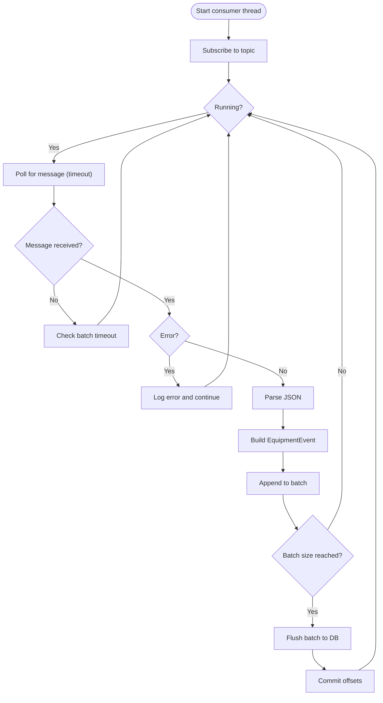
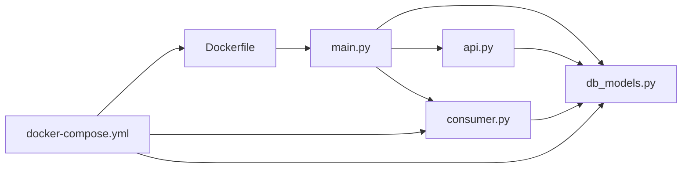

# Service Orchestration and Lifecycle

<cite>
**Referenced Files in This Document**
- [services/analytics_backend/src/main.py](file://services/analytics_backend/src/main.py)
- [services/analytics_backend/src/consumer.py](file://services/analytics_backend/src/consumer.py)
- [services/analytics_backend/src/api.py](file://services/analytics_backend/src/api.py)
- [services/analytics_backend/src/db_models.py](file://services/analytics_backend/src/db_models.py)
- [config/settings.yaml](file://config/settings.yaml)
- [services/analytics_backend/Dockerfile](file://services/analytics_backend/Dockerfile)
- [docker-compose.yml](file://docker-compose.yml)
- [services/analytics_backend/requirements.txt](file://services/analytics_backend/requirements.txt)
</cite>

## Table of Contents
1. [Introduction](#introduction)
2. [Project Structure](#project-structure)
3. [Core Components](#core-components)
4. [Architecture Overview](#architecture-overview)
5. [Detailed Component Analysis](#detailed-component-analysis)
6. [Dependency Analysis](#dependency-analysis)
7. [Performance Considerations](#performance-considerations)
8. [Troubleshooting Guide](#troubleshooting-guide)
9. [Conclusion](#conclusion)
10. [Appendices](#appendices)

## Introduction
This document explains how the Analytics Backend service orchestrates its lifecycle, coordinates a Kafka consumer and a FastAPI server, and handles graceful shutdown. It covers configuration loading across multiple environments, signal handling for SIGTERM and SIGINT, the threading model with a background consumer and main server thread, logging configuration, error handling strategies, health monitoring, deployment considerations, resource management, scaling patterns, startup dependencies, and operational guidance.

## Project Structure
The Analytics Backend is implemented as a Python package with a single entrypoint that initializes the database, starts a Kafka consumer in a background thread, and runs a FastAPI server in the main thread. Configuration is loaded from a YAML file with environment-aware fallbacks. The service is containerized and orchestrated via Docker Compose alongside Kafka, PostgreSQL/TimescaleDB, and the CV service.

**Diagram sources**
- [services/analytics_backend/src/main.py:64-149](file://services/analytics_backend/src/main.py#L64-L149)
- [services/analytics_backend/src/consumer.py:23-268](file://services/analytics_backend/src/consumer.py#L23-L268)
- [services/analytics_backend/src/api.py:23-444](file://services/analytics_backend/src/api.py#L23-L444)
- [services/analytics_backend/src/db_models.py:70-191](file://services/analytics_backend/src/db_models.py#L70-L191)
- [config/settings.yaml:41-58](file://config/settings.yaml#L41-L58)

**Section sources**
- [services/analytics_backend/src/main.py:64-149](file://services/analytics_backend/src/main.py#L64-L149)
- [services/analytics_backend/src/consumer.py:23-268](file://services/analytics_backend/src/consumer.py#L23-L268)
- [services/analytics_backend/src/api.py:23-444](file://services/analytics_backend/src/api.py#L23-L444)
- [services/analytics_backend/src/db_models.py:70-191](file://services/analytics_backend/src/db_models.py#L70-L191)
- [config/settings.yaml:41-58](file://config/settings.yaml#L41-L58)

## Core Components
- Entrypoint and lifecycle coordinator: Orchestrates configuration loading, database initialization, background consumer startup, Uvicorn server startup, and graceful shutdown on signals.
- Kafka consumer: Reads events from a configured Kafka topic, batches and persists to PostgreSQL, and commits offsets upon successful writes.
- FastAPI application: Provides health checks and analytics endpoints backed by the database.
- Database layer: SQLAlchemy models with optional TimescaleDB hypertable creation.
- Configuration: Centralized YAML with environment-aware discovery and defaults.

Key responsibilities:
- Startup: Load config, initialize DB, create consumer, start consumer thread, configure and run Uvicorn.
- Runtime: Handle signals, coordinate shutdown, ensure consumer stops cleanly, close server.
- Health: Expose /api/health endpoint to verify connectivity.

**Section sources**
- [services/analytics_backend/src/main.py:64-149](file://services/analytics_backend/src/main.py#L64-L149)
- [services/analytics_backend/src/consumer.py:23-268](file://services/analytics_backend/src/consumer.py#L23-L268)
- [services/analytics_backend/src/api.py:159-177](file://services/analytics_backend/src/api.py#L159-L177)
- [services/analytics_backend/src/db_models.py:70-191](file://services/analytics_backend/src/db_models.py#L70-L191)
- [config/settings.yaml:41-58](file://config/settings.yaml#L41-L58)

## Architecture Overview
The Analytics Backend runs a single-threaded main process that:
- Loads configuration from a YAML file using environment-aware discovery.
- Initializes the database and binds the SQLAlchemy engine to the API.
- Starts a background thread running the Kafka consumer.
- Runs the FastAPI/Uvicorn server on the main thread.
- Registers signal handlers for SIGTERM/SIGINT to trigger coordinated shutdown.

**Diagram sources**
- [services/analytics_backend/src/main.py:64-149](file://services/analytics_backend/src/main.py#L64-L149)
- [services/analytics_backend/src/consumer.py:79-243](file://services/analytics_backend/src/consumer.py#L79-L243)
- [services/analytics_backend/src/api.py:23-444](file://services/analytics_backend/src/api.py#L23-L444)
- [services/analytics_backend/src/db_models.py:70-100](file://services/analytics_backend/src/db_models.py#L70-L100)

## Detailed Component Analysis

### Entrypoint and Lifecycle Coordinator (main.py)
Responsibilities:
- Logging configuration with stdout handler and INFO level.
- Configuration loading with environment-aware discovery across Docker and local paths.
- Database initialization and engine binding to the API.
- Consumer instantiation and background thread startup.
- Uvicorn server configuration and execution.
- Signal handling for SIGTERM/SIGINT to trigger coordinated shutdown.

Key behaviors:
- Configuration discovery attempts multiple paths and raises a clear error if none exist.
- Database initialization uses a pooled engine with pre-ping and optional TimescaleDB setup.
- Consumer is started in a daemon thread; the main thread runs the Uvicorn server.
- Graceful shutdown sets a threading event, signals the consumer to stop, and ensures thread join with timeout.

Operational notes:
- The server listens on 0.0.0.0:8000.
- Access logs are enabled.
- On keyboard interrupt, the server exits gracefully and the consumer is stopped.

**Section sources**
- [services/analytics_backend/src/main.py:18-26](file://services/analytics_backend/src/main.py#L18-L26)
- [services/analytics_backend/src/main.py:29-61](file://services/analytics_backend/src/main.py#L29-L61)
- [services/analytics_backend/src/main.py:90-103](file://services/analytics_backend/src/main.py#L90-L103)
- [services/analytics_backend/src/main.py:104-122](file://services/analytics_backend/src/main.py#L104-L122)
- [services/analytics_backend/src/main.py:124-144](file://services/analytics_backend/src/main.py#L124-L144)

### Kafka Consumer (consumer.py)
Responsibilities:
- Subscribe to a Kafka topic and poll messages with a timeout.
- Parse JSON payloads and construct database records.
- Batch insert into PostgreSQL using bulk operations.
- Commit Kafka offsets after successful DB writes.
- Provide a stop method to gracefully shut down the consumer thread.

Key behaviors:
- Batch size and timeout control throughput and latency.
- Manual commit disabled for better control; offsets committed after DB writes.
- Robust error handling for JSON decoding, Kafka exceptions, and DB errors.
- Consumer thread is daemonized; stop waits for thread completion with a timeout.

Processing logic:

**Diagram sources**
- [services/analytics_backend/src/consumer.py:93-243](file://services/analytics_backend/src/consumer.py#L93-L243)

**Section sources**
- [services/analytics_backend/src/consumer.py:23-78](file://services/analytics_backend/src/consumer.py#L23-L78)
- [services/analytics_backend/src/consumer.py:93-243](file://services/analytics_backend/src/consumer.py#L93-L243)

### FastAPI Application (api.py)
Responsibilities:
- Define REST endpoints for health, equipment listing, history, utilization summary, latest frame, and statistics.
- Provide dependency injection for database sessions.
- Enforce CORS for cross-origin requests.
- Expose a health endpoint that verifies database connectivity.

Endpoints overview:
- GET /api/health: Health check returning status and database connectivity.
- GET /api/equipment: Latest state for each equipment.
- GET /api/equipment/{id}/history: Time-series history with configurable limit.
- GET /api/utilization/summary: Aggregate utilization statistics.
- GET /api/latest-frame: Current frame data for real-time dashboards.
- GET /api/stats: General database statistics.

Error handling:
- Raises HTTP 503 when the database is not initialized.
- Raises HTTP 500 for internal errors and 404 when resources are missing.

**Section sources**
- [services/analytics_backend/src/api.py:159-177](file://services/analytics_backend/src/api.py#L159-L177)
- [services/analytics_backend/src/api.py:179-284](file://services/analytics_backend/src/api.py#L179-L284)
- [services/analytics_backend/src/api.py:286-416](file://services/analytics_backend/src/api.py#L286-L416)
- [services/analytics_backend/src/api.py:419-444](file://services/analytics_backend/src/api.py#L419-L444)

### Database Layer (db_models.py)
Responsibilities:
- Define the EquipmentEvent model and create tables on startup.
- Initialize a pooled SQLAlchemy engine with pre-ping.
- Optionally set up TimescaleDB hypertable on equipment_events.
- Provide session factory and context manager helpers.

Key behaviors:
- Creates all tables defined in the declarative base.
- Attempts to enable TimescaleDB extension and convert the table to a hypertable if available.
- Falls back gracefully if TimescaleDB is not present.

**Section sources**
- [services/analytics_backend/src/db_models.py:22-68](file://services/analytics_backend/src/db_models.py#L22-L68)
- [services/analytics_backend/src/db_models.py:70-100](file://services/analytics_backend/src/db_models.py#L70-L100)
- [services/analytics_backend/src/db_models.py:103-156](file://services/analytics_backend/src/db_models.py#L103-L156)
- [services/analytics_backend/src/db_models.py:158-191](file://services/analytics_backend/src/db_models.py#L158-L191)

### Configuration Loading (settings.yaml)
Responsibilities:
- Provide centralized configuration for Kafka, database, and other pipeline parameters.
- Used by the main entrypoint to derive Kafka and database settings.

Highlights:
- Kafka bootstrap servers, topic, and consumer group are configurable.
- Database URI and credentials are provided.
- Defaults align with Docker Compose service names.

**Section sources**
- [config/settings.yaml:41-58](file://config/settings.yaml#L41-L58)

## Dependency Analysis
Runtime dependencies and relationships:
- main.py depends on db_models for engine initialization, api for engine binding, and consumer for event consumption.
- consumer.py depends on db_models for ORM models and sessions, and confluent_kafka for messaging.
- api.py depends on db_models for ORM models and session management.
- Dockerfile builds the service image and exposes port 8000.
- docker-compose orchestrates Kafka, PostgreSQL/TimescaleDB, CV service, Analytics Backend, and Dashboard.

**Diagram sources**
- [services/analytics_backend/src/main.py:90-103](file://services/analytics_backend/src/main.py#L90-L103)
- [services/analytics_backend/src/consumer.py:18-68](file://services/analytics_backend/src/consumer.py#L18-L68)
- [services/analytics_backend/src/api.py:19-41](file://services/analytics_backend/src/api.py#L19-L41)
- [services/analytics_backend/Dockerfile:10-22](file://services/analytics_backend/Dockerfile#L10-L22)
- [docker-compose.yml:64-78](file://docker-compose.yml#L64-L78)

**Section sources**
- [services/analytics_backend/src/main.py:90-103](file://services/analytics_backend/src/main.py#L90-L103)
- [services/analytics_backend/src/consumer.py:18-68](file://services/analytics_backend/src/consumer.py#L18-L68)
- [services/analytics_backend/src/api.py:19-41](file://services/analytics_backend/src/api.py#L19-L41)
- [services/analytics_backend/Dockerfile:10-22](file://services/analytics_backend/Dockerfile#L10-L22)
- [docker-compose.yml:64-78](file://docker-compose.yml#L64-L78)

## Performance Considerations
- Consumer batching: Batch size and timeout balance throughput and latency; tune for workload characteristics.
- Database pooling: Engine configured with pool size and overflow; pre-ping reduces stale connections.
- TimescaleDB: Hypertable creation improves time-series performance; graceful fallback if unavailable.
- Kafka manual commit: Ensures exactly-once semantics at the cost of explicit offset management.
- Uvicorn access logs: Enabled for observability; consider disabling in high-throughput production deployments.

[No sources needed since this section provides general guidance]

## Troubleshooting Guide
Common issues and remedies:
- Configuration not found: The loader tries multiple paths; verify config volume mounting or file presence.
- Database initialization failures: Check PostgreSQL availability and credentials; confirm TimescaleDB readiness.
- Kafka consumer errors: Inspect topic existence and permissions; monitor for EOF or unknown topic/partition conditions.
- Health check failures: Confirm database connectivity and that the engine is bound to the API.
- Graceful shutdown hangs: Ensure the consumer thread completes within the join timeout; verify signal propagation.

Operational tips:
- Use the /api/health endpoint to quickly verify service and DB health.
- Review logs for Kafka polling errors, JSON decode failures, and DB transaction rollbacks.
- Validate environment variables and mounted volumes in Docker Compose.

**Section sources**
- [services/analytics_backend/src/main.py:29-61](file://services/analytics_backend/src/main.py#L29-L61)
- [services/analytics_backend/src/main.py:90-103](file://services/analytics_backend/src/main.py#L90-L103)
- [services/analytics_backend/src/consumer.py:110-141](file://services/analytics_backend/src/consumer.py#L110-L141)
- [services/analytics_backend/src/api.py:159-177](file://services/analytics_backend/src/api.py#L159-L177)

## Conclusion
The Analytics Backend implements a robust, single-process orchestration model that initializes the database, starts a background Kafka consumer, and runs a FastAPI server on the main thread. It supports environment-aware configuration, signal-driven graceful shutdown, and health monitoring. The design emphasizes simplicity, observability, and resilience, with clear separation of concerns across the entrypoint, consumer, API, and database layers.

[No sources needed since this section summarizes without analyzing specific files]

## Appendices

### Configuration Loading Mechanism
- Attempts multiple paths in order: Docker path, local relative path, and path derived from the source location.
- Raises a clear error if none of the paths exist.
- Logs the chosen configuration path for traceability.

**Section sources**
- [services/analytics_backend/src/main.py:29-61](file://services/analytics_backend/src/main.py#L29-L61)

### Signal Handling and Graceful Shutdown
- Registers handlers for SIGTERM and SIGINT.
- Sets a threading event and invokes consumer.stop().
- Ensures the consumer thread joins with a timeout.
- Closes the Uvicorn server in a finally block.

**Section sources**
- [services/analytics_backend/src/main.py:110-144](file://services/analytics_backend/src/main.py#L110-L144)
- [services/analytics_backend/src/consumer.py:230-239](file://services/analytics_backend/src/consumer.py#L230-L239)

### Threading Model
- Background consumer thread: Daemonized, polls Kafka, processes messages, batches writes, and commits offsets.
- Main server thread: Runs Uvicorn; signals trigger coordinated shutdown.

**Section sources**
- [services/analytics_backend/src/consumer.py:79-91](file://services/analytics_backend/src/consumer.py#L79-L91)
- [services/analytics_backend/src/main.py:120-122](file://services/analytics_backend/src/main.py#L120-L122)

### Logging Configuration
- BasicConfig with INFO level and stdout handler.
- Structured log entries with timestamp, logger name, level, and message.

**Section sources**
- [services/analytics_backend/src/main.py:18-26](file://services/analytics_backend/src/main.py#L18-L26)

### Deployment Considerations
- Container image: Python slim base, system dependencies for psycopg2, installed requirements, copied source, exposed port 8000.
- Docker Compose: Defines dependencies among Zookeeper, Kafka, PostgreSQL/TimescaleDB, CV service, Analytics Backend, and Dashboard.
- Environment: PYTHONUNBUFFERED set for consistent logs; config mounted as a volume.

**Section sources**
- [services/analytics_backend/Dockerfile:10-22](file://services/analytics_backend/Dockerfile#L10-L22)
- [docker-compose.yml:64-78](file://docker-compose.yml#L64-L78)

### Resource Management and Scaling Patterns
- Database pooling: Engine configured with pool size and overflow to handle concurrent requests.
- Consumer batching: Controls write amplification and offset commit cadence.
- Horizontal scaling: Multiple replicas of the Analytics Backend can share the same Kafka consumer group for event distribution.

**Section sources**
- [services/analytics_backend/src/db_models.py:85-91](file://services/analytics_backend/src/db_models.py#L85-L91)
- [services/analytics_backend/src/consumer.py:31-33](file://services/analytics_backend/src/consumer.py#L31-L33)

### Startup Dependencies and Resolution Order
- Load configuration.
- Initialize database and bind engine to API.
- Instantiate and start the consumer in a background thread.
- Configure and run Uvicorn server.
- Register signal handlers for graceful shutdown.

**Section sources**
- [services/analytics_backend/src/main.py:75-103](file://services/analytics_backend/src/main.py#L75-L103)
- [services/analytics_backend/src/main.py:110-122](file://services/analytics_backend/src/main.py#L110-L122)

### Failure Recovery Mechanisms
- Consumer handles Kafka exceptions and continues processing; logs errors and flushes batches on timeouts.
- DB transactions rollback on errors; consumer continues to process subsequent messages.
- Health endpoint surfaces database connectivity issues for external monitoring systems.

**Section sources**
- [services/analytics_backend/src/consumer.py:134-141](file://services/analytics_backend/src/consumer.py#L134-L141)
- [services/analytics_backend/src/consumer.py:222-228](file://services/analytics_backend/src/consumer.py#L222-L228)
- [services/analytics_backend/src/api.py:166-176](file://services/analytics_backend/src/api.py#L166-L176)