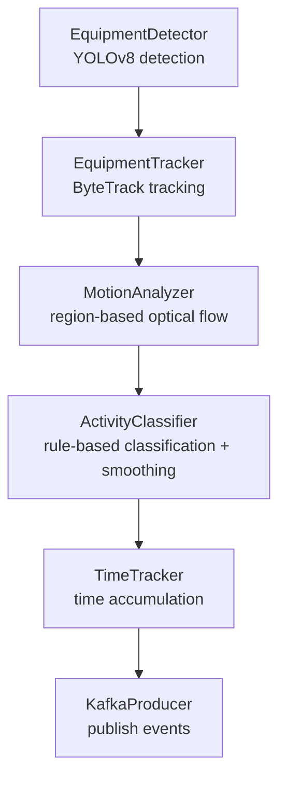
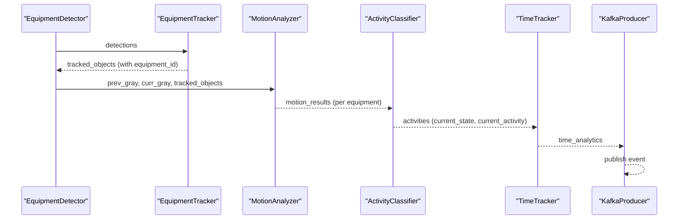
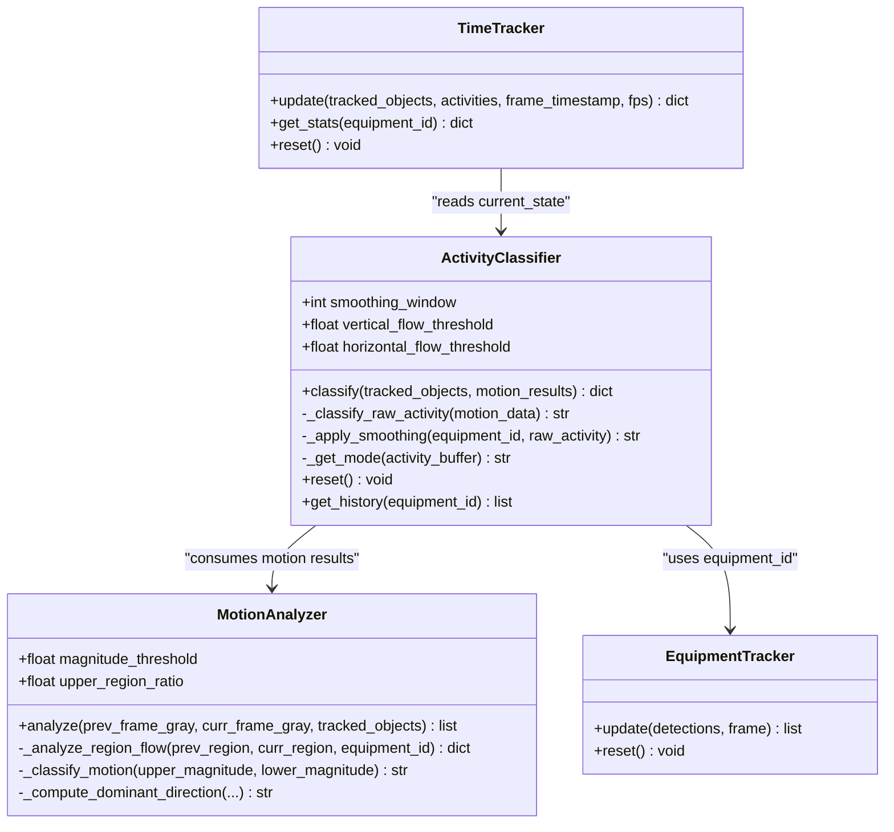
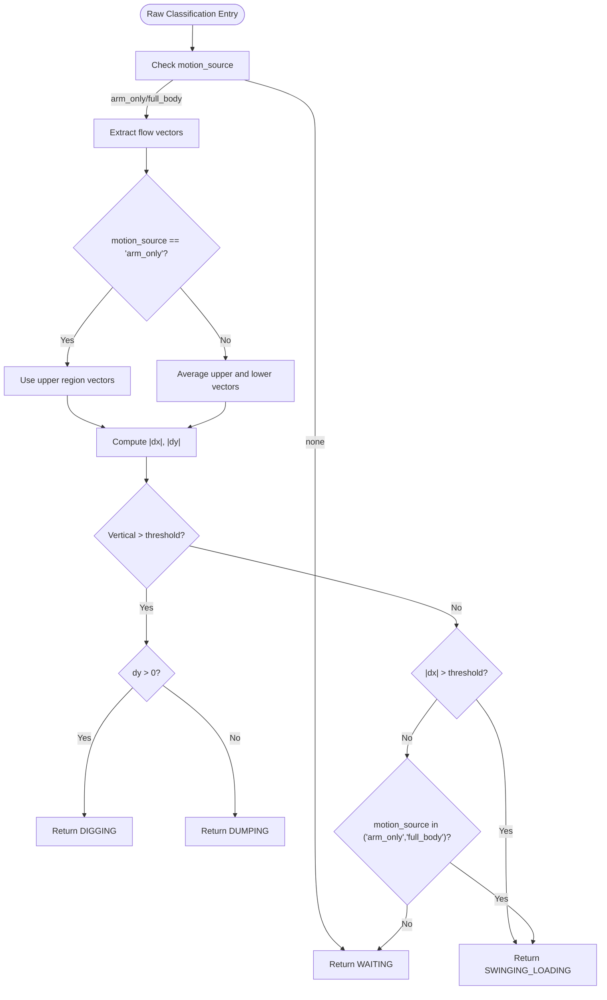
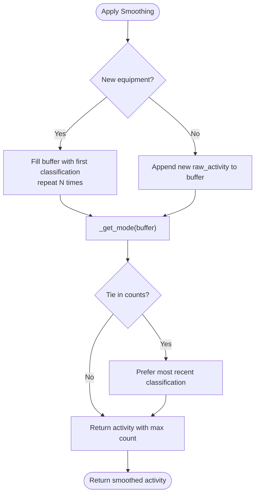
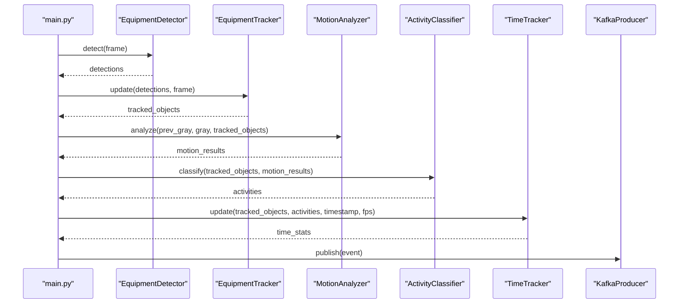
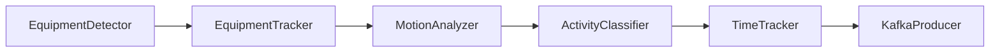

# Activity Classification

<cite>
**Referenced Files in This Document**
- [activity_classifier.py](file://services/cv_service/src/activity_classifier.py)
- [motion_analyzer.py](file://services/cv_service/src/motion_analyzer.py)
- [tracker.py](file://services/cv_service/src/tracker.py)
- [time_tracker.py](file://services/cv_service/src/time_tracker.py)
- [main.py](file://services/cv_service/src/main.py)
- [settings.yaml](file://config/settings.yaml)
- [test_activity_classifier.py](file://tests/test_activity_classifier.py)
</cite>

## Table of Contents
1. [Introduction](#introduction)
2. [Project Structure](#project-structure)
3. [Core Components](#core-components)
4. [Architecture Overview](#architecture-overview)
5. [Detailed Component Analysis](#detailed-component-analysis)
6. [Dependency Analysis](#dependency-analysis)
7. [Performance Considerations](#performance-considerations)
8. [Troubleshooting Guide](#troubleshooting-guide)
9. [Conclusion](#conclusion)

## Introduction
This document explains the activity classification component used to infer construction equipment operational states from tracking and motion analysis results. The ActivityClassifier implements a rule-based classification system that determines whether equipment is actively performing tasks (digging, swinging/loading, dumping) or idling (WAITING). It applies N-frame smoothing to reduce flickering caused by noisy motion detection and integrates with the broader computer vision pipeline to produce time-stamped events for downstream analytics.

## Project Structure
The activity classification logic resides in the CV service module and is orchestrated by the main pipeline. The relevant files are organized as follows:
- ActivityClassifier: rule-based classification with smoothing
- MotionAnalyzer: region-based optical flow analysis to determine motion source
- EquipmentTracker: multi-object tracking to provide consistent equipment identities
- TimeTracker: time accumulation and utilization metrics
- main.py: orchestration of detection, tracking, motion analysis, classification, time tracking, and event publishing
- settings.yaml: configuration for activity classification thresholds and smoothing window
- tests: unit tests validating classification rules and smoothing behavior

**Diagram sources**
- [main.py:323-372](file://services/cv_service/src/main.py#L323-L372)
- [activity_classifier.py:71-125](file://services/cv_service/src/activity_classifier.py#L71-L125)
- [motion_analyzer.py:88-166](file://services/cv_service/src/motion_analyzer.py#L88-L166)
- [tracker.py:159-264](file://services/cv_service/src/tracker.py#L159-L264)

**Section sources**
- [main.py:104-142](file://services/cv_service/src/main.py#L104-L142)
- [settings.yaml:36-39](file://config/settings.yaml#L36-L39)

## Core Components
- ActivityClassifier: Implements rule-based classification for four activities (DIGGING, SWINGING_LOADING, DUMPING, WAITING) and applies N-frame smoothing to stabilize decisions.
- MotionAnalyzer: Computes optical flow per region (upper/lower) to classify motion source as “full_body”, “arm_only”, or “none”.
- EquipmentTracker: Provides consistent equipment IDs across frames using ByteTrack.
- TimeTracker: Aggregates time-based utilization metrics per equipment.
- main.py: Orchestrates the pipeline and publishes structured events to Kafka.

Key configuration parameters for activity classification:
- smoothing_window: Number of frames used for mode-based smoothing
- vertical_flow_threshold: Minimum vertical flow magnitude to consider upward/downward motion
- horizontal_flow_threshold: Minimum horizontal flow magnitude to consider horizontal motion

These parameters are loaded from the configuration file and passed to the ActivityClassifier constructor.

**Section sources**
- [activity_classifier.py:46-69](file://services/cv_service/src/activity_classifier.py#L46-L69)
- [settings.yaml:36-39](file://config/settings.yaml#L36-L39)

## Architecture Overview
The classification pipeline operates frame-by-frame:
1. EquipmentDetector detects targets in the current frame.
2. EquipmentTracker assigns persistent equipment IDs to detections.
3. MotionAnalyzer computes optical flow for each tracked object’s bounding box split into upper and lower regions, classifying motion source and dominant direction.
4. ActivityClassifier applies classification rules to motion results and applies N-frame smoothing to produce stable activity labels.
5. TimeTracker accumulates time statistics for each equipment.
6. Events are built and published to Kafka.

**Diagram sources**
- [main.py:323-372](file://services/cv_service/src/main.py#L323-L372)
- [activity_classifier.py:71-125](file://services/cv_service/src/activity_classifier.py#L71-L125)
- [motion_analyzer.py:88-166](file://services/cv_service/src/motion_analyzer.py#L88-L166)
- [time_tracker.py:53-120](file://services/cv_service/src/time_tracker.py#L53-L120)

## Detailed Component Analysis

### ActivityClassifier
The ActivityClassifier performs rule-based classification using motion analysis results and applies N-frame smoothing to prevent flickering.

- Activity categories:
  - DIGGING: arm_only motion with dominant downward vertical flow (> vertical_flow_threshold)
  - SWINGING_LOADING: horizontal motion (|dx| > horizontal_flow_threshold) regardless of motion source
  - DUMPING: arm_only motion with dominant upward vertical flow (< -vertical_flow_threshold)
  - WAITING: no motion detected (motion_source == "none")

- Decision logic:
  - For arm_only motion, use upper region flow vectors.
  - For full_body motion, average upper and lower region flow vectors.
  - If no motion is detected, classify as WAITING.
  - If there is motion but no specific rule matches, default to SWINGING_LOADING.

- Smoothing algorithm:
  - Maintains a sliding window (deque) of recent raw classifications per equipment.
  - Returns the mode (most frequent) activity; in case of ties, prefers the most recent classification.
  - On first classification for a new equipment, fills the buffer with the initial classification.

- Output format:
  - current_state: "ACTIVE" for DIGGING, SWINGING_LOADING, DUMPING; "INACTIVE" for WAITING
  - current_activity: one of the four activity categories
  - activity: alias for current_activity
  - motion_source: "full_body", "arm_only", or "none"

Edge cases and conflict resolution:
- Missing motion data: falls back to empty motion defaults (no motion), resulting in WAITING.
- Dict vs list motion results: accepts either format; builds a lookup map keyed by equipment_id.
- Tie-breaking in smoothing: resolves ties by preferring the most recent classification.

Confidence scoring:
- The classifier does not expose explicit numeric confidence scores. Stability is achieved through smoothing and threshold-based rules.

Examples:
- Classification execution: see [process_frame:323-372](file://services/cv_service/src/main.py#L323-L372) invoking ActivityClassifier.classify.
- Rule configuration: see [settings.yaml:36-39](file://config/settings.yaml#L36-L39).
- Result interpretation: see [test_activity_classifier.py:319-370](file://tests/test_activity_classifier.py#L319-L370).

**Section sources**
- [activity_classifier.py:23-125](file://services/cv_service/src/activity_classifier.py#L23-L125)
- [activity_classifier.py:166-231](file://services/cv_service/src/activity_classifier.py#L166-L231)
- [activity_classifier.py:233-286](file://services/cv_service/src/activity_classifier.py#L233-L286)
- [test_activity_classifier.py:51-208](file://tests/test_activity_classifier.py#L51-L208)
- [test_activity_classifier.py:319-370](file://tests/test_activity_classifier.py#L319-L370)

### MotionAnalyzer
The MotionAnalyzer performs region-based optical flow analysis to distinguish articulated motion (e.g., excavator arm) from whole-body motion (e.g., driving).

- Region splitting:
  - Upper region: top fraction of the bounding box (controlled by upper_region_ratio)
  - Lower region: bottom fraction of the bounding box

- Optical flow computation:
  - Uses Farneback dense optical flow with tuned parameters for construction equipment scenes.
  - Computes mean magnitude and mean flow vectors (dx, dy) for each region.

- Motion classification:
  - "full_body": both regions moving
  - "arm_only": only upper region moving
  - "none": neither region moving

- Dominant direction:
  - Determined from the region with higher motion magnitude; uses OpenCV coordinate system (y increasing downward).

- Robustness:
  - Clips bounding boxes to frame boundaries.
  - Skips regions smaller than a minimum size.
  - Handles invalid or empty regions gracefully.

**Section sources**
- [motion_analyzer.py:24-86](file://services/cv_service/src/motion_analyzer.py#L24-L86)
- [motion_analyzer.py:88-166](file://services/cv_service/src/motion_analyzer.py#L88-L166)
- [motion_analyzer.py:192-251](file://services/cv_service/src/motion_analyzer.py#L192-L251)
- [motion_analyzer.py:324-355](file://services/cv_service/src/motion_analyzer.py#L324-L355)
- [motion_analyzer.py:357-417](file://services/cv_service/src/motion_analyzer.py#L357-L417)

### EquipmentTracker
Provides consistent equipment IDs across frames using ByteTrack. The ActivityClassifier relies on these IDs to correlate motion results with activity classifications.

- ID generation:
  - Prefixes equipment IDs by class (e.g., DT-001 for trucks).
  - Sequential numbering per class.

- Matching:
  - Matches tracked detections back to original detections using IoU.

**Section sources**
- [tracker.py:19-83](file://services/cv_service/src/tracker.py#L19-L83)
- [tracker.py:159-264](file://services/cv_service/src/tracker.py#L159-L264)

### TimeTracker
Accumulates time-based utilization metrics per equipment and provides utilization percentages.

- Metrics:
  - total_tracked_seconds: cumulative time tracked
  - total_active_seconds: time in ACTIVE state
  - total_idle_seconds: time in INACTIVE state
  - utilization_percent: total_active_seconds / total_tracked_seconds

- Integration:
  - Updates counters each frame using ActivityClassifier outputs.
  - Builds per-equipment statistics and aggregate totals.

**Section sources**
- [time_tracker.py:21-51](file://services/cv_service/src/time_tracker.py#L21-L51)
- [time_tracker.py:53-120](file://services/cv_service/src/time_tracker.py#L53-L120)
- [time_tracker.py:157-187](file://services/cv_service/src/time_tracker.py#L157-L187)

### Orchestration and Event Publishing
The main pipeline coordinates all stages and publishes structured events to Kafka.

- Frame processing:
  - Detects, tracks, analyzes motion, classifies activity, updates time tracking, and builds events.

- Event schema:
  - Includes frame_id, equipment_id, equipment_class, timestamp, utilization (current_state, current_activity, motion_source), and time_analytics.

**Section sources**
- [main.py:323-372](file://services/cv_service/src/main.py#L323-L372)
- [main.py:270-321](file://services/cv_service/src/main.py#L270-L321)
- [kafka_producer.py:91-112](file://services/cv_service/src/kafka_producer.py#L91-L112)

## Architecture Overview

**Diagram sources**
- [activity_classifier.py:23-125](file://services/cv_service/src/activity_classifier.py#L23-L125)
- [motion_analyzer.py:24-166](file://services/cv_service/src/motion_analyzer.py#L24-L166)
- [tracker.py:159-264](file://services/cv_service/src/tracker.py#L159-L264)
- [time_tracker.py:53-120](file://services/cv_service/src/time_tracker.py#L53-L120)

## Detailed Component Analysis

### Rule-Based Classification Logic
The raw classification logic evaluates motion source and dominant direction to assign activities. The decision flow is summarized below.

**Diagram sources**
- [activity_classifier.py:166-231](file://services/cv_service/src/activity_classifier.py#L166-L231)

**Section sources**
- [activity_classifier.py:166-231](file://services/cv_service/src/activity_classifier.py#L166-L231)
- [test_activity_classifier.py:441-542](file://tests/test_activity_classifier.py#L441-L542)

### N-Frame Smoothing Algorithm
The smoothing algorithm stabilizes activity decisions by selecting the mode (most frequent) activity over the last N frames. Ties are broken by preferring the most recent classification.

**Diagram sources**
- [activity_classifier.py:233-286](file://services/cv_service/src/activity_classifier.py#L233-L286)

**Section sources**
- [activity_classifier.py:233-286](file://services/cv_service/src/activity_classifier.py#L233-L286)
- [test_activity_classifier.py:219-290](file://tests/test_activity_classifier.py#L219-L290)

### Integration in the Pipeline
The main pipeline orchestrates detection, tracking, motion analysis, classification, time tracking, and event publishing.

**Diagram sources**
- [main.py:323-372](file://services/cv_service/src/main.py#L323-L372)

**Section sources**
- [main.py:323-372](file://services/cv_service/src/main.py#L323-L372)

## Dependency Analysis
- ActivityClassifier depends on MotionAnalyzer outputs and EquipmentTracker IDs.
- TimeTracker consumes ActivityClassifier outputs to compute utilization metrics.
- main.py orchestrates all components and publishes events to Kafka.

**Diagram sources**
- [main.py:323-372](file://services/cv_service/src/main.py#L323-L372)
- [activity_classifier.py:71-125](file://services/cv_service/src/activity_classifier.py#L71-L125)
- [time_tracker.py:53-120](file://services/cv_service/src/time_tracker.py#L53-L120)

**Section sources**
- [main.py:104-142](file://services/cv_service/src/main.py#L104-L142)

## Performance Considerations
- Smoothing window size: Larger windows increase stability but may slow response to activity transitions.
- Thresholds: Tuning vertical and horizontal thresholds affects sensitivity to motion; higher thresholds reduce false positives but may miss subtle motions.
- Frame skip: Skipping frames reduces computational load; ensure smoothing window compensates for reduced frame rate.
- Optical flow parameters: Farneback parameters are optimized for construction equipment; adjust if processing different domains.

[No sources needed since this section provides general guidance]

## Troubleshooting Guide
Common issues and resolutions:
- No motion detected:
  - Verify that MotionAnalyzer receives valid bounding boxes and that regions meet minimum size requirements.
  - Confirm that magnitude_threshold is not set too high for the scene.
- Incorrect activity classification:
  - Check thresholds and motion source classification; ensure arm_only vs full_body distinction aligns with equipment type.
  - Validate that smoothing window is sufficient to prevent flickering.
- Missing equipment IDs:
  - Ensure EquipmentTracker is initialized with required configuration and that detections are valid.
- Time tracking anomalies:
  - Confirm that TimeTracker.update is called with correct timestamps and FPS.

Validation references:
- Classification rule tests: [test_activity_classifier.py:441-542](file://tests/test_activity_classifier.py#L441-L542)
- Smoothing behavior tests: [test_activity_classifier.py:219-290](file://tests/test_activity_classifier.py#L219-L290)
- Initialization and defaults: [test_activity_classifier.py:18-41](file://tests/test_activity_classifier.py#L18-L41)

**Section sources**
- [test_activity_classifier.py:18-41](file://tests/test_activity_classifier.py#L18-L41)
- [test_activity_classifier.py:219-290](file://tests/test_activity_classifier.py#L219-L290)
- [test_activity_classifier.py:441-542](file://tests/test_activity_classifier.py#L441-L542)

## Conclusion
The ActivityClassifier provides a robust, rule-based classification system for construction equipment activities, combining region-based motion analysis with N-frame smoothing to produce stable, interpretable results. Its integration with the broader pipeline enables real-time utilization analytics and event-driven workflows suitable for monitoring and optimization.