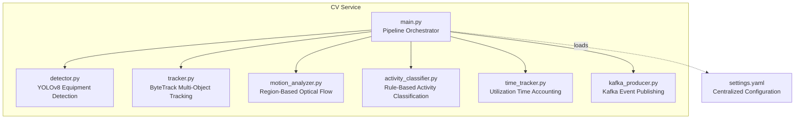
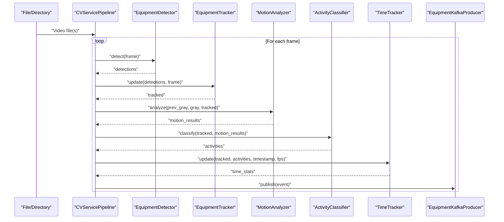
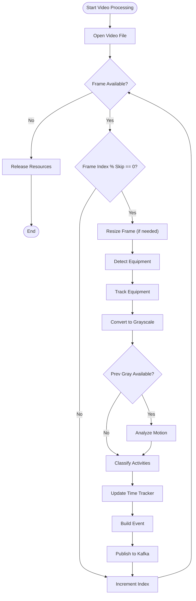
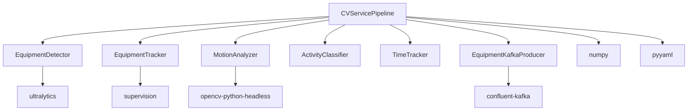

# CV Service

<cite>
**Referenced Files in This Document**
- [main.py](file://services/cv_service/src/main.py)
- [detector.py](file://services/cv_service/src/detector.py)
- [tracker.py](file://services/cv_service/src/tracker.py)
- [motion_analyzer.py](file://services/cv_service/src/motion_analyzer.py)
- [activity_classifier.py](file://services/cv_service/src/activity_classifier.py)
- [time_tracker.py](file://services/cv_service/src/time_tracker.py)
- [kafka_producer.py](file://services/cv_service/src/kafka_producer.py)
- [settings.yaml](file://config/settings.yaml)
- [Dockerfile](file://services/cv_service/Dockerfile)
- [docker-compose.yml](file://docker-compose.yml)
- [requirements.txt](file://services/cv_service/requirements.txt)
- [README.md](file://README.md)
</cite>

## Table of Contents
1. [Introduction](#introduction)
2. [Project Structure](#project-structure)
3. [Core Components](#core-components)
4. [Architecture Overview](#architecture-overview)
5. [Detailed Component Analysis](#detailed-component-analysis)
6. [Dependency Analysis](#dependency-analysis)
7. [Performance Considerations](#performance-considerations)
8. [Troubleshooting Guide](#troubleshooting-guide)
9. [Conclusion](#conclusion)
10. [Appendices](#appendices)

## Introduction
The CV Service microservice is the primary computer vision processing engine responsible for orchestrating the complete pipeline from equipment detection to event publishing. It processes video files through a series of stages: equipment detection using YOLOv8, object tracking with ID persistence, optical flow-based motion analysis, rule-based activity classification, time tracking for utilization metrics, and Kafka event publishing. The service supports two processing modes:
- File mode: Batch processing of all video files present in the input directory, then exits.
- Continuous mode: Watches the input directory for new video files and processes them as they appear.

The pipeline is designed for CPU-only operation with optimizations such as frame skipping and resizing to balance performance and accuracy.

## Project Structure
The CV Service resides under services/cv_service/src and integrates with shared configuration and container orchestration.

**Diagram sources**
- [main.py:42-142](file://services/cv_service/src/main.py#L42-L142)
- [detector.py:18-84](file://services/cv_service/src/detector.py#L18-L84)
- [tracker.py:19-84](file://services/cv_service/src/tracker.py#L19-L84)
- [motion_analyzer.py:24-87](file://services/cv_service/src/motion_analyzer.py#L24-L87)
- [activity_classifier.py:23-70](file://services/cv_service/src/activity_classifier.py#L23-L70)
- [time_tracker.py:21-52](file://services/cv_service/src/time_tracker.py#L21-L52)
- [kafka_producer.py:17-69](file://services/cv_service/src/kafka_producer.py#L17-L69)
- [settings.yaml:1-59](file://config/settings.yaml#L1-L59)

**Section sources**
- [main.py:1-60](file://services/cv_service/src/main.py#L1-L60)
- [settings.yaml:1-59](file://config/settings.yaml#L1-L59)
- [docker-compose.yml:51-63](file://docker-compose.yml#L51-L63)

## Core Components
- CVServicePipeline: The main orchestrator that initializes components, loads configuration, sets up signal handlers for graceful shutdown, and runs either file mode or continuous mode.
- EquipmentDetector: YOLOv8-based detector configured with class mapping and confidence thresholds.
- EquipmentTracker: ByteTrack-based tracker that persists equipment IDs across frames and generates friendly IDs with class-based prefixes.
- MotionAnalyzer: Region-based optical flow analyzer that splits tracked bounding boxes into upper and lower regions to classify motion sources.
- ActivityClassifier: Rule-based classifier using N-frame smoothing to prevent flickering and map motion to activities (DIGGING, SWINGING_LOADING, DUMPING, WAITING).
- TimeTracker: Accumulates total tracked seconds, active seconds, idle seconds, and utilization percentages per equipment.
- EquipmentKafkaProducer: Asynchronous Kafka producer with delivery callbacks, batching, and retry/backoff for publishing events.

**Section sources**
- [main.py:42-142](file://services/cv_service/src/main.py#L42-L142)
- [detector.py:18-84](file://services/cv_service/src/detector.py#L18-L84)
- [tracker.py:19-84](file://services/cv_service/src/tracker.py#L19-L84)
- [motion_analyzer.py:24-87](file://services/cv_service/src/motion_analyzer.py#L24-L87)
- [activity_classifier.py:23-70](file://services/cv_service/src/activity_classifier.py#L23-L70)
- [time_tracker.py:21-52](file://services/cv_service/src/time_tracker.py#L21-L52)
- [kafka_producer.py:17-69](file://services/cv_service/src/kafka_producer.py#L17-L69)

## Architecture Overview
The CV Service orchestrates a five-stage pipeline per frame, building events and publishing them to Kafka.

**Diagram sources**
- [main.py:323-421](file://services/cv_service/src/main.py#L323-L421)
- [detector.py:85-170](file://services/cv_service/src/detector.py#L85-L170)
- [tracker.py:159-265](file://services/cv_service/src/tracker.py#L159-L265)
- [motion_analyzer.py:88-167](file://services/cv_service/src/motion_analyzer.py#L88-L167)
- [activity_classifier.py:71-126](file://services/cv_service/src/activity_classifier.py#L71-L126)
- [time_tracker.py:53-121](file://services/cv_service/src/time_tracker.py#L53-L121)
- [kafka_producer.py:91-169](file://services/cv_service/src/kafka_producer.py#L91-L169)

## Detailed Component Analysis

### CVServicePipeline
Responsibilities:
- Loads configuration from YAML with fallback search paths.
- Initializes all pipeline components (detector, tracker, motion analyzer, activity classifier, time tracker, Kafka producer).
- Sets up SIGTERM/SIGINT handlers for graceful shutdown.
- Implements file mode (process all videos then exit) and continuous mode (watch directory and process new videos).
- Iterates video frames with frame skipping and resizing, processes frames through the pipeline, builds events, and publishes to Kafka.

Key behaviors:
- Configuration loading prioritizes explicit path, then common mount paths, then local paths.
- Frame iteration calculates effective FPS based on frame_skip and resizes frames proportionally.
- Shutdown is handled via signal handlers and a flag checked between frames and during processing loops.

Processing modes:
- File mode: Enumerates video files, resets tracker and time tracker per video, processes each frame, publishes events, and flushes producer.
- Continuous mode: Polls directory periodically, identifies new files, processes them, and continues polling until shutdown.

Error handling:
- Exceptions during frame processing are logged and skipped to keep the pipeline running.
- Graceful shutdown ensures Kafka producer flush/close and resource release.

**Section sources**
- [main.py:69-142](file://services/cv_service/src/main.py#L69-L142)
- [main.py:184-254](file://services/cv_service/src/main.py#L184-L254)
- [main.py:323-421](file://services/cv_service/src/main.py#L323-L421)
- [main.py:422-484](file://services/cv_service/src/main.py#L422-L484)
- [main.py:486-498](file://services/cv_service/src/main.py#L486-L498)

### EquipmentDetector (YOLOv8)
Responsibilities:
- Validates required configuration keys and loads the YOLOv8 model.
- Filters detections to target classes and confidence threshold.
- Returns structured detection results with bounding boxes, confidence, class ID, and class name.

Implementation highlights:
- Uses YOLOv8 inference with imgsz and device parameters.
- Converts supervision-style results to a list of detection dictionaries.
- Applies class filtering and confidence thresholding.

**Section sources**
- [detector.py:35-84](file://services/cv_service/src/detector.py#L35-L84)
- [detector.py:85-170](file://services/cv_service/src/detector.py#L85-L170)

### EquipmentTracker (ByteTrack)
Responsibilities:
- Converts detection dictionaries to supervision Detections format.
- Updates ByteTrack with detections to maintain persistent IDs across frames.
- Generates friendly equipment IDs with class-based prefixes and sequential numbering.
- Computes IoU to map tracked detections back to original detection class names.

Implementation highlights:
- Uses supervision.ByteTrack with configurable thresholds.
- Maintains mappings from internal tracker IDs to equipment IDs and class counters per class.
- Resets state when processing a new video.

**Section sources**
- [tracker.py:35-84](file://services/cv_service/src/tracker.py#L35-L84)
- [tracker.py:159-265](file://services/cv_service/src/tracker.py#L159-L265)
- [tracker.py:266-328](file://services/cv_service/src/tracker.py#L266-L328)
- [tracker.py:329-341](file://services/cv_service/src/tracker.py#L329-L341)

### MotionAnalyzer (Region-Based Optical Flow)
Responsibilities:
- Splits each tracked object’s bounding box into upper (arm/boom) and lower (base/tracks) regions.
- Computes dense optical flow using Farneback method for each region.
- Classifies motion source as full_body, arm_only, or none based on magnitude thresholds.
- Determines dominant direction from active region(s).

Implementation highlights:
- Clips bounding boxes to frame boundaries and validates region sizes.
- Computes mean flow magnitudes and directional vectors per region.
- Classifies motion using magnitude thresholds and determines dominant direction.

**Section sources**
- [motion_analyzer.py:59-87](file://services/cv_service/src/motion_analyzer.py#L59-L87)
- [motion_analyzer.py:88-167](file://services/cv_service/src/motion_analyzer.py#L88-L167)
- [motion_analyzer.py:192-251](file://services/cv_service/src/motion_analyzer.py#L192-L251)
- [motion_analyzer.py:324-356](file://services/cv_service/src/motion_analyzer.py#L324-L356)
- [motion_analyzer.py:357-418](file://services/cv_service/src/motion_analyzer.py#L357-L418)

### ActivityClassifier (Rule-Based Classification)
Responsibilities:
- Classifies equipment activity based on motion analysis results.
- Uses N-frame smoothing with mode-based voting to prevent flickering.
- Maps motion rules to activities: DIGGING, SWINGING_LOADING, DUMPING, WAITING.

Implementation highlights:
- Builds a motion lookup map from motion results.
- Applies rules using vertical and horizontal flow thresholds.
- Maintains per-equipment deques for smoothing and returns smoothed activity.

**Section sources**
- [activity_classifier.py:46-70](file://services/cv_service/src/activity_classifier.py#L46-L70)
- [activity_classifier.py:71-126](file://services/cv_service/src/activity_classifier.py#L71-L126)
- [activity_classifier.py:166-232](file://services/cv_service/src/activity_classifier.py#L166-L232)
- [activity_classifier.py:233-287](file://services/cv_service/src/activity_classifier.py#L233-L287)

### TimeTracker (Utilization Metrics)
Responsibilities:
- Tracks total tracked seconds, total active seconds, total idle seconds, and utilization percentage per equipment.
- Updates counters per frame using 1/fps increments.
- Provides per-equipment and aggregate statistics.

Implementation highlights:
- Initializes stats for new equipment and accumulates time deltas.
- Calculates utilization percent from accumulated totals.
- Resets statistics when starting a new video.

**Section sources**
- [time_tracker.py:37-52](file://services/cv_service/src/time_tracker.py#L37-L52)
- [time_tracker.py:53-121](file://services/cv_service/src/time_tracker.py#L53-L121)
- [time_tracker.py:122-211](file://services/cv_service/src/time_tracker.py#L122-L211)
- [time_tracker.py:212-265](file://services/cv_service/src/time_tracker.py#L212-L265)

### EquipmentKafkaProducer (Event Publishing)
Responsibilities:
- Serializes events to JSON and publishes to Kafka with delivery callbacks.
- Partitions messages by equipment_id for ordering.
- Handles retries, backoff, batching, and flush/close semantics.

Implementation highlights:
- Producer configuration includes acks=all, retries, linger, and batch size for reliability and throughput.
- Delivery callback decrements pending count and logs errors.
- Flush waits for pending messages with timeout and logs remaining messages.

**Section sources**
- [kafka_producer.py:25-69](file://services/cv_service/src/kafka_producer.py#L25-L69)
- [kafka_producer.py:70-90](file://services/cv_service/src/kafka_producer.py#L70-L90)
- [kafka_producer.py:91-169](file://services/cv_service/src/kafka_producer.py#L91-L169)
- [kafka_producer.py:170-228](file://services/cv_service/src/kafka_producer.py#L170-L228)

### Frame Processing Workflow and Video Handling
- Frame iteration opens video via OpenCV, reads frames in a loop, applies frame skipping, and resizes frames proportionally.
- Grayscale conversion is performed for motion analysis.
- The pipeline processes each frame through detection, tracking, motion analysis, activity classification, time tracking, and event building/publishing.

**Diagram sources**
- [main.py:184-254](file://services/cv_service/src/main.py#L184-L254)
- [main.py:323-421](file://services/cv_service/src/main.py#L323-L421)

**Section sources**
- [main.py:184-254](file://services/cv_service/src/main.py#L184-L254)
- [main.py:323-421](file://services/cv_service/src/main.py#L323-L421)

## Dependency Analysis
External libraries and their roles:
- ultralytics: YOLOv8 model inference.
- opencv-python-headless: Video capture, grayscale conversion, optical flow.
- supervision: ByteTrack multi-object tracking.
- confluent-kafka: Kafka producer with asynchronous delivery and batching.
- numpy: Numerical operations for arrays and statistics.
- pyyaml: YAML configuration parsing.

**Diagram sources**
- [requirements.txt:1-7](file://services/cv_service/requirements.txt#L1-L7)
- [main.py:24-29](file://services/cv_service/src/main.py#L24-L29)

**Section sources**
- [requirements.txt:1-7](file://services/cv_service/requirements.txt#L1-L7)
- [main.py:24-29](file://services/cv_service/src/main.py#L24-L29)

## Performance Considerations
- CPU-only optimization:
  - YOLOv8n (nano) reduces model size and improves speed compared to larger variants.
  - Frame skipping reduces processing workload by processing every Nth frame.
  - Resizing frames to a smaller width reduces pixel count and speeds inference.
  - Crop-based optical flow avoids full-frame computation by operating within bounding boxes.
- Producer tuning:
  - linger.ms and batch.size improve throughput.
  - acks=all and retries ensure reliability.
- Logging and monitoring:
  - Structured logging aids performance diagnostics and debugging.

[No sources needed since this section provides general guidance]

## Troubleshooting Guide
Common issues and resolutions:
- Model loading failures:
  - Ensure the YOLOv8 model path is correct and accessible in the container.
  - Verify device setting matches available hardware (cpu/cuda).
- Video file handling:
  - Confirm input directory volume mounting and file permissions.
  - Check frame_skip and resize_width settings for performance vs. accuracy trade-offs.
- Kafka connectivity:
  - Verify bootstrap_servers and topic configuration.
  - Ensure Kafka and Zookeeper are healthy before starting the service.
- Graceful shutdown:
  - SIGTERM/SIGINT triggers shutdown; confirm logs show “Shutting down” and “shutdown complete”.

Operational checks:
- Logs indicate successful initialization of each component and progress during processing.
- Kafka producer logs delivery callbacks and warnings for buffer full conditions.

**Section sources**
- [main.py:69-103](file://services/cv_service/src/main.py#L69-L103)
- [main.py:143-159](file://services/cv_service/src/main.py#L143-L159)
- [main.py:486-498](file://services/cv_service/src/main.py#L486-L498)
- [kafka_producer.py:59-69](file://services/cv_service/src/kafka_producer.py#L59-L69)
- [kafka_producer.py:153-169](file://services/cv_service/src/kafka_producer.py#L153-L169)

## Conclusion
The CV Service microservice provides a robust, CPU-optimized pipeline for equipment detection, tracking, motion analysis, activity classification, and utilization metrics, all streamed to Kafka for downstream analytics. Its modular design, configuration-driven tuning, and graceful shutdown support enable reliable batch and continuous processing of video feeds. The architecture balances accuracy and performance, leveraging region-based optical flow and rule-based classification to deliver actionable insights for construction equipment monitoring.

[No sources needed since this section summarizes without analyzing specific files]

## Appendices

### Configuration Options
Key configuration parameters and defaults are defined in settings.yaml. They include:
- video: frame_skip, resize_width, input_dir
- detection: model, confidence_threshold, device, input_size, target_classes, class_names
- tracking: track_thresh, track_buffer, match_thresh, equipment_id_prefix
- motion: magnitude_threshold, upper_region_ratio, flow_method
- activity: smoothing_window, vertical_flow_threshold, horizontal_flow_threshold
- kafka: bootstrap_servers, topic, client_id, consumer_group
- database: host, port, name, user, password, uri
- dashboard: api_url, refresh_interval, page_title

**Section sources**
- [settings.yaml:1-59](file://config/settings.yaml#L1-L59)

### Containerization and Orchestration
- Dockerfile installs system dependencies for OpenCV, CPU-only PyTorch, and Python packages, then runs the main module.
- docker-compose defines services for Zookeeper, Kafka, Postgres, CV Service, Analytics Backend, and Dashboard, with volume mounts for videos and config.

**Section sources**
- [Dockerfile:1-27](file://services/cv_service/Dockerfile#L1-L27)
- [docker-compose.yml:1-95](file://docker-compose.yml#L1-L95)

### API and Message Schema
- Kafka message schema includes frame_id, equipment_id, equipment_class, timestamp, utilization, and time_analytics.
- The CV Service publishes one event per tracked equipment per processed frame.

**Section sources**
- [kafka_producer.py:91-113](file://services/cv_service/src/kafka_producer.py#L91-L113)
- [main.py:270-322](file://services/cv_service/src/main.py#L270-L322)