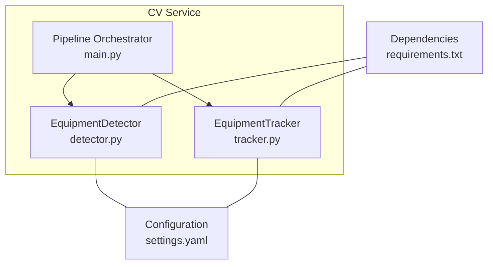
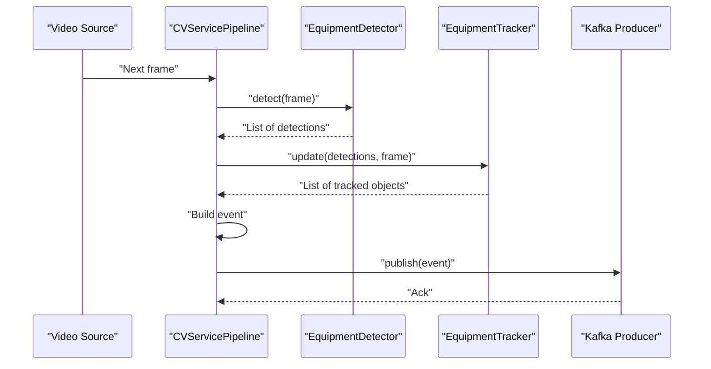
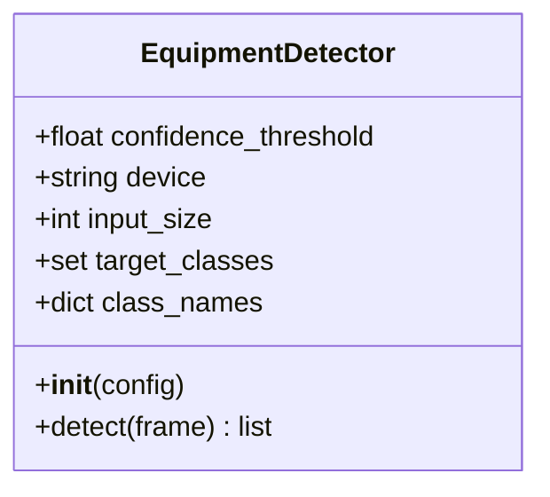
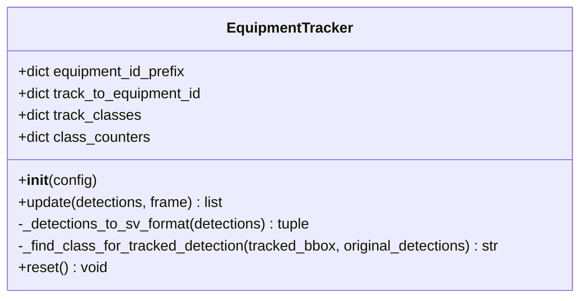
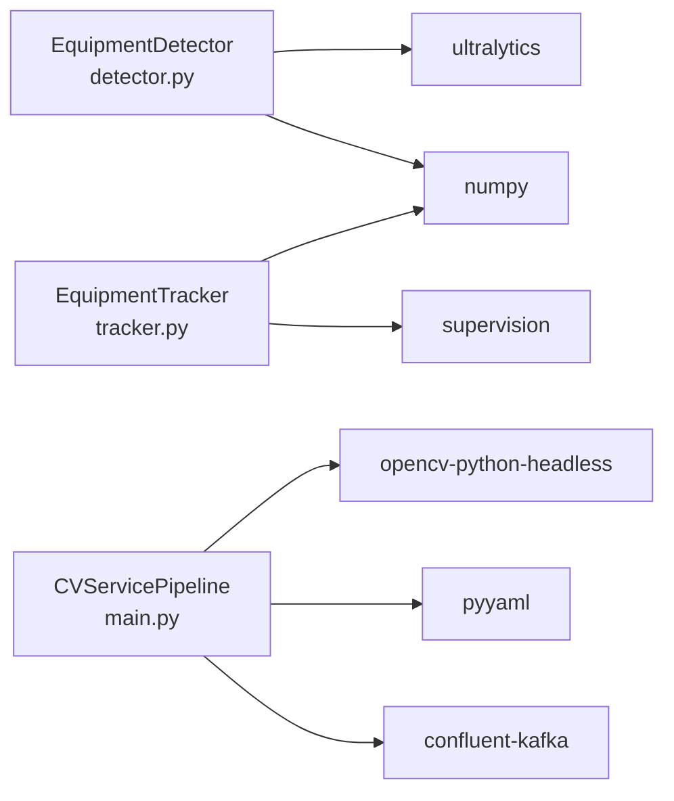

# Equipment Detection

<cite>
**Referenced Files in This Document**
- [detector.py](file://services/cv_service/src/detector.py)
- [tracker.py](file://services/cv_service/src/tracker.py)
- [main.py](file://services/cv_service/src/main.py)
- [settings.yaml](file://config/settings.yaml)
- [test_detector.py](file://tests/test_detector.py)
- [conftest.py](file://tests/conftest.py)
- [requirements.txt](file://services/cv_service/requirements.txt)
- [README.md](file://README.md)
</cite>

## Table of Contents
1. [Introduction](#introduction)
2. [Project Structure](#project-structure)
3. [Core Components](#core-components)
4. [Architecture Overview](#architecture-overview)
5. [Detailed Component Analysis](#detailed-component-analysis)
6. [Dependency Analysis](#dependency-analysis)
7. [Performance Considerations](#performance-considerations)
8. [Troubleshooting Guide](#troubleshooting-guide)
9. [Conclusion](#conclusion)
10. [Appendices](#appendices)

## Introduction
This document explains the equipment detection component that powers construction equipment monitoring. It focuses on the EquipmentDetector class using YOLOv8 for object detection, including configuration, preprocessing, inference, and post-processing. It also covers integration with the tracking component and how detection results are formatted for downstream processing. Practical examples demonstrate configuration, inference execution, and result interpretation.

## Project Structure
The equipment detection is implemented in the CV service and orchestrated by the main pipeline. The configuration is centralized in settings.yaml.

**Diagram sources**
- [detector.py:18-170](file://services/cv_service/src/detector.py#L18-L170)
- [tracker.py:19-341](file://services/cv_service/src/tracker.py#L19-L341)
- [main.py:42-571](file://services/cv_service/src/main.py#L42-L571)
- [settings.yaml:1-59](file://config/settings.yaml#L1-L59)
- [requirements.txt:1-7](file://services/cv_service/requirements.txt#L1-L7)

**Section sources**
- [main.py:104-142](file://services/cv_service/src/main.py#L104-L142)
- [settings.yaml:8-30](file://config/settings.yaml#L8-L30)

## Core Components
- EquipmentDetector: Loads a YOLOv8 model and performs detection on frames, filtering by COCO class IDs and confidence threshold. It returns structured detection results suitable for tracking.
- EquipmentTracker: Converts detection results into supervision Detections, applies ByteTrack multi-object tracking, and assigns persistent equipment IDs with class-based prefixes.
- CVServicePipeline: Initializes detectors and trackers, iterates frames, runs detection and tracking, and publishes events to Kafka.

Key responsibilities:
- Detection: model loading, preprocessing, inference, filtering, and result formatting.
- Tracking: conversion to supervision format, updating ByteTrack, mapping class names, and generating friendly IDs.
- Orchestration: frame iteration, pipeline sequencing, and event building/publishing.

**Section sources**
- [detector.py:35-84](file://services/cv_service/src/detector.py#L35-L84)
- [tracker.py:35-84](file://services/cv_service/src/tracker.py#L35-L84)
- [main.py:104-142](file://services/cv_service/src/main.py#L104-L142)

## Architecture Overview
End-to-end flow from video frames to Kafka events:

**Diagram sources**
- [main.py:323-372](file://services/cv_service/src/main.py#L323-L372)
- [detector.py:85-169](file://services/cv_service/src/detector.py#L85-L169)
- [tracker.py:159-264](file://services/cv_service/src/tracker.py#L159-L264)

## Detailed Component Analysis

### EquipmentDetector
Implements YOLOv8-based detection tailored for construction vehicles (car, bus, truck) using COCO class IDs.

- Initialization
  - Validates required keys: model path, confidence threshold, device, input size, target classes, class names.
  - Loads YOLOv8 model and logs configuration.
  - Stores configuration for later use.

- Detection pipeline
  - Skips empty frames.
  - Runs inference with imgsz and device parameters.
  - Parses results: boxes, confidences, class IDs.
  - Filters by target classes and confidence threshold.
  - Maps class IDs to friendly names.
  - Returns structured detections with bbox, confidence, class_id, class_name.

- Output format
  - Each detection is a dictionary with keys: bbox (list of four floats), confidence (float), class_id (int), class_name (string).

- Error handling
  - Graceful handling of empty frames, missing results, and inference exceptions.

**Diagram sources**
- [detector.py:18-84](file://services/cv_service/src/detector.py#L18-L84)

**Section sources**
- [detector.py:35-84](file://services/cv_service/src/detector.py#L35-L84)
- [detector.py:85-169](file://services/cv_service/src/detector.py#L85-L169)

### EquipmentTracker
Provides multi-object tracking using ByteTrack via the supervision library and assigns persistent equipment IDs.

- Initialization
  - Validates required keys: track_thresh, track_buffer, match_thresh, equipment_id_prefix.
  - Creates ByteTrack instance with configured thresholds.
  - Maintains mappings for track IDs to equipment IDs and class names, plus per-class counters.

- Conversion to supervision format
  - Transforms detection dictionaries into supervision Detections with xyxy, confidence, and class_id arrays.

- Tracking update
  - Updates ByteTrack with supervision Detections.
  - For each tracked detection, resolves class name by IoU matching against original detections.
  - Assigns new equipment IDs with class-based prefixes and sequential numbering.
  - Returns tracked objects with equipment_id, equipment_class, bbox, confidence, and track_id.

- Utilities
  - IoU computation helper for class name resolution.
  - Reset method to clear state.

**Diagram sources**
- [tracker.py:19-84](file://services/cv_service/src/tracker.py#L19-L84)
- [tracker.py:159-264](file://services/cv_service/src/tracker.py#L159-L264)

**Section sources**
- [tracker.py:35-84](file://services/cv_service/src/tracker.py#L35-L84)
- [tracker.py:159-264](file://services/cv_service/src/tracker.py#L159-L264)

### Configuration Options
Centralized configuration in settings.yaml controls detection and tracking behavior.

- Detection parameters
  - model: YOLOv8 model path (e.g., yolov8n.pt).
  - confidence_threshold: Minimum confidence for valid detections (0–1).
  - device: Computing device ("cpu" or "cuda").
  - input_size: Input image size for inference (e.g., 640).
  - target_classes: COCO class IDs to detect (e.g., [2, 5, 7] for car, bus, truck).
  - class_names: Mapping from COCO class IDs to friendly names.

- Tracking parameters
  - track_thresh: Detection confidence threshold for track activation.
  - track_buffer: Number of frames to keep lost tracks alive.
  - match_thresh: IoU threshold for matching detections to tracks.
  - equipment_id_prefix: Mapping of class names to ID prefixes (e.g., truck: DT, car: VH, bus: BU, default: EQ).

- Video processing parameters
  - frame_skip: Process every Nth frame for CPU performance.
  - resize_width: Resize frame width for inference.

- Motion and activity parameters
  - magnitude_threshold, upper_region_ratio, flow_method.
  - smoothing_window, vertical_flow_threshold, horizontal_flow_threshold.

- Kafka and database parameters
  - bootstrap_servers, topic, client_id, consumer_group.
  - host, port, name, user, password, uri.

**Section sources**
- [settings.yaml:8-30](file://config/settings.yaml#L8-L30)
- [settings.yaml:31-59](file://config/settings.yaml#L31-L59)

### Preprocessing, Model Loading, Inference, and Post-processing
- Preprocessing
  - Frame iteration applies frame skipping and resizing according to video configuration.
  - Grayscale conversion occurs before motion analysis.

- Model loading
  - EquipmentDetector loads the YOLOv8 model from the configured path and device.

- Inference
  - EquipmentDetector runs inference with imgsz and device parameters.
  - Results are parsed into boxes, confidences, and class IDs.

- Post-processing
  - EquipmentDetector filters detections by target_classes and confidence_threshold, then maps class IDs to names.
  - EquipmentTracker converts detections to supervision Detections, updates ByteTrack, resolves class names via IoU, and assigns equipment IDs.

**Section sources**
- [main.py:184-253](file://services/cv_service/src/main.py#L184-L253)
- [detector.py:114-169](file://services/cv_service/src/detector.py#L114-L169)
- [tracker.py:127-157](file://services/cv_service/src/tracker.py#L127-L157)

### Integration with Tracking and Downstream Processing
- Integration with tracking
  - CVServicePipeline calls EquipmentDetector.detect(frame) and passes results to EquipmentTracker.update(detections, frame).
  - EquipmentTracker returns tracked objects with equipment_id, equipment_class, bbox, confidence, and track_id.

- Formatting for downstream processing
  - CVServicePipeline builds Kafka events from tracked equipment, activity classification results, and time analytics.
  - Events include frame_id, equipment_id, equipment_class, timestamp, utilization state/activity/motion_source, and time analytics.

**Section sources**
- [main.py:346-372](file://services/cv_service/src/main.py#L346-L372)
- [main.py:270-321](file://services/cv_service/src/main.py#L270-L321)

### Examples

- Detection configuration
  - Configure detection in settings.yaml with model path, confidence threshold, device, input size, target classes, and class names mapping.

- Inference execution
  - Initialize EquipmentDetector with detection_config.
  - Call detect(frame) to obtain detections.

- Result interpretation
  - Each detection contains bbox, confidence, class_id, and class_name.
  - After tracking, each tracked object contains equipment_id, equipment_class, bbox, confidence, and track_id.

**Section sources**
- [settings.yaml:8-20](file://config/settings.yaml#L8-L20)
- [detector.py:85-169](file://services/cv_service/src/detector.py#L85-L169)
- [tracker.py:159-264](file://services/cv_service/src/tracker.py#L159-L264)
- [main.py:323-372](file://services/cv_service/src/main.py#L323-L372)

## Dependency Analysis
External dependencies and their roles:
- ultralytics: YOLOv8 model interface.
- opencv-python-headless: Video capture and image processing.
- supervision: ByteTrack multi-object tracking and Detections format.
- confluent-kafka: Event publishing to Kafka.
- numpy: Numerical operations for arrays.
- pyyaml: Configuration parsing.

**Diagram sources**
- [requirements.txt:1-7](file://services/cv_service/requirements.txt#L1-L7)
- [detector.py:12](file://services/cv_service/src/detector.py#L12)
- [tracker.py:13](file://services/cv_service/src/tracker.py#L13)
- [main.py:19-21](file://services/cv_service/src/main.py#L19-L21)

**Section sources**
- [requirements.txt:1-7](file://services/cv_service/requirements.txt#L1-L7)

## Performance Considerations
- CPU optimization strategies
  - Use YOLOv8n (nano) model for lightweight CPU inference.
  - Reduce effective FPS by increasing frame_skip and resizing frames via resize_width.
  - Crop-based optical flow avoids full-frame computation.

- Detection sensitivity tuning
  - Adjust confidence_threshold to balance precision/recall.
  - Modify target_classes to include/exclude COCO classes relevant to your scenario.

- Tracking performance
  - tune track_thresh, track_buffer, and match_thresh to reduce false positives and improve ID stability.

- Practical guidance
  - Increase smoothing_window to reduce flickering in activity classification.
  - Lower magnitude_threshold to increase sensitivity to motion.

**Section sources**
- [README.md:177-198](file://README.md#L177-L198)
- [README.md:294-312](file://README.md#L294-L312)
- [settings.yaml:8-30](file://config/settings.yaml#L8-L30)

## Troubleshooting Guide
- Model loading failures
  - Ensure model path exists and is accessible. The detector raises a runtime error if loading fails.

- Empty or invalid frames
  - The detector returns an empty list for None or empty frames.

- No detections
  - Verify target_classes and confidence_threshold. Lower confidence_threshold or adjust target_classes if nothing is detected.

- Tracking issues
  - If class names are unknown, check match_thresh and ensure sufficient overlap between tracked and original detections.
  - Reset the tracker between videos to clear stale state.

- Inference errors
  - Catch exceptions during inference and handle gracefully; the detector returns an empty list on failure.

**Section sources**
- [detector.py:68-83](file://services/cv_service/src/detector.py#L68-L83)
- [detector.py:114-125](file://services/cv_service/src/detector.py#L114-L125)
- [tracker.py:205-210](file://services/cv_service/src/tracker.py#L205-L210)
- [tracker.py:329-341](file://services/cv_service/src/tracker.py#L329-L341)

## Conclusion
The equipment detection component integrates YOLOv8-based detection with ByteTrack multi-object tracking to monitor construction vehicles. Configuration-driven parameters enable sensitivity tuning, while the pipeline’s modular design supports robust inference and downstream event publishing. The provided examples and troubleshooting guidance facilitate practical deployment and maintenance.

## Appendices

### Appendix A: Detection Parameters Summary
- Detection parameters
  - model: YOLOv8 weights path.
  - confidence_threshold: Minimum detection confidence.
  - device: cpu or cuda.
  - input_size: Image size for inference.
  - target_classes: COCO class IDs to detect.
  - class_names: ID-to-name mapping.

- Tracking parameters
  - track_thresh: Track activation threshold.
  - track_buffer: Lost track buffer frames.
  - match_thresh: IoU matching threshold.
  - equipment_id_prefix: Class-to-ID prefix mapping.

**Section sources**
- [settings.yaml:8-30](file://config/settings.yaml#L8-L30)

### Appendix B: Test Coverage Highlights
- Initialization tests validate required keys and model loading behavior.
- Detection tests verify output format, filtering by class and confidence, and error handling.
- Fixtures provide reusable configuration and sample data for tests.

**Section sources**
- [test_detector.py:18-63](file://tests/test_detector.py#L18-L63)
- [test_detector.py:81-190](file://tests/test_detector.py#L81-L190)
- [conftest.py:14-82](file://tests/conftest.py#L14-L82)