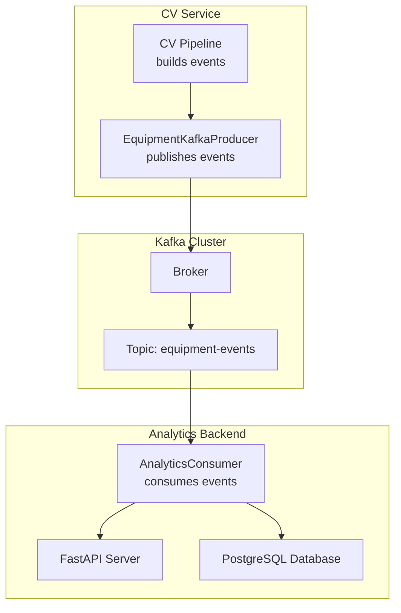
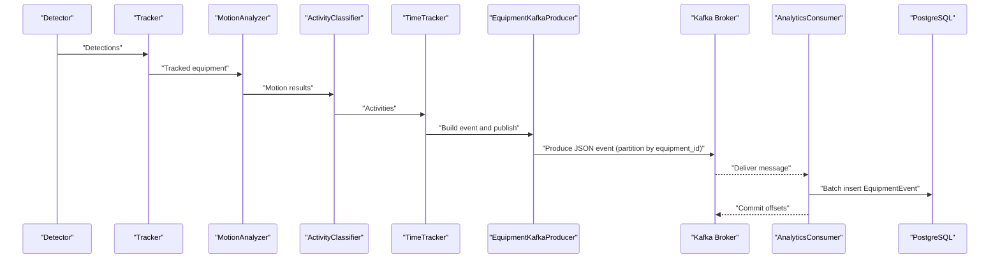
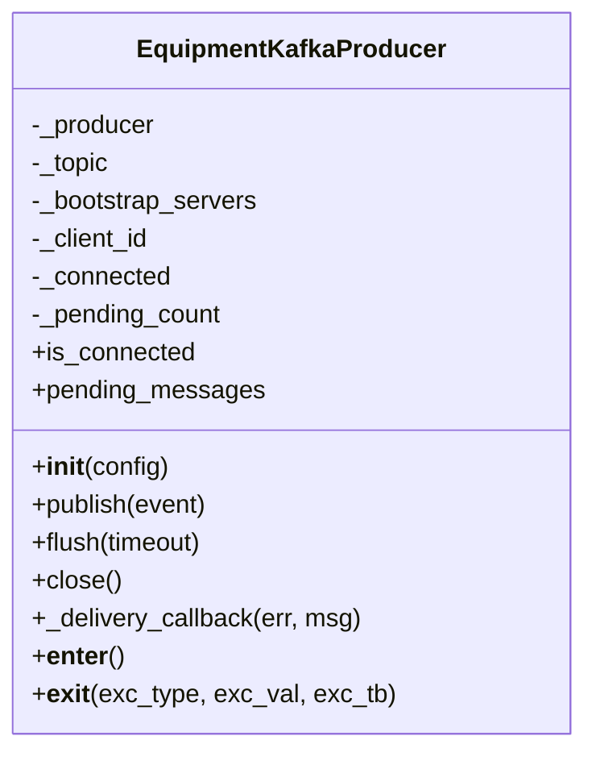
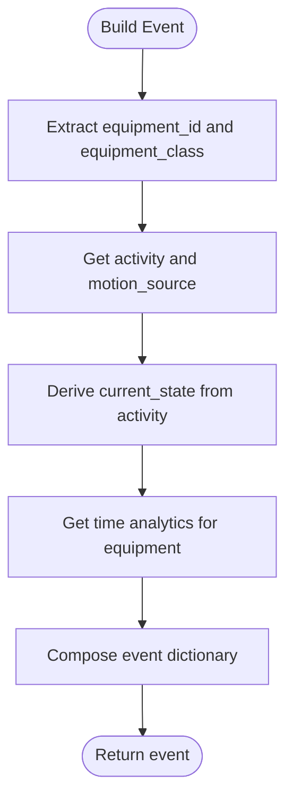
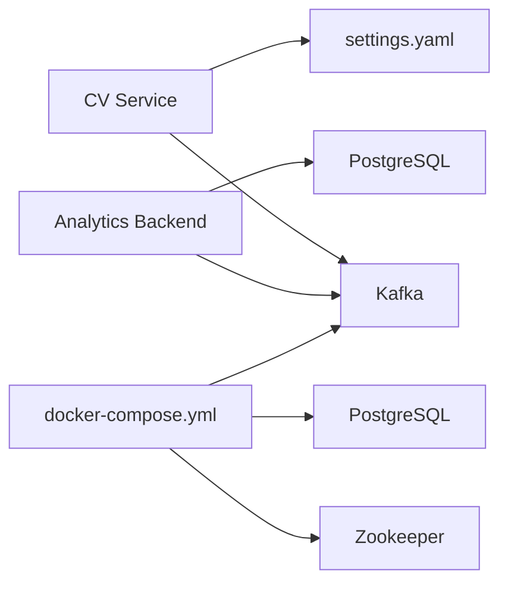

# Kafka Integration

<cite>
**Referenced Files in This Document**
- [kafka_producer.py](file://services/cv_service/src/kafka_producer.py)
- [main.py](file://services/cv_service/src/main.py)
- [settings.yaml](file://config/settings.yaml)
- [consumer.py](file://services/analytics_backend/src/consumer.py)
- [main.py](file://services/analytics_backend/src/main.py)
- [docker-compose.yml](file://docker-compose.yml)
- [requirements.txt](file://services/cv_service/requirements.txt)
- [requirements.txt](file://services/analytics_backend/requirements.txt)
</cite>

## Table of Contents
1. [Introduction](#introduction)
2. [Project Structure](#project-structure)
3. [Core Components](#core-components)
4. [Architecture Overview](#architecture-overview)
5. [Detailed Component Analysis](#detailed-component-analysis)
6. [Dependency Analysis](#dependency-analysis)
7. [Performance Considerations](#performance-considerations)
8. [Troubleshooting Guide](#troubleshooting-guide)
9. [Conclusion](#conclusion)

## Introduction
This document explains the Kafka integration component used to publish equipment utilization and activity events from the Computer Vision (CV) service to a Kafka cluster. It focuses on the EquipmentKafkaProducer class implementation, including producer configuration, topic management, message serialization, event schema, event building, message formatting, batch publishing strategies, error handling, retry mechanisms, and connection management. It also documents configuration options for Kafka brokers, topic names, and producer settings, along with practical examples of producer initialization, event publishing, and error handling procedures.

## Project Structure
The Kafka integration spans two services:
- CV Service (producer): Generates equipment events and publishes them to Kafka.
- Analytics Backend (consumer): Subscribes to the Kafka topic, deserializes messages, and persists them to PostgreSQL.

**Diagram sources**
- [kafka_producer.py:17-227](file://services/cv_service/src/kafka_producer.py#L17-L227)
- [main.py:270-321](file://services/cv_service/src/main.py#L270-L321)
- [consumer.py:23-141](file://services/analytics_backend/src/consumer.py#L23-L141)

**Section sources**
- [docker-compose.yml:15-33](file://docker-compose.yml#L15-L33)
- [settings.yaml:41-46](file://config/settings.yaml#L41-L46)

## Core Components
- EquipmentKafkaProducer: Asynchronous Kafka producer that serializes events to JSON, partitions by equipment_id, and handles delivery callbacks and retries.
- CVServicePipeline: Orchestrates the computer vision pipeline and builds event dictionaries that conform to the Kafka schema.
- AnalyticsConsumer: Consumes messages from Kafka, deserializes JSON payloads, batches writes to PostgreSQL, and commits offsets.

Key responsibilities:
- Producer configuration and connection lifecycle management.
- Event schema validation and serialization.
- Partitioning strategy for ordering by equipment_id.
- Delivery confirmation and error handling.
- Consumer-side batching and transactional persistence.

**Section sources**
- [kafka_producer.py:17-227](file://services/cv_service/src/kafka_producer.py#L17-L227)
- [main.py:270-321](file://services/cv_service/src/main.py#L270-L321)
- [consumer.py:23-244](file://services/analytics_backend/src/consumer.py#L23-L244)

## Architecture Overview
The CV service produces equipment events to Kafka, and the analytics backend consumes them for persistence and API exposure.

**Diagram sources**
- [main.py:323-372](file://services/cv_service/src/main.py#L323-L372)
- [kafka_producer.py:91-169](file://services/cv_service/src/kafka_producer.py#L91-L169)
- [consumer.py:143-200](file://services/analytics_backend/src/consumer.py#L143-L200)

## Detailed Component Analysis

### EquipmentKafkaProducer
The EquipmentKafkaProducer encapsulates Kafka producer configuration, event publishing, delivery callbacks, and resource cleanup.

- Initialization and configuration:
  - Reads bootstrap_servers, topic, and client_id from config.
  - Sets producer settings for reliability and performance:
    - acks: "all" for durability.
    - retries and retry.backoff.ms for retry behavior.
    - linger.ms and batch.size for batching.
    - socket.timeout.ms and request.timeout.ms for connection timeouts.
  - Creates a confluent-kafka Producer instance and logs initialization.

- Event publishing:
  - Validates required fields: frame_id, equipment_id, equipment_class, timestamp.
  - Serializes the event dictionary to UTF-8 JSON bytes.
  - Uses equipment_id as the message key to ensure ordering per equipment.
  - Produces asynchronously and triggers poll(0) to drain callbacks without blocking.
  - Handles BufferError by flushing and retrying once.

- Delivery callback:
  - Decrements pending message counter.
  - Logs errors and debug information for successful deliveries.

- Flush and close:
  - flush(timeout) blocks until all messages are delivered or timeout expires.
  - close() flushes remaining messages, logs closure, and resets internal state.

- Properties and context management:
  - is_connected indicates connection state.
  - pending_messages approximates in-flight messages.
  - Context manager ensures cleanup on exit.

**Diagram sources**
- [kafka_producer.py:17-227](file://services/cv_service/src/kafka_producer.py#L17-L227)

**Section sources**
- [kafka_producer.py:25-68](file://services/cv_service/src/kafka_producer.py#L25-L68)
- [kafka_producer.py:91-169](file://services/cv_service/src/kafka_producer.py#L91-L169)
- [kafka_producer.py:70-89](file://services/cv_service/src/kafka_producer.py#L70-L89)
- [kafka_producer.py:170-191](file://services/cv_service/src/kafka_producer.py#L170-L191)
- [kafka_producer.py:193-209](file://services/cv_service/src/kafka_producer.py#L193-L209)

### Event Schema and Building Process
The CV pipeline constructs events that match the Kafka schema before publishing.

- Event schema fields:
  - frame_id: integer frame index.
  - equipment_id: string identifier.
  - equipment_class: string category.
  - timestamp: string formatted as "HH:MM:SS.mmm".
  - utilization: object with:
    - current_state: "ACTIVE" or "INACTIVE".
    - current_activity: activity type.
    - motion_source: motion detection source.
  - time_analytics: object with:
    - total_tracked_seconds: float.
    - total_active_seconds: float.
    - total_idle_seconds: float.
    - utilization_percent: float.

- Building process:
  - Extracts equipment_id and equipment_class from tracked equipment.
  - Retrieves activity and motion_source from activity classification results.
  - Determines current_state based on activity.
  - Aggregates time statistics from TimeTracker for the equipment.
  - Returns a dictionary matching the schema.

**Diagram sources**
- [main.py:270-321](file://services/cv_service/src/main.py#L270-L321)

**Section sources**
- [main.py:270-321](file://services/cv_service/src/main.py#L270-L321)

### Message Serialization and Formatting
- Serialization:
  - The event dictionary is serialized to JSON using json.dumps with default=str to handle non-serializable types.
  - Encoded to UTF-8 bytes for the message value.
  - The equipment_id is encoded to UTF-8 bytes for the message key.

- Partitioning:
  - Uses equipment_id as the message key to ensure all events for the same equipment are routed to the same partition, preserving ordering.

- Formatting:
  - Timestamps are formatted as "HH:MM:SS.mmm" strings during pipeline processing.

**Section sources**
- [kafka_producer.py:134-146](file://services/cv_service/src/kafka_producer.py#L134-L146)
- [main.py:255-268](file://services/cv_service/src/main.py#L255-L268)

### Batch Publishing Strategies
- Producer batching:
  - linger.ms set to a small value to batch messages efficiently.
  - batch.size tuned for throughput.
  - acks set to "all" for durability guarantees.

- Consumer batching:
  - AnalyticsConsumer batches events and commits every BATCH_SIZE or after BATCH_TIMEOUT seconds.
  - Commits offsets after successful database writes.

**Section sources**
- [kafka_producer.py:48-49](file://services/cv_service/src/kafka_producer.py#L48-L49)
- [consumer.py:31-33](file://services/analytics_backend/src/consumer.py#L31-L33)
- [consumer.py:195-204](file://services/analytics_backend/src/consumer.py#L195-L204)

### Error Handling, Retry Mechanisms, and Connection Management
- Producer error handling:
  - Validates required fields and raises ValueError if missing.
  - Handles BufferError by flushing and retrying once.
  - Catches KafkaException during produce and re-raises after logging.
  - Delivery callback logs errors and debug info.

- Producer retry configuration:
  - retries and retry.backoff.ms configured in producer settings.

- Connection management:
  - Producer initialization attempts to create a Producer instance and logs success or failure.
  - flush(timeout) ensures pending messages are delivered before closing.
  - close() performs a graceful shutdown with a generous timeout.

- Consumer error handling:
  - Handles unknown topic/partition errors and logs warnings.
  - JSON decoding errors are caught and logged.
  - Batch commit failures roll back and log errors.

**Section sources**
- [kafka_producer.py:121-129](file://services/cv_service/src/kafka_producer.py#L121-L129)
- [kafka_producer.py:153-168](file://services/cv_service/src/kafka_producer.py#L153-L168)
- [kafka_producer.py:66-68](file://services/cv_service/src/kafka_producer.py#L66-L68)
- [kafka_producer.py:170-191](file://services/cv_service/src/kafka_producer.py#L170-L191)
- [kafka_producer.py:193-209](file://services/cv_service/src/kafka_producer.py#L193-L209)
- [consumer.py:110-132](file://services/analytics_backend/src/consumer.py#L110-L132)
- [consumer.py:212-226](file://services/analytics_backend/src/consumer.py#L212-L226)

### Configuration Options
- Kafka producer configuration (from settings.yaml):
  - bootstrap_servers: Kafka broker address.
  - topic: Target topic name.
  - client_id: Producer client identifier.
  - consumer_group: Consumer group ID for analytics backend.

- Producer settings (from EquipmentKafkaProducer):
  - acks: "all"
  - retries: 3
  - retry.backoff.ms: 100
  - linger.ms: 5
  - batch.size: 16384
  - socket.timeout.ms: 30000
  - request.timeout.ms: 30000

- Consumer settings (from AnalyticsConsumer):
  - auto.offset.reset: "earliest"
  - enable.auto.commit: False
  - max.poll.interval.ms: 300000
  - session.timeout.ms: 30000

**Section sources**
- [settings.yaml:41-46](file://config/settings.yaml#L41-L46)
- [kafka_producer.py:39-53](file://services/cv_service/src/kafka_producer.py#L39-L53)
- [consumer.py:52-59](file://services/analytics_backend/src/consumer.py#L52-L59)

### Examples

- Producer initialization:
  - Load Kafka configuration from settings.yaml.
  - Instantiate EquipmentKafkaProducer with the kafka config.
  - Use context manager for automatic cleanup.

- Event publishing:
  - Build an event dictionary using the pipeline’s event builder.
  - Call EquipmentKafkaProducer.publish(event).
  - Optionally flush pending messages before shutdown.

- Error handling procedures:
  - Catch ValueError for missing fields.
  - Catch KafkaException during produce and handle appropriately.
  - Use delivery callback logs to diagnose delivery issues.
  - On consumer side, handle JSON decode errors and batch commit failures.

**Section sources**
- [main.py:132-135](file://services/cv_service/src/main.py#L132-L135)
- [kafka_producer.py:91-169](file://services/cv_service/src/kafka_producer.py#L91-L169)
- [consumer.py:124-132](file://services/analytics_backend/src/consumer.py#L124-L132)

## Dependency Analysis
- External libraries:
  - confluent-kafka for producer and consumer.
  - pyyaml for configuration loading.
  - numpy for numerical operations.
  - Additional CV and analytics dependencies as per requirements.

- Service dependencies:
  - CV service depends on Kafka and PostgreSQL (via analytics backend).
  - Analytics backend depends on Kafka and PostgreSQL.

**Diagram sources**
- [docker-compose.yml:15-33](file://docker-compose.yml#L15-L33)
- [docker-compose.yml:35-49](file://docker-compose.yml#L35-L49)
- [requirements.txt](file://services/cv_service/requirements.txt#L4)
- [requirements.txt](file://services/analytics_backend/requirements.txt#L1)

**Section sources**
- [requirements.txt:1-7](file://services/cv_service/requirements.txt#L1-L7)
- [requirements.txt:1-8](file://services/analytics_backend/requirements.txt#L1-L8)
- [docker-compose.yml:15-33](file://docker-compose.yml#L15-L33)
- [docker-compose.yml:35-49](file://docker-compose.yml#L35-L49)

## Performance Considerations
- Producer batching:
  - linger.ms and batch.size balance latency and throughput.
  - acks="all" ensures durability but may increase latency; acceptable for analytics.

- Consumer batching:
  - BATCH_SIZE and BATCH_TIMEOUT reduce database write overhead.

- Connection timeouts:
  - socket.timeout.ms and request.timeout.ms tuned to tolerate network variability.

- Monitoring:
  - Use delivery callback logs to track delivery outcomes and adjust batching/timeout settings.

[No sources needed since this section provides general guidance]

## Troubleshooting Guide
- Producer fails to initialize:
  - Verify bootstrap_servers and topic availability.
  - Check Kafka connectivity and cluster health.

- Messages not delivered:
  - Inspect delivery callback logs for KafkaError details.
  - Confirm acks and retries configuration.

- Buffer full during publish:
  - Producer automatically flushes and retries once; monitor logs for repeated occurrences.

- Consumer not receiving messages:
  - Ensure topic name matches settings.yaml.
  - Check auto.offset.reset and consumer group configuration.
  - Verify database connection and batch commit logs.

- JSON decode errors:
  - Validate event schema and ensure all fields are serializable.

**Section sources**
- [kafka_producer.py:66-68](file://services/cv_service/src/kafka_producer.py#L66-L68)
- [kafka_producer.py:80-89](file://services/cv_service/src/kafka_producer.py#L80-L89)
- [kafka_producer.py:153-168](file://services/cv_service/src/kafka_producer.py#L153-L168)
- [consumer.py:110-132](file://services/analytics_backend/src/consumer.py#L110-L132)
- [consumer.py:212-226](file://services/analytics_backend/src/consumer.py#L212-L226)

## Conclusion
The Kafka integration provides a robust, asynchronous pipeline for publishing equipment utilization and activity events from the CV service to the analytics backend. The EquipmentKafkaProducer offers reliable delivery with configurable retries, batching, and partitioning by equipment_id. The analytics backend consumes messages, batches writes, and commits offsets reliably. Together, these components form a scalable foundation for equipment analytics.