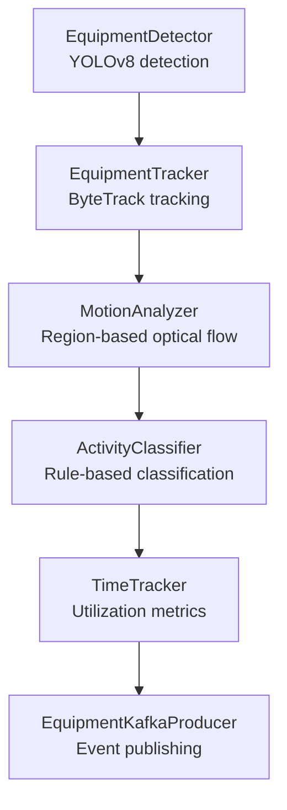
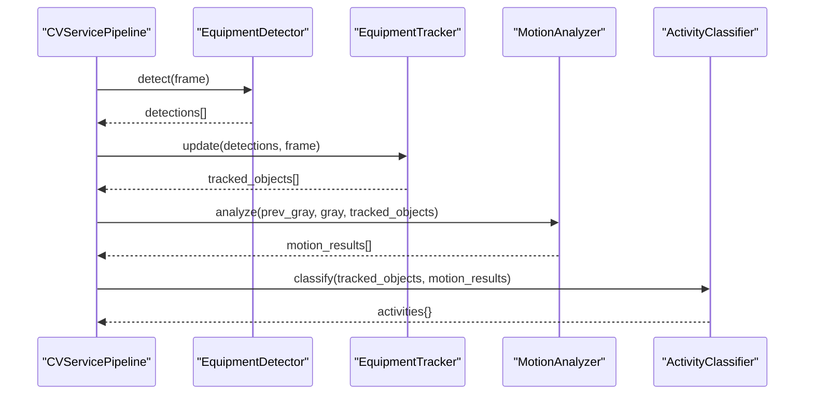
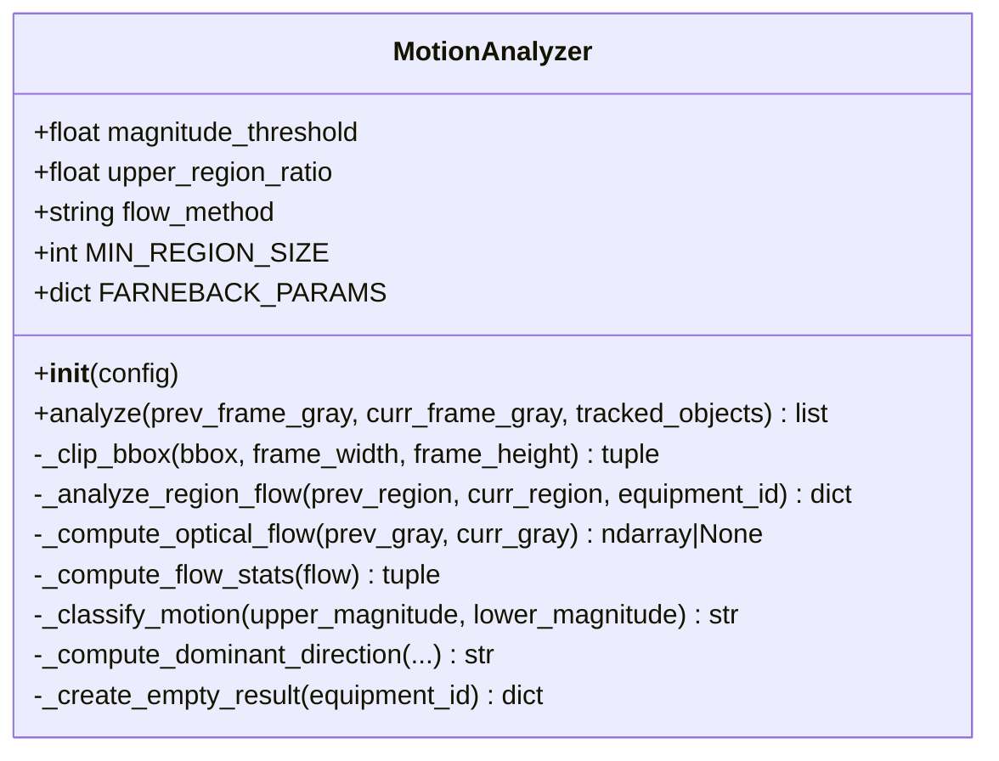
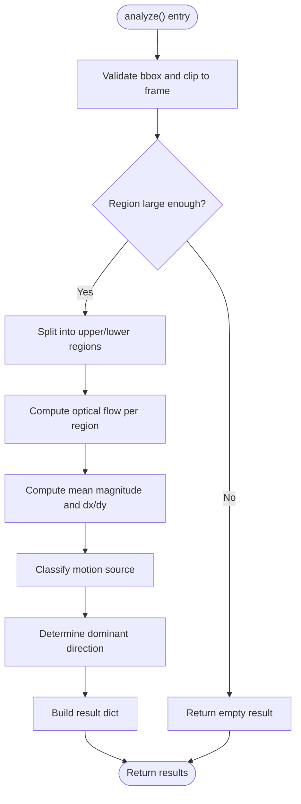
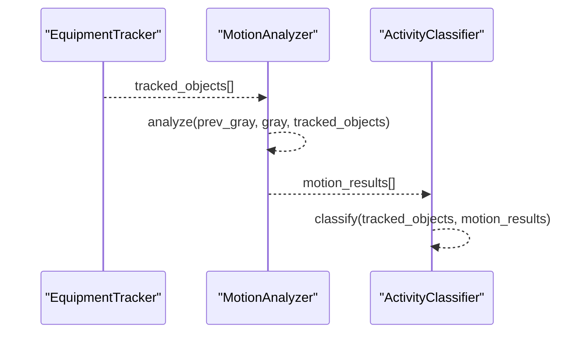
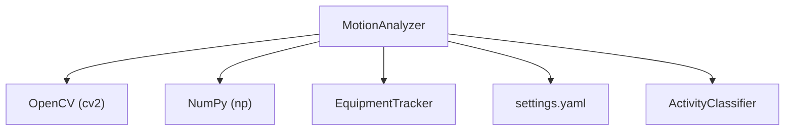

# Motion Analysis

<cite>
**Referenced Files in This Document**
- [motion_analyzer.py](file://services/cv_service/src/motion_analyzer.py)
- [main.py](file://services/cv_service/src/main.py)
- [settings.yaml](file://config/settings.yaml)
- [test_motion_analyzer.py](file://tests/test_motion_analyzer.py)
- [activity_classifier.py](file://services/cv_service/src/activity_classifier.py)
- [tracker.py](file://services/cv_service/src/tracker.py)
</cite>

## Table of Contents
1. [Introduction](#introduction)
2. [Project Structure](#project-structure)
3. [Core Components](#core-components)
4. [Architecture Overview](#architecture-overview)
5. [Detailed Component Analysis](#detailed-component-analysis)
6. [Dependency Analysis](#dependency-analysis)
7. [Performance Considerations](#performance-considerations)
8. [Troubleshooting Guide](#troubleshooting-guide)
9. [Conclusion](#conclusion)
10. [Appendices](#appendices)

## Introduction
This document explains the motion analysis component responsible for detecting and characterizing movement in tracked equipment using optical flow. It focuses on the MotionAnalyzer class, which performs region-based optical flow analysis to distinguish articulated motion (e.g., boom/arm movement) from vehicle travel motion. The motion analysis results integrate with tracking data to inform activity classification and time-based utilization analytics.

## Project Structure
The motion analysis module is part of the computer vision service pipeline. It receives tracked objects and grayscale frames from the pipeline and produces motion classification results consumed by the activity classifier.

**Diagram sources**
- [main.py:323-372](file://services/cv_service/src/main.py#L323-L372)
- [motion_analyzer.py:24-442](file://services/cv_service/src/motion_analyzer.py#L24-L442)
- [activity_classifier.py:23-306](file://services/cv_service/src/activity_classifier.py#L23-L306)
- [tracker.py:19-341](file://services/cv_service/src/tracker.py#L19-L341)

**Section sources**
- [main.py:104-142](file://services/cv_service/src/main.py#L104-L142)

## Core Components
- MotionAnalyzer: Computes dense optical flow on region-split bounding boxes and classifies motion sources.
- ActivityClassifier: Consumes motion results to produce activity labels with smoothing.
- EquipmentTracker: Provides tracked objects with bounding boxes and equipment identifiers.
- Settings: Defines motion sensitivity, region ratios, and optical flow parameters.

**Section sources**
- [motion_analyzer.py:24-87](file://services/cv_service/src/motion_analyzer.py#L24-L87)
- [activity_classifier.py:23-70](file://services/cv_service/src/activity_classifier.py#L23-L70)
- [tracker.py:19-84](file://services/cv_service/src/tracker.py#L19-L84)
- [settings.yaml:31-39](file://config/settings.yaml#L31-L39)

## Architecture Overview
The motion analysis pipeline operates on pairs of consecutive grayscale frames. For each tracked object, the analyzer:
- Clips the bounding box to frame boundaries.
- Splits the region into upper (arm/boom) and lower (base/tracks) parts.
- Computes dense optical flow using Farneback.
- Aggregates per-region flow magnitudes and mean vectors.
- Classifies motion source and determines dominant direction.
- Produces structured results for downstream activity classification.

**Diagram sources**
- [main.py:323-372](file://services/cv_service/src/main.py#L323-L372)
- [motion_analyzer.py:88-166](file://services/cv_service/src/motion_analyzer.py#L88-L166)
- [activity_classifier.py:71-125](file://services/cv_service/src/activity_classifier.py#L71-L125)

## Detailed Component Analysis

### MotionAnalyzer Class
The MotionAnalyzer implements region-based optical flow to differentiate articulated motion from vehicle travel. It uses Farneback dense optical flow and applies configurable thresholds to classify motion sources.

Key attributes and parameters:
- magnitude_threshold: Minimum optical flow magnitude to consider motion significant.
- upper_region_ratio: Fraction of the bounding box height allocated to the upper region.
- flow_method: Currently fixed to "farneback".
- min_region_size: Minimum region dimension for reliable analysis.

Core methods:
- analyze: Orchestrates region extraction, optical flow computation, statistics aggregation, classification, and direction determination.
- _analyze_region_flow: Splits region into upper/lower, computes flow, aggregates statistics, classifies motion, and determines dominant direction.
- _compute_optical_flow: Calls OpenCV Farneback with tuned parameters.
- _compute_flow_stats: Computes mean magnitude and mean dx/dy per region.
- _classify_motion: Determines motion source based on thresholds.
- _compute_dominant_direction: Chooses dominant direction from the higher-magnitude region.

**Diagram sources**
- [motion_analyzer.py:24-442](file://services/cv_service/src/motion_analyzer.py#L24-L442)

**Section sources**
- [motion_analyzer.py:59-87](file://services/cv_service/src/motion_analyzer.py#L59-L87)
- [motion_analyzer.py:88-166](file://services/cv_service/src/motion_analyzer.py#L88-L166)
- [motion_analyzer.py:192-251](file://services/cv_service/src/motion_analyzer.py#L192-L251)
- [motion_analyzer.py:253-293](file://services/cv_service/src/motion_analyzer.py#L253-L293)
- [motion_analyzer.py:294-322](file://services/cv_service/src/motion_analyzer.py#L294-L322)
- [motion_analyzer.py:324-356](file://services/cv_service/src/motion_analyzer.py#L324-L356)
- [motion_analyzer.py:357-418](file://services/cv_service/src/motion_analyzer.py#L357-L418)
- [motion_analyzer.py:419-442](file://services/cv_service/src/motion_analyzer.py#L419-L442)

### Lucas-Kanade vs Farneback
The MotionAnalyzer uses dense optical flow via OpenCV’s Farneback implementation. While Lucas-Kanade is typically used for sparse feature tracking, Farneback is chosen here because:
- It computes dense flow across the entire region, enabling robust region-wise statistics.
- It is well-suited for textured scenes typical in construction environments.
- It provides mean flow magnitudes and directions per region, which are essential for motion classification.

Configuration parameters for Farneback are optimized for construction equipment:
- pyr_scale: Multi-resolution pyramid scaling factor.
- levels: Number of pyramid levels.
- winsize: Averaging window size.
- iterations: Iterations per pyramid level.
- poly_n: Size of pixel neighborhood for polynomial expansion.
- poly_sigma: Gaussian sigma for polynomial expansion.
- flags: Computation flags.

These parameters are encapsulated in a constant dictionary and applied during flow computation.

**Section sources**
- [motion_analyzer.py:49-57](file://services/cv_service/src/motion_analyzer.py#L49-L57)
- [motion_analyzer.py:277-288](file://services/cv_service/src/motion_analyzer.py#L277-L288)

### Motion Vector Calculation and Region-Based Assessment
For each tracked object:
- The bounding box is clipped to frame boundaries.
- The region is split vertically according to upper_region_ratio.
- Dense optical flow is computed independently for upper and lower sub-regions.
- Magnitude and mean dx/dy are computed per region.
- Motion source classification is derived from thresholds:
  - full_body: both regions exceed magnitude_threshold.
  - arm_only: only upper region exceeds threshold.
  - full_body: only lower region exceeds threshold (driving with stationary arm).
  - none: neither region exceeds threshold.
- Dominant direction is determined from the region with higher motion, prioritizing vertical vs horizontal components.

**Diagram sources**
- [motion_analyzer.py:130-166](file://services/cv_service/src/motion_analyzer.py#L130-L166)
- [motion_analyzer.py:192-251](file://services/cv_service/src/motion_analyzer.py#L192-L251)
- [motion_analyzer.py:324-418](file://services/cv_service/src/motion_analyzer.py#L324-L418)

**Section sources**
- [motion_analyzer.py:130-166](file://services/cv_service/src/motion_analyzer.py#L130-L166)
- [motion_analyzer.py:192-251](file://services/cv_service/src/motion_analyzer.py#L192-L251)
- [motion_analyzer.py:324-418](file://services/cv_service/src/motion_analyzer.py#L324-L418)

### Motion Threshold Parameters and Noise Filtering
Thresholds and filtering:
- magnitude_threshold: Controls whether a region is considered “moving.” Motion classification requires both regions to exceed this threshold for full_body, while arm_only requires only the upper region to exceed it.
- upper_region_ratio: Defines the vertical split proportion for upper vs lower regions. Must be strictly between 0 and 1.
- min_region_size: Ensures regions are large enough to compute meaningful optical flow; otherwise, results are treated as “none.”
- Farneback parameters: Provide inherent smoothing and regularization for dense flow estimation.

Behavior verified by tests:
- Identical frames produce “none” motion.
- Upper-only motion yields “arm_only.”
- Both regions moving yields “full_body.”
- Direction detection uses the higher-magnitude region and respects OpenCV coordinate conventions (y increasing downward).

**Section sources**
- [motion_analyzer.py:45-87](file://services/cv_service/src/motion_analyzer.py#L45-L87)
- [motion_analyzer.py:324-356](file://services/cv_service/src/motion_analyzer.py#L324-L356)
- [motion_analyzer.py:357-418](file://services/cv_service/src/motion_analyzer.py#L357-L418)
- [test_motion_analyzer.py:61-80](file://tests/test_motion_analyzer.py#L61-L80)
- [test_motion_analyzer.py:81-128](file://tests/test_motion_analyzer.py#L81-L128)
- [test_motion_analyzer.py:298-346](file://tests/test_motion_analyzer.py#L298-L346)
- [test_motion_analyzer.py:356-410](file://tests/test_motion_analyzer.py#L356-L410)

### Motion Source Determination and Integration with Tracking
Motion results include:
- motion_source: Classification of motion source.
- upper_magnitude/lower_magnitude: Mean optical flow magnitudes per region.
- dominant_direction: Up/down/left/right or none.
- flow_vectors: Mean dx/dy per region for downstream use.

Integration with tracking:
- Tracked objects carry equipment_id and bbox.
- Motion results are matched by equipment_id to feed activity classification and time tracking.

**Diagram sources**
- [main.py:349-360](file://services/cv_service/src/main.py#L349-L360)
- [motion_analyzer.py:88-166](file://services/cv_service/src/motion_analyzer.py#L88-L166)
- [activity_classifier.py:71-125](file://services/cv_service/src/activity_classifier.py#L71-L125)

**Section sources**
- [main.py:349-360](file://services/cv_service/src/main.py#L349-L360)
- [tracker.py:253-260](file://services/cv_service/src/tracker.py#L253-L260)
- [motion_analyzer.py:108-121](file://services/cv_service/src/motion_analyzer.py#L108-L121)

### Configuration Options for Motion Sensitivity, Temporal Averaging, and Spatial Region Analysis
Motion configuration (from settings):
- magnitude_threshold: Minimum magnitude to consider motion (default 2.0).
- upper_region_ratio: Upper region proportion of bbox height (default 0.5).
- flow_method: Optical flow method (default “farneback”).

Temporal averaging:
- MotionAnalyzer does not apply temporal smoothing; it operates on pairs of frames.
- Temporal smoothing is handled by ActivityClassifier using a configurable N-frame window.

Spatial region analysis:
- Region splitting is controlled by upper_region_ratio.
- Regions must exceed MIN_REGION_SIZE for reliable analysis.

**Section sources**
- [settings.yaml:31-39](file://config/settings.yaml#L31-L39)
- [motion_analyzer.py:45-87](file://services/cv_service/src/motion_analyzer.py#L45-L87)
- [activity_classifier.py:52-69](file://services/cv_service/src/activity_classifier.py#L52-L69)

### Examples of Motion Analysis Execution, Parameter Tuning, and Result Interpretation
Execution flow:
- The pipeline loads settings, initializes components, and iterates frames.
- For each frame, it detects, tracks, converts to grayscale, runs motion analysis, classifies activity, updates time tracking, and publishes events.

Parameter tuning tips:
- magnitude_threshold: Increase to reduce false positives in low-noise conditions; decrease for sensitive detection in low-texture scenes.
- upper_region_ratio: Adjust based on equipment geometry (e.g., taller booms may require higher ratios).
- Farneback parameters: Tune winsize and iterations for balancing speed and accuracy.

Interpretation guidelines:
- motion_source “arm_only”: Likely digging, swinging, or loading with minimal base motion.
- motion_source “full_body”: Traveling with articulated arm stationary or vice versa.
- motion_source “none”: Stationary equipment.
- dominant_direction: Up/down indicates vertical motion; left/right indicates horizontal motion.

**Section sources**
- [main.py:323-372](file://services/cv_service/src/main.py#L323-L372)
- [settings.yaml:31-39](file://config/settings.yaml#L31-L39)
- [motion_analyzer.py:324-418](file://services/cv_service/src/motion_analyzer.py#L324-L418)
- [activity_classifier.py:166-231](file://services/cv_service/src/activity_classifier.py#L166-L231)

## Dependency Analysis
The MotionAnalyzer depends on:
- OpenCV for dense optical flow computation.
- NumPy for array operations and statistics.
- Logging for diagnostics.

It integrates with:
- EquipmentTracker for tracked objects and equipment_id.
- ActivityClassifier for downstream classification.
- Settings for configuration.

**Diagram sources**
- [motion_analyzer.py:14-19](file://services/cv_service/src/motion_analyzer.py#L14-L19)
- [main.py:24-29](file://services/cv_service/src/main.py#L24-L29)
- [settings.yaml:31-39](file://config/settings.yaml#L31-L39)

**Section sources**
- [motion_analyzer.py:14-19](file://services/cv_service/src/motion_analyzer.py#L14-L19)
- [main.py:104-142](file://services/cv_service/src/main.py#L104-L142)

## Performance Considerations
- Frame skipping: The pipeline skips frames to reduce computational load; motion analysis runs only when a previous grayscale frame is available.
- Region size: Regions smaller than a minimum size are skipped to avoid unreliable flow estimates.
- Farneback parameters: Tuned for a balance between speed and accuracy; adjust winsize and iterations if performance is constrained.
- Memory: Dense optical flow allocates memory proportional to region size; ensure adequate RAM for high-resolution inputs.

[No sources needed since this section provides general guidance]

## Troubleshooting Guide
Common issues and resolutions:
- Invalid upper_region_ratio: Must be strictly between 0 and 1; otherwise, initialization raises an error.
- Too-small regions: Regions below MIN_REGION_SIZE are treated as “none”; increase region size or adjust detection/tracking.
- Optical flow failures: Farneback computation can fail under certain conditions; the analyzer logs errors and returns None, leading to “none” motion.
- Direction ambiguity: When magnitudes are near threshold or equal, direction may be “none”; adjust thresholds or inspect flow vectors.

Validation via tests:
- Initialization with invalid ratio raises ValueError.
- Identical frames produce “none” motion.
- Direction detection tests confirm correct axis and sign handling.

**Section sources**
- [motion_analyzer.py:77-86](file://services/cv_service/src/motion_analyzer.py#L77-L86)
- [motion_analyzer.py:269-292](file://services/cv_service/src/motion_analyzer.py#L269-L292)
- [test_motion_analyzer.py:38-51](file://tests/test_motion_analyzer.py#L38-L51)
- [test_motion_analyzer.py:61-80](file://tests/test_motion_analyzer.py#L61-L80)
- [test_motion_analyzer.py:356-410](file://tests/test_motion_analyzer.py#L356-L410)

## Conclusion
The MotionAnalyzer provides robust, region-based optical flow analysis tailored for construction equipment. By splitting tracked regions and applying configurable thresholds, it distinguishes articulated motion from travel, enabling accurate activity classification and utilization analytics. Proper tuning of motion sensitivity and region ratios, combined with downstream temporal smoothing, yields reliable operational insights.

[No sources needed since this section summarizes without analyzing specific files]

## Appendices

### Appendix A: Configuration Reference
- motion.magnitude_threshold: Minimum optical flow magnitude for motion detection.
- motion.upper_region_ratio: Proportion of bbox height for upper region.
- motion.flow_method: Optical flow method (default “farneback”).

**Section sources**
- [settings.yaml:31-39](file://config/settings.yaml#L31-L39)

### Appendix B: Integration with Activity Classification
ActivityClassifier consumes motion results to produce:
- current_state: ACTIVE or INACTIVE.
- current_activity: DIGGING, SWINGING_LOADING, DUMPING, or WAITING.
- motion_source: full_body, arm_only, or none.

Smoothing prevents flickering by selecting the most frequent activity over an N-frame window.

**Section sources**
- [activity_classifier.py:71-125](file://services/cv_service/src/activity_classifier.py#L71-L125)
- [activity_classifier.py:233-286](file://services/cv_service/src/activity_classifier.py#L233-L286)