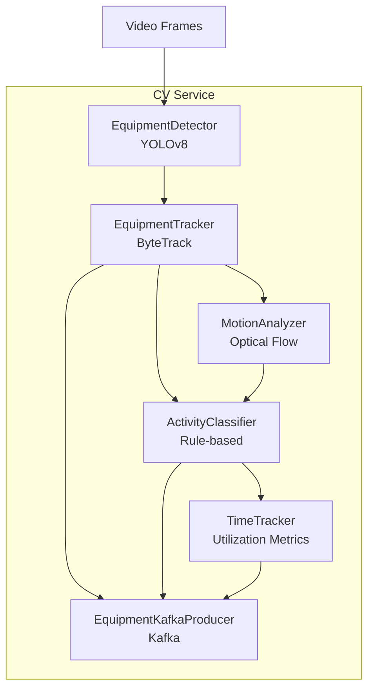
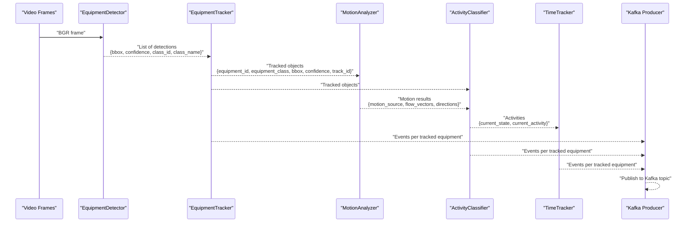
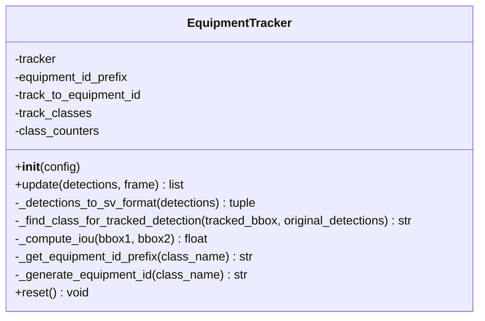
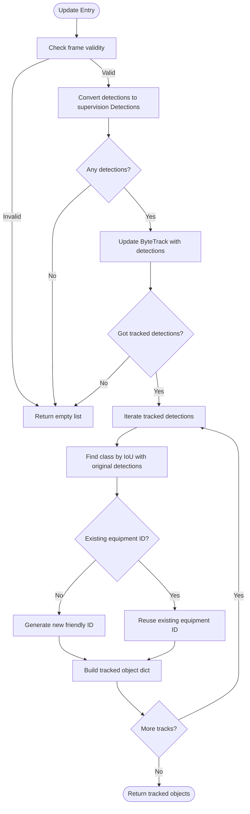
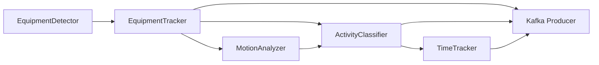

# Object Tracking

<cite>
**Referenced Files in This Document**
- [tracker.py](file://services/cv_service/src/tracker.py)
- [detector.py](file://services/cv_service/src/detector.py)
- [motion_analyzer.py](file://services/cv_service/src/motion_analyzer.py)
- [activity_classifier.py](file://services/cv_service/src/activity_classifier.py)
- [time_tracker.py](file://services/cv_service/src/time_tracker.py)
- [main.py](file://services/cv_service/src/main.py)
- [settings.yaml](file://config/settings.yaml)
- [kafka_producer.py](file://services/cv_service/src/kafka_producer.py)
</cite>

## Table of Contents
1. [Introduction](#introduction)
2. [Project Structure](#project-structure)
3. [Core Components](#core-components)
4. [Architecture Overview](#architecture-overview)
5. [Detailed Component Analysis](#detailed-component-analysis)
6. [Dependency Analysis](#dependency-analysis)
7. [Performance Considerations](#performance-considerations)
8. [Troubleshooting Guide](#troubleshooting-guide)
9. [Conclusion](#conclusion)
10. [Appendices](#appendices)

## Introduction
This document explains the object tracking component responsible for multi-object tracking with persistent equipment IDs across frames. It covers the EquipmentTracker class implementation, the ByteTrack-based tracking algorithm, ID generation strategy, bounding box association methods, and tracking state management. It also documents tracking parameters, occlusion handling, ID switching, frame-to-frame continuity, integration with detection results, and how tracked equipment data is formatted for motion analysis and activity classification.

## Project Structure
The tracking pipeline is part of the Computer Vision service and integrates with detection, motion analysis, activity classification, time tracking, and Kafka publishing.

**Diagram sources**
- [main.py:323-372](file://services/cv_service/src/main.py#L323-L372)
- [detector.py:85-169](file://services/cv_service/src/detector.py#L85-L169)
- [tracker.py:159-264](file://services/cv_service/src/tracker.py#L159-L264)
- [motion_analyzer.py:88-166](file://services/cv_service/src/motion_analyzer.py#L88-L166)
- [activity_classifier.py:71-125](file://services/cv_service/src/activity_classifier.py#L71-L125)
- [time_tracker.py:53-120](file://services/cv_service/src/time_tracker.py#L53-L120)
- [kafka_producer.py:91-169](file://services/cv_service/src/kafka_producer.py#L91-L169)

**Section sources**
- [main.py:104-142](file://services/cv_service/src/main.py#L104-L142)
- [settings.yaml:21-39](file://config/settings.yaml#L21-L39)

## Core Components
- EquipmentTracker: Multi-object tracking with ByteTrack, ID persistence, and friendly equipment ID generation.
- EquipmentDetector: YOLOv8-based detection with configurable confidence and class filtering.
- MotionAnalyzer: Region-based optical flow to detect articulated motion and classify motion source.
- ActivityClassifier: Rule-based classification with N-frame smoothing to prevent flickering.
- TimeTracker: Accumulates utilization metrics per tracked equipment across frames.
- Kafka Producer: Publishes structured events to Kafka for downstream analytics.

**Section sources**
- [tracker.py:19-84](file://services/cv_service/src/tracker.py#L19-L84)
- [detector.py:18-83](file://services/cv_service/src/detector.py#L18-L83)
- [motion_analyzer.py:24-86](file://services/cv_service/src/motion_analyzer.py#L24-L86)
- [activity_classifier.py:23-69](file://services/cv_service/src/activity_classifier.py#L23-L69)
- [time_tracker.py:21-51](file://services/cv_service/src/time_tracker.py#L21-L51)
- [kafka_producer.py:17-68](file://services/cv_service/src/kafka_producer.py#L17-L68)

## Architecture Overview
End-to-end pipeline flow from detection to tracking, motion analysis, activity classification, time tracking, and event publishing.

**Diagram sources**
- [main.py:323-372](file://services/cv_service/src/main.py#L323-L372)
- [detector.py:85-169](file://services/cv_service/src/detector.py#L85-L169)
- [tracker.py:159-264](file://services/cv_service/src/tracker.py#L159-L264)
- [motion_analyzer.py:88-166](file://services/cv_service/src/motion_analyzer.py#L88-L166)
- [activity_classifier.py:71-125](file://services/cv_service/src/activity_classifier.py#L71-L125)
- [time_tracker.py:53-120](file://services/cv_service/src/time_tracker.py#L53-L120)
- [kafka_producer.py:91-169](file://services/cv_service/src/kafka_producer.py#L91-L169)

## Detailed Component Analysis

### EquipmentTracker
The EquipmentTracker wraps supervision’s ByteTrack to provide:
- Persistent equipment IDs across frames using a mapping from internal track IDs to friendly IDs.
- Friendly ID generation with class-based prefixes and sequential numbering.
- Association of tracked detections back to original detection class names using IoU matching.
- Robust update pipeline with empty frame/frame size checks and error handling.

Key behaviors:
- Initialization validates required configuration keys and sets up ByteTrack with track activation threshold, buffer, and matching threshold.
- ID generation uses a per-class counter and a prefix mapping; unknown classes fall back to a default prefix.
- Detection conversion transforms detection dictionaries into supervision Detections format.
- Update processes supervision Detections, updates the tracker, and constructs tracked objects with consistent equipment IDs and class names.
- Class association uses IoU-based matching against original detections to recover class names for tracked detections.
- Reset clears all mappings and counters to start fresh.

**Diagram sources**
- [tracker.py:19-341](file://services/cv_service/src/tracker.py#L19-L341)

**Section sources**
- [tracker.py:35-84](file://services/cv_service/src/tracker.py#L35-L84)
- [tracker.py:100-126](file://services/cv_service/src/tracker.py#L100-L126)
- [tracker.py:127-158](file://services/cv_service/src/tracker.py#L127-L158)
- [tracker.py:159-264](file://services/cv_service/src/tracker.py#L159-L264)
- [tracker.py:266-328](file://services/cv_service/src/tracker.py#L266-L328)
- [tracker.py:329-341](file://services/cv_service/src/tracker.py#L329-L341)

### Tracking Algorithm and Parameters
- Algorithm: ByteTrack via supervision library.
- Parameters (from configuration):
  - track_thresh: Detection confidence threshold for track activation.
  - track_buffer: Number of frames to keep lost tracks alive.
  - match_thresh: IOU threshold for matching detections to tracks.
  - equipment_id_prefix: Mapping of class names to ID prefixes.

Behavior:
- Tracks are activated when detection confidence meets track_thresh.
- Lost tracks remain for track_buffer frames before being discarded.
- Matching uses IOU with minimum_matching_threshold to associate detections to existing tracks.

**Section sources**
- [settings.yaml:21-29](file://config/settings.yaml#L21-L29)
- [tracker.py:62-66](file://services/cv_service/src/tracker.py#L62-L66)

### ID Generation Strategy
- Prefix selection: Uses equipment_id_prefix mapping; falls back to default if class not found.
- Sequential numbering: Per-class counters generate unique IDs with zero-padded 3-digit suffixes.
- Persistence: Internal track IDs map to friendly equipment IDs; subsequent frames reuse the same equipment ID.

**Section sources**
- [tracker.py:85-98](file://services/cv_service/src/tracker.py#L85-L98)
- [tracker.py:100-125](file://services/cv_service/src/tracker.py#L100-L125)
- [tracker.py:242-251](file://services/cv_service/src/tracker.py#L242-L251)

### Bounding Box Association Methods
- Supervision Detections conversion: Converts detection dicts to supervision Detections with xyxy, confidence, and class_id.
- Class name recovery: For each tracked detection, finds the best-matching original detection by IoU and uses its class name.
- IoU computation: Standard intersection-over-union calculation with a threshold to accept matches.

**Diagram sources**
- [tracker.py:159-264](file://services/cv_service/src/tracker.py#L159-L264)
- [tracker.py:266-297](file://services/cv_service/src/tracker.py#L266-L297)
- [tracker.py:300-327](file://services/cv_service/src/tracker.py#L300-L327)

**Section sources**
- [tracker.py:127-158](file://services/cv_service/src/tracker.py#L127-L158)
- [tracker.py:235-239](file://services/cv_service/src/tracker.py#L235-L239)
- [tracker.py:266-297](file://services/cv_service/src/tracker.py#L266-L297)
- [tracker.py:300-327](file://services/cv_service/src/tracker.py#L300-L327)

### Tracking State Management
- Internal state:
  - track_to_equipment_id: Maps internal ByteTrack track_id to friendly equipment_id.
  - track_classes: Maps track_id to equipment class name.
  - class_counters: Per-class sequential counters for ID generation.
- Reset clears all mappings and counters to restart tracking cleanly.

**Section sources**
- [tracker.py:68-77](file://services/cv_service/src/tracker.py#L68-L77)
- [tracker.py:329-341](file://services/cv_service/src/tracker.py#L329-L341)

### Occlusion, ID Switching, and Continuity
- Occlusion handling: Lost tracks are retained for track_buffer frames; if a previously lost track reappears within this window, it can resume the same equipment ID depending on how the underlying tracker reassociates.
- ID switching: The tracker does not intentionally switch IDs; it preserves the mapping from internal track_id to equipment_id. If a new track is created for an object, a new equipment ID is generated.
- Frame-to-frame continuity: The ByteTrack algorithm maintains continuity by matching detections across frames using IOU and confidence thresholds.

**Section sources**
- [tracker.py:62-66](file://services/cv_service/src/tracker.py#L62-L66)
- [tracker.py:242-251](file://services/cv_service/src/tracker.py#L242-L251)

### Integration with Detection Results
- Detector output: List of detection dicts with bbox, confidence, class_id, class_name.
- Tracker input: Same detection dicts; converted to supervision Detections and updated with ByteTrack.
- Output: List of tracked object dicts with equipment_id, equipment_class, bbox, confidence, and track_id.

**Section sources**
- [detector.py:85-169](file://services/cv_service/src/detector.py#L85-L169)
- [tracker.py:159-264](file://services/cv_service/src/tracker.py#L159-L264)

### Tracking Data Formatting for Motion Analysis and Activity Classification
- Tracked objects passed to MotionAnalyzer include equipment_id and bbox.
- MotionAnalyzer returns motion_source, dominant_direction, and summarized flow_vectors.
- ActivityClassifier consumes tracked objects and motion results to produce current_state and current_activity with smoothing.

**Section sources**
- [tracker.py:253-260](file://services/cv_service/src/tracker.py#L253-L260)
- [motion_analyzer.py:88-166](file://services/cv_service/src/motion_analyzer.py#L88-L166)
- [activity_classifier.py:71-125](file://services/cv_service/src/activity_classifier.py#L71-L125)

### Examples
- Tracker initialization: Construct EquipmentTracker with configuration keys track_thresh, track_buffer, match_thresh, and equipment_id_prefix.
- Update operation: Call update(detections, frame) to receive tracked objects with persistent equipment IDs.
- State inspection: Use reset() to clear state; inspect internal mappings for debugging.

**Section sources**
- [tracker.py:35-84](file://services/cv_service/src/tracker.py#L35-L84)
- [tracker.py:159-264](file://services/cv_service/src/tracker.py#L159-L264)
- [tracker.py:329-341](file://services/cv_service/src/tracker.py#L329-L341)

## Dependency Analysis
- EquipmentTracker depends on supervision’s ByteTrack for multi-object tracking.
- EquipmentDetector provides detection results consumed by EquipmentTracker.
- MotionAnalyzer consumes tracked objects and grayscale frames to compute motion.
- ActivityClassifier consumes tracked objects and motion results to classify activities.
- TimeTracker consumes tracked objects and activity results to compute utilization metrics.
- Kafka Producer publishes structured events combining tracking, motion, and time analytics.

**Diagram sources**
- [main.py:323-372](file://services/cv_service/src/main.py#L323-L372)
- [detector.py:85-169](file://services/cv_service/src/detector.py#L85-L169)
- [tracker.py:159-264](file://services/cv_service/src/tracker.py#L159-L264)
- [motion_analyzer.py:88-166](file://services/cv_service/src/motion_analyzer.py#L88-L166)
- [activity_classifier.py:71-125](file://services/cv_service/src/activity_classifier.py#L71-L125)
- [time_tracker.py:53-120](file://services/cv_service/src/time_tracker.py#L53-L120)
- [kafka_producer.py:91-169](file://services/cv_service/src/kafka_producer.py#L91-L169)

**Section sources**
- [main.py:104-142](file://services/cv_service/src/main.py#L104-L142)

## Performance Considerations
- Frame skipping: The pipeline processes every Nth frame to reduce computational load.
- Model device and input size: Configurable device (CPU/CUDA) and input size for YOLO inference.
- ByteTrack parameters: track_thresh, track_buffer, and match_thresh balance responsiveness and stability.
- Optical flow parameters: Farneback parameters tuned for construction equipment motion.
- Kafka batching: Producer settings optimize throughput and reliability.

[No sources needed since this section provides general guidance]

## Troubleshooting Guide
Common issues and diagnostics:
- Missing configuration keys: EquipmentTracker raises ValueError if required keys are absent.
- Empty or invalid frame: Tracker logs warnings and returns empty results.
- Detection inference failures: Detector catches exceptions and returns empty detections.
- Motion analysis region too small: MotionAnalyzer skips analysis for tiny regions and returns neutral results.
- Kafka producer not connected: Producer warns and skips publishing; flush and close methods handle cleanup.

**Section sources**
- [tracker.py:52-56](file://services/cv_service/src/tracker.py#L52-L56)
- [tracker.py:192-194](file://services/cv_service/src/tracker.py#L192-L194)
- [detector.py:123-125](file://services/cv_service/src/detector.py#L123-L125)
- [motion_analyzer.py:149-154](file://services/cv_service/src/motion_analyzer.py#L149-L154)
- [kafka_producer.py:121-129](file://services/cv_service/src/kafka_producer.py#L121-L129)
- [kafka_producer.py:170-191](file://services/cv_service/src/kafka_producer.py#L170-L191)
- [kafka_producer.py:193-208](file://services/cv_service/src/kafka_producer.py#L193-L208)

## Conclusion
The EquipmentTracker provides robust, ByteTrack-based multi-object tracking with persistent equipment IDs across frames. It integrates tightly with detection, motion analysis, activity classification, and time tracking to deliver structured events suitable for downstream analytics. Proper configuration of tracking parameters and careful handling of edge cases ensure reliable operation under typical construction site conditions.

## Appendices

### Configuration Reference
- Tracking parameters:
  - track_thresh: Detection confidence threshold for track activation.
  - track_buffer: Frames to retain lost tracks.
  - match_thresh: IOU threshold for detection-to-track matching.
  - equipment_id_prefix: Class-to-prefix mapping for friendly IDs.

**Section sources**
- [settings.yaml:21-29](file://config/settings.yaml#L21-L29)
- [tracker.py:62-66](file://services/cv_service/src/tracker.py#L62-L66)

### Event Schema Published to Kafka
- Fields include frame_id, equipment_id, equipment_class, timestamp, utilization, and time_analytics.

**Section sources**
- [kafka_producer.py:95-112](file://services/cv_service/src/kafka_producer.py#L95-L112)
- [main.py:270-321](file://services/cv_service/src/main.py#L270-L321)