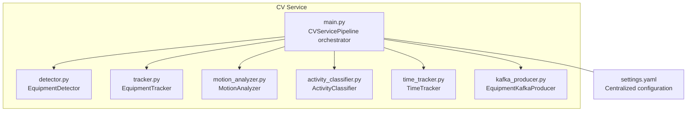
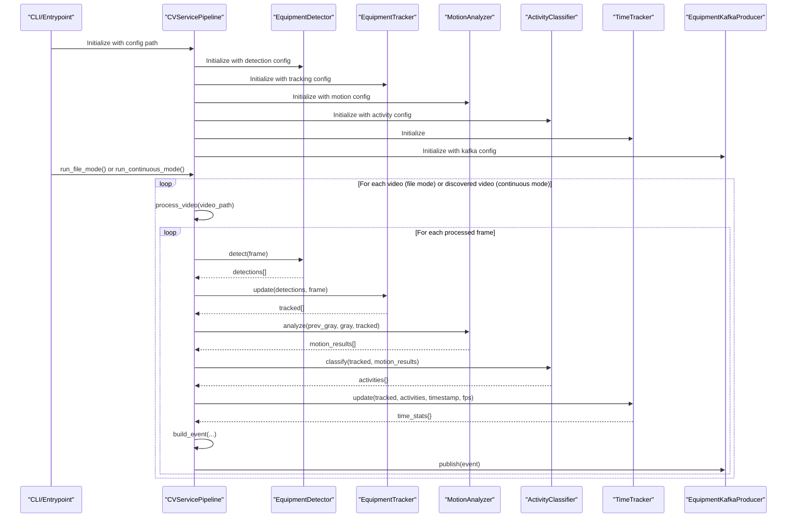
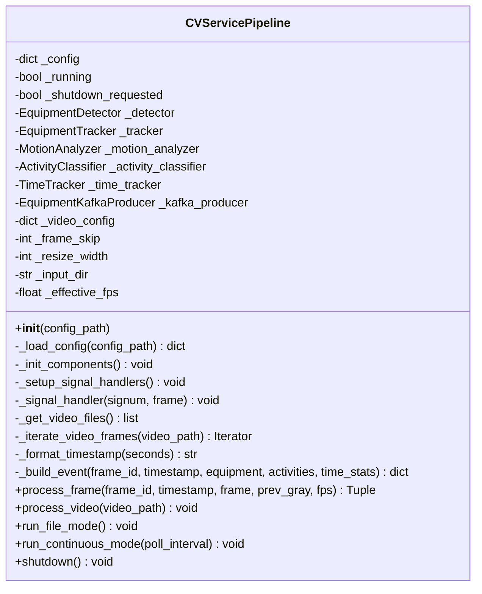
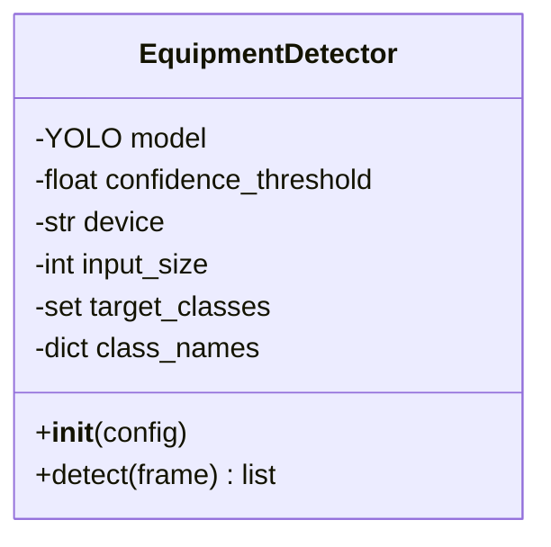
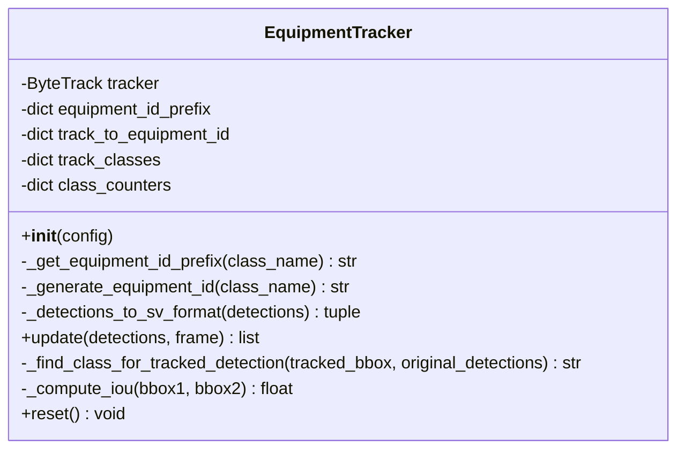
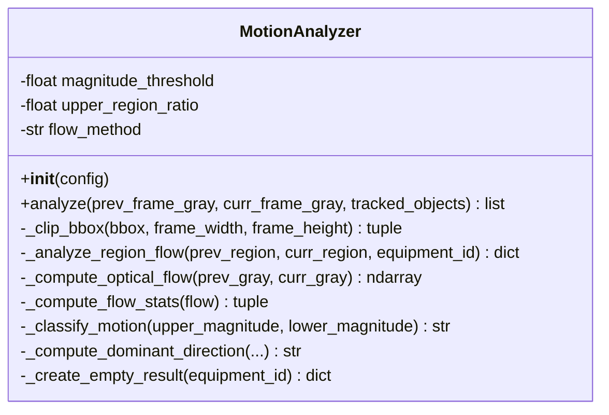
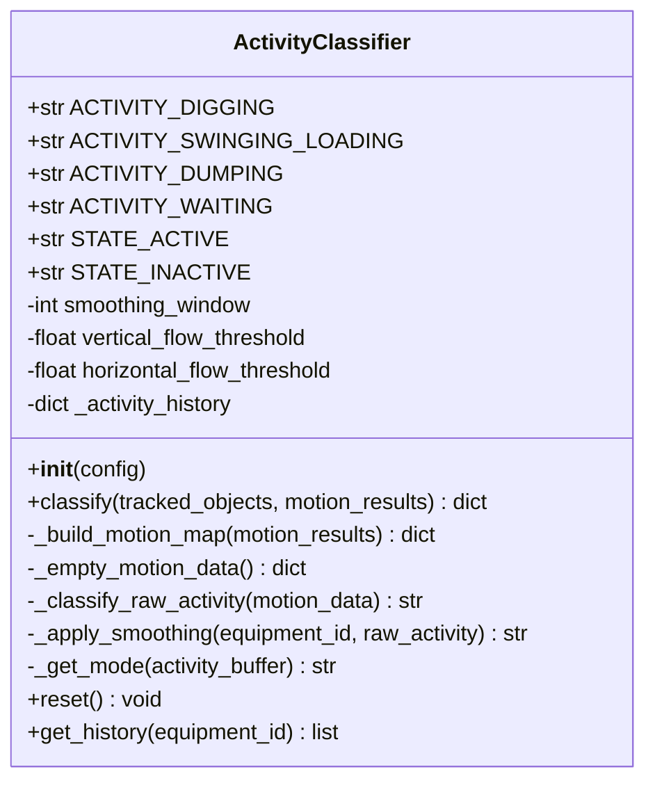
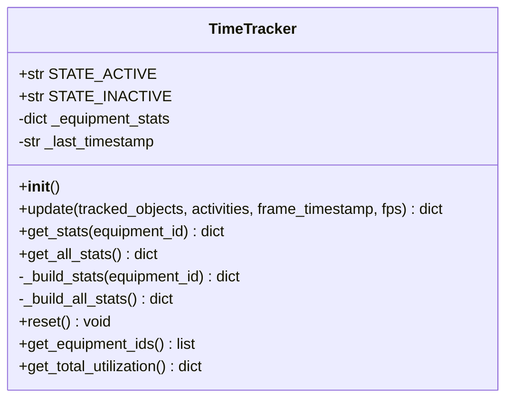
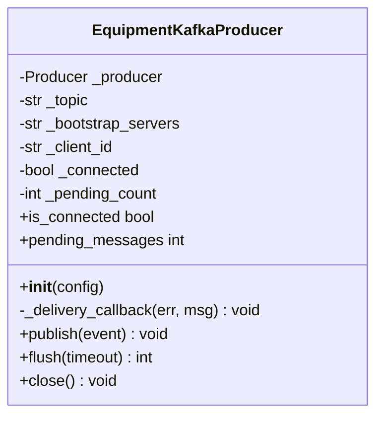
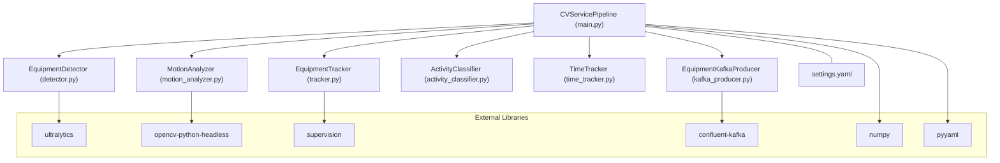

# Pipeline Orchestration

<cite>
**Referenced Files in This Document**
- [main.py](file://services/cv_service/src/main.py)
- [detector.py](file://services/cv_service/src/detector.py)
- [tracker.py](file://services/cv_service/src/tracker.py)
- [motion_analyzer.py](file://services/cv_service/src/motion_analyzer.py)
- [activity_classifier.py](file://services/cv_service/src/activity_classifier.py)
- [time_tracker.py](file://services/cv_service/src/time_tracker.py)
- [kafka_producer.py](file://services/cv_service/src/kafka_producer.py)
- [settings.yaml](file://config/settings.yaml)
- [README.md](file://README.md)
- [docker-compose.yml](file://docker-compose.yml)
- [Dockerfile](file://services/cv_service/Dockerfile)
- [requirements.txt](file://services/cv_service/requirements.txt)
</cite>

## Table of Contents
1. [Introduction](#introduction)
2. [Project Structure](#project-structure)
3. [Core Components](#core-components)
4. [Architecture Overview](#architecture-overview)
5. [Detailed Component Analysis](#detailed-component-analysis)
6. [Dependency Analysis](#dependency-analysis)
7. [Performance Considerations](#performance-considerations)
8. [Troubleshooting Guide](#troubleshooting-guide)
9. [Conclusion](#conclusion)
10. [Appendices](#appendices)

## Introduction
This document explains the CV Service pipeline orchestration component responsible for processing video streams through a computer vision pipeline that detects equipment, tracks it across frames, analyzes motion, classifies activities, tracks utilization time, and publishes events to Kafka. It covers the CVServicePipeline class architecture, configuration loading from YAML, signal handling for graceful shutdown, processing modes (file mode and continuous mode), frame iteration, video discovery, and the coordinated workflow across pipeline stages. It also documents configuration management, logging setup, error handling strategies, and resource cleanup procedures, with practical examples for initialization, mode selection, and shutdown.

## Project Structure
The CV Service pipeline resides under services/cv_service/src and is orchestrated by main.py. Configuration is centralized in config/settings.yaml. The pipeline integrates with external systems via Kafka and is containerized with Docker Compose.

**Diagram sources**
- [main.py](file://services/cv_service/src/main.py)
- [detector.py](file://services/cv_service/src/detector.py)
- [tracker.py](file://services/cv_service/src/tracker.py)
- [motion_analyzer.py](file://services/cv_service/src/motion_analyzer.py)
- [activity_classifier.py](file://services/cv_service/src/activity_classifier.py)
- [time_tracker.py](file://services/cv_service/src/time_tracker.py)
- [kafka_producer.py](file://services/cv_service/src/kafka_producer.py)
- [settings.yaml](file://config/settings.yaml)

**Section sources**
- [README.md](file://README.md)
- [docker-compose.yml](file://docker-compose.yml)
- [Dockerfile](file://services/cv_service/Dockerfile)
- [requirements.txt](file://services/cv_service/requirements.txt)

## Core Components
- CVServicePipeline: The main orchestrator that initializes components, loads configuration, sets up signal handlers, discovers video files, iterates frames, coordinates pipeline stages, and publishes events to Kafka.
- EquipmentDetector: YOLOv8-based detector for vehicles/equipment using configurable class mapping and thresholds.
- EquipmentTracker: ByteTrack-based multi-object tracker that assigns persistent equipment IDs across frames.
- MotionAnalyzer: Region-based optical flow analyzer that splits tracked bounding boxes into upper and lower regions to classify motion sources.
- ActivityClassifier: Rule-based classifier that determines equipment activity using N-frame smoothing and motion thresholds.
- TimeTracker: Accumulates utilization time per equipment and computes utilization percentages.
- EquipmentKafkaProducer: Asynchronous Kafka producer with delivery callbacks, batching, and retry/backoff.

**Section sources**
- [main.py](file://services/cv_service/src/main.py)
- [detector.py](file://services/cv_service/src/detector.py)
- [tracker.py](file://services/cv_service/src/tracker.py)
- [motion_analyzer.py](file://services/cv_service/src/motion_analyzer.py)
- [activity_classifier.py](file://services/cv_service/src/activity_classifier.py)
- [time_tracker.py](file://services/cv_service/src/time_tracker.py)
- [kafka_producer.py](file://services/cv_service/src/kafka_producer.py)

## Architecture Overview
The CV Service pipeline processes video frames through a series of stages, emitting Kafka events for each tracked equipment at each processed frame.

**Diagram sources**
- [main.py](file://services/cv_service/src/main.py)
- [detector.py](file://services/cv_service/src/detector.py)
- [tracker.py](file://services/cv_service/src/tracker.py)
- [motion_analyzer.py](file://services/cv_service/src/motion_analyzer.py)
- [activity_classifier.py](file://services/cv_service/src/activity_classifier.py)
- [time_tracker.py](file://services/cv_service/src/time_tracker.py)
- [kafka_producer.py](file://services/cv_service/src/kafka_producer.py)

## Detailed Component Analysis

### CVServicePipeline Class
The orchestrator initializes all pipeline components, loads configuration from YAML, sets up signal handlers for graceful shutdown, and coordinates processing modes and frame iteration.

Key responsibilities:
- Configuration loading from YAML with fallback search paths.
- Component initialization for detection, tracking, motion analysis, activity classification, time tracking, and Kafka publishing.
- Signal handling for SIGTERM/SIGINT to trigger graceful shutdown.
- Video file discovery and frame iteration with frame skipping and resizing.
- End-to-end frame processing pipeline and event building/publishing.
- Two processing modes:
  - File mode: processes all existing videos and exits.
  - Continuous mode: watches for new videos and processes them as they appear.
- Resource cleanup via shutdown routine.

**Diagram sources**
- [main.py](file://services/cv_service/src/main.py)

**Section sources**
- [main.py](file://services/cv_service/src/main.py)

### EquipmentDetector
Implements YOLOv8-based equipment detection with configurable model, device, input size, confidence threshold, and target classes. It validates configuration, loads the model, and returns filtered detections.

**Diagram sources**
- [detector.py](file://services/cv_service/src/detector.py)

**Section sources**
- [detector.py](file://services/cv_service/src/detector.py)

### EquipmentTracker
Implements ByteTrack-based multi-object tracking via supervision. Assigns persistent equipment IDs with class-based prefixes and maintains per-class counters. Converts detection dictionaries to supervision Detections format and updates the tracker.

**Diagram sources**
- [tracker.py](file://services/cv_service/src/tracker.py)

**Section sources**
- [tracker.py](file://services/cv_service/src/tracker.py)

### MotionAnalyzer
Performs region-based optical flow analysis by splitting each tracked bounding box into upper and lower regions, computing Farneback optical flow independently, and classifying motion sources as full_body, arm_only, or none. Computes dominant direction and summarized flow vectors.

**Diagram sources**
- [motion_analyzer.py](file://services/cv_service/src/motion_analyzer.py)

**Section sources**
- [motion_analyzer.py](file://services/cv_service/src/motion_analyzer.py)

### ActivityClassifier
Implements a rule-based activity classification using N-frame smoothing to prevent flickering. Classifies activities as DIGGING, SWINGING_LOADING, DUMPING, or WAITING based on motion source and direction vectors.

**Diagram sources**
- [activity_classifier.py](file://services/cv_service/src/activity_classifier.py)

**Section sources**
- [activity_classifier.py](file://services/cv_service/src/activity_classifier.py)

### TimeTracker
Accumulates utilization time per equipment across frames, computing total tracked seconds, active seconds, idle seconds, and utilization percentage. Supports resetting and aggregation across all equipment.

**Diagram sources**
- [time_tracker.py](file://services/cv_service/src/time_tracker.py)

**Section sources**
- [time_tracker.py](file://services/cv_service/src/time_tracker.py)

### EquipmentKafkaProducer
Asynchronously publishes equipment events to Kafka with delivery callbacks, batching, retries, and connection settings. Provides flush/close routines for graceful shutdown.

**Diagram sources**
- [kafka_producer.py](file://services/cv_service/src/kafka_producer.py)

**Section sources**
- [kafka_producer.py](file://services/cv_service/src/kafka_producer.py)

### Configuration Management
Configuration is loaded from YAML with multiple fallback paths and validated during component initialization. Centralized parameters include:
- video: frame_skip, resize_width, input_dir
- detection: model, confidence_threshold, device, input_size, target_classes, class_names
- tracking: track_thresh, track_buffer, match_thresh, equipment_id_prefix
- motion: magnitude_threshold, upper_region_ratio, flow_method
- activity: smoothing_window, vertical_flow_threshold, horizontal_flow_threshold
- kafka: bootstrap_servers, topic, client_id, consumer_group
- database and dashboard endpoints for backend integration

**Section sources**
- [main.py](file://services/cv_service/src/main.py)
- [settings.yaml](file://config/settings.yaml)

### Logging Setup
Logging is configured at module level and globally in main.py with INFO level and stdout handler. Each module defines its own logger with module-specific names. The main entrypoint allows setting log level via CLI arguments.

**Section sources**
- [main.py](file://services/cv_service/src/main.py)

### Error Handling Strategies
- Configuration loading: raises FileNotFoundError if config not found across multiple search paths.
- Model loading: raises RuntimeError if YOLOv8 model fails to load.
- Frame processing: wraps per-frame processing in try/except to continue on errors.
- Motion analysis: returns empty results for invalid regions or computation failures.
- Kafka publishing: logs delivery failures and retries with buffered produce; flushes on shutdown.
- Graceful shutdown: signal handlers set a flag to stop processing loops and ensure resource cleanup.

**Section sources**
- [main.py](file://services/cv_service/src/main.py)
- [detector.py](file://services/cv_service/src/detector.py)
- [motion_analyzer.py](file://services/cv_service/src/motion_analyzer.py)
- [kafka_producer.py](file://services/cv_service/src/kafka_producer.py)

### Resource Cleanup Procedures
- Shutdown sequence:
  - Set shutdown flag.
  - Close Kafka producer with flush and pending message reporting.
  - Release OpenCV capture resources implicitly via context and finally blocks.
- Component resets:
  - Tracker reset between videos to clear mappings and counters.
  - TimeTracker reset to clear accumulated statistics.
  - ActivityClassifier reset to clear smoothing history.

**Section sources**
- [main.py](file://services/cv_service/src/main.py)
- [tracker.py](file://services/cv_service/src/tracker.py)
- [time_tracker.py](file://services/cv_service/src/time_tracker.py)
- [kafka_producer.py](file://services/cv_service/src/kafka_producer.py)

### Practical Examples

- Pipeline initialization:
  - Instantiate CVServicePipeline with a config path (defaults to a mounted path in container).
  - The constructor loads YAML, initializes components, sets up signal handlers, and logs initialization.

- Mode selection:
  - File mode: Call run_file_mode() to process all existing videos and exit.
  - Continuous mode: Call run_continuous_mode(poll_interval) to continuously monitor the input directory for new videos.

- Shutdown procedures:
  - Use SIGTERM/SIGINT to trigger graceful shutdown; the pipeline sets a flag and closes Kafka producer.
  - Alternatively, call shutdown() directly to ensure cleanup.

- Event publishing:
  - Events are built per tracked equipment and published to Kafka topic with delivery callbacks and retries.

**Section sources**
- [main.py](file://services/cv_service/src/main.py)

## Dependency Analysis
The CV Service pipeline integrates several external libraries and services:
- YOLOv8 via ultralytics for detection.
- OpenCV for optical flow and frame processing.
- supervision for ByteTrack-based tracking.
- confluent-kafka for event publishing.
- YAML for configuration parsing.
- Docker Compose for orchestration with Kafka, Zookeeper, and Postgres.

**Diagram sources**
- [main.py](file://services/cv_service/src/main.py)
- [detector.py](file://services/cv_service/src/detector.py)
- [tracker.py](file://services/cv_service/src/tracker.py)
- [motion_analyzer.py](file://services/cv_service/src/motion_analyzer.py)
- [activity_classifier.py](file://services/cv_service/src/activity_classifier.py)
- [time_tracker.py](file://services/cv_service/src/time_tracker.py)
- [kafka_producer.py](file://services/cv_service/src/kafka_producer.py)
- [requirements.txt](file://services/cv_service/requirements.txt)

**Section sources**
- [requirements.txt](file://services/cv_service/requirements.txt)
- [docker-compose.yml](file://docker-compose.yml)

## Performance Considerations
- CPU optimization strategies:
  - YOLOv8n (nano) model for lightweight CPU inference.
  - Frame skipping reduces processing load by processing every Nth frame.
  - Frame resizing reduces pixel count for inference.
  - Crop-based optical flow avoids full-frame computation.
- Tuning guidelines:
  - Increase smoothing_window to reduce flickering.
  - Adjust magnitude_threshold and flow thresholds to balance sensitivity.
  - Increase frame_skip or reduce resize_width for CPU savings.

**Section sources**
- [README.md](file://README.md)
- [settings.yaml](file://config/settings.yaml)

## Troubleshooting Guide
Common issues and resolutions:
- Configuration not found:
  - Ensure settings.yaml exists at one of the searched paths or mount it via Docker volumes.
- Model loading failures:
  - Verify model path and device availability; check logs for detailed error messages.
- Video file discovery:
  - Confirm input_dir exists and contains supported video extensions.
- Frame iteration errors:
  - Check OpenCV capture status and handle unsupported formats gracefully.
- Kafka delivery failures:
  - Review producer configuration and broker connectivity; check delivery callbacks for errors.
- Graceful shutdown:
  - Use SIGTERM/SIGINT or call shutdown(); verify Kafka flush completes.

**Section sources**
- [main.py](file://services/cv_service/src/main.py)
- [kafka_producer.py](file://services/cv_service/src/kafka_producer.py)

## Conclusion
The CV Service pipeline orchestrator provides a robust, modular, and configurable framework for processing video streams through a computer vision pipeline. It supports both batch and continuous processing modes, integrates tightly with Kafka for event streaming, and offers comprehensive logging, error handling, and resource cleanup. Centralized configuration enables easy tuning of detection, tracking, motion analysis, activity classification, and time tracking parameters.

## Appendices

### Processing Modes
- File mode:
  - Scans input directory, processes all existing videos, and exits.
- Continuous mode:
  - Periodically polls the input directory, processes newly discovered videos, and continues running until shutdown.

**Section sources**
- [main.py](file://services/cv_service/src/main.py)

### Frame Iteration and Processing Workflow
- Video discovery:
  - Lists files in input_dir with supported extensions.
- Frame iteration:
  - Opens video with OpenCV, applies frame skipping and resizing, yields timestamps and frames.
- Pipeline stages:
  - Detection → Tracking → Grayscale conversion → Motion analysis → Activity classification → Time tracking → Event building → Kafka publishing.

**Section sources**
- [main.py](file://services/cv_service/src/main.py)

### Kafka Event Schema
Events published to Kafka include frame metadata, equipment identity, current state/activity, motion source, and time analytics.

**Section sources**
- [main.py](file://services/cv_service/src/main.py)
- [kafka_producer.py](file://services/cv_service/src/kafka_producer.py)