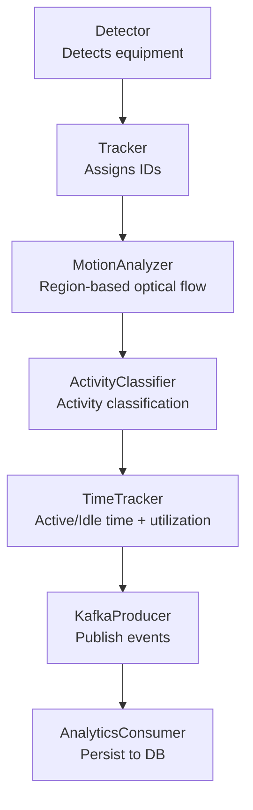
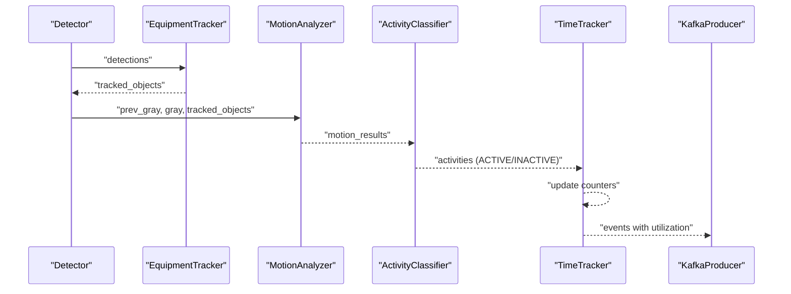
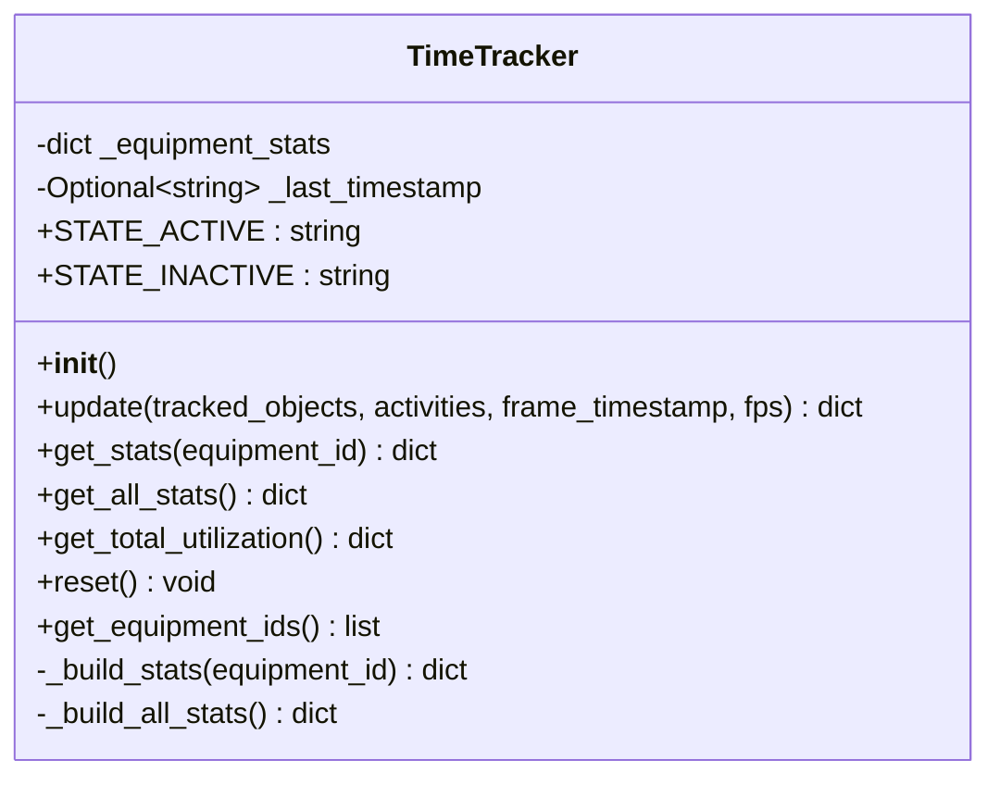
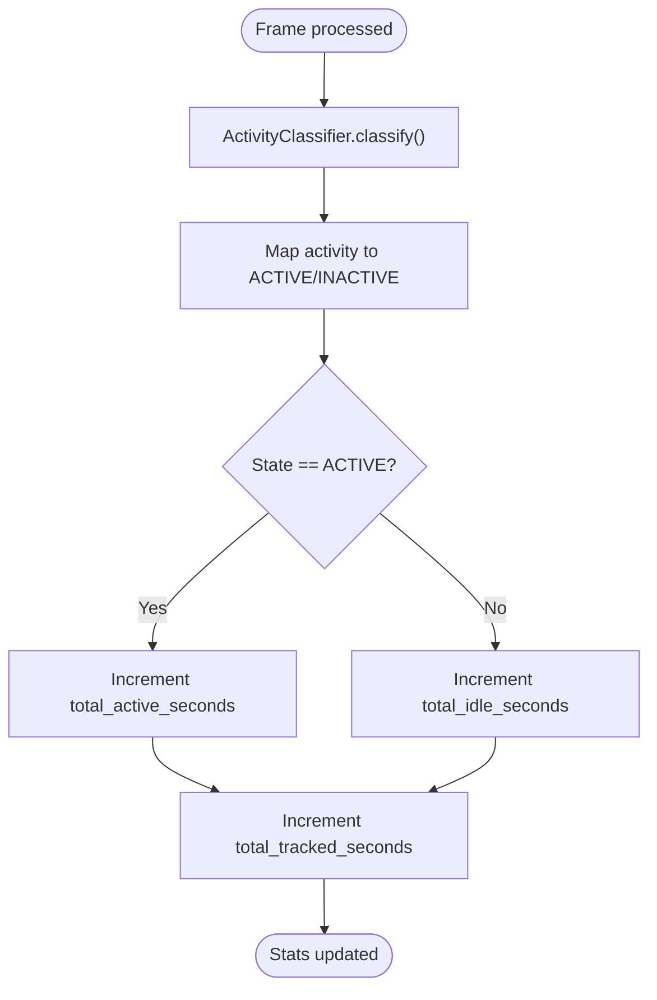
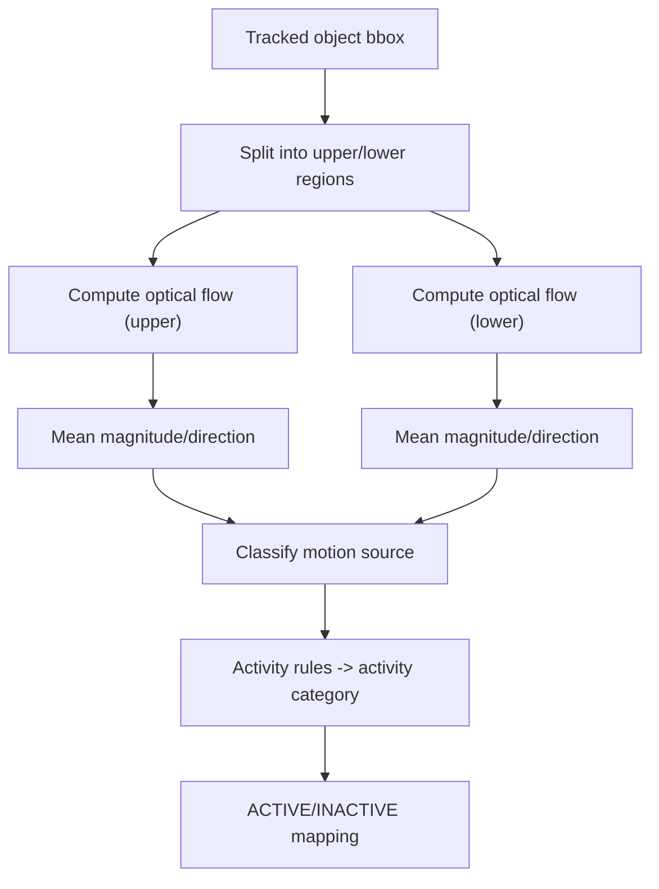
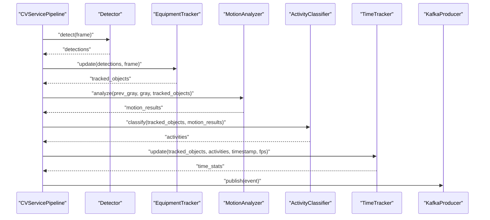
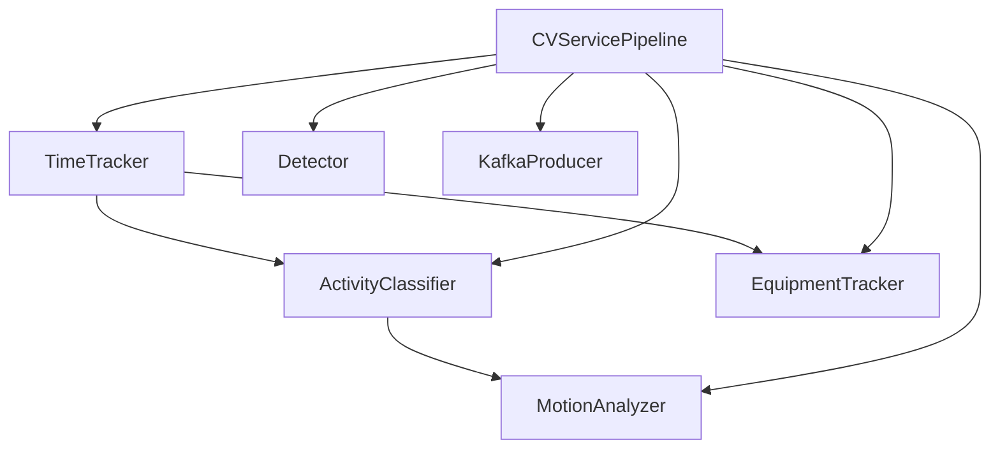

# Time Tracking

<cite>
**Referenced Files in This Document**
- [time_tracker.py](file://services/cv_service/src/time_tracker.py)
- [activity_classifier.py](file://services/cv_service/src/activity_classifier.py)
- [motion_analyzer.py](file://services/cv_service/src/motion_analyzer.py)
- [tracker.py](file://services/cv_service/src/tracker.py)
- [main.py](file://services/cv_service/src/main.py)
- [kafka_producer.py](file://services/cv_service/src/kafka_producer.py)
- [consumer.py](file://services/analytics_backend/src/consumer.py)
- [settings.yaml](file://config/settings.yaml)
- [test_time_tracker.py](file://tests/test_time_tracker.py)
</cite>

## Table of Contents
1. [Introduction](#introduction)
2. [Project Structure](#project-structure)
3. [Core Components](#core-components)
4. [Architecture Overview](#architecture-overview)
5. [Detailed Component Analysis](#detailed-component-analysis)
6. [Dependency Analysis](#dependency-analysis)
7. [Performance Considerations](#performance-considerations)
8. [Troubleshooting Guide](#troubleshooting-guide)
9. [Conclusion](#conclusion)

## Introduction
This document explains the time tracking component responsible for computing equipment utilization time and statistics. The TimeTracker class accumulates per-equipment time spent in ACTIVE versus INACTIVE states across video frames, derives utilization percentages, and supports aggregation across multiple pieces of equipment. It integrates tightly with activity classification to distinguish active from idle periods and feeds results into the broader analytics pipeline for persistence and dashboards.

## Project Structure
The time tracking capability is part of the computer vision service pipeline that orchestrates detection, tracking, motion analysis, activity classification, time tracking, and event publishing. The relevant modules and their roles are:
- Detector: Identifies equipment in frames.
- Tracker: Assigns persistent IDs to tracked equipment across frames.
- Motion Analyzer: Computes optical flow per region to infer motion sources.
- Activity Classifier: Translates motion into activity states and determines ACTIVE/INACTIVE.
- TimeTracker: Updates per-equipment time counters and computes utilization.
- Kafka Producer: Publishes structured events for downstream analytics.
- Analytics Backend Consumer: Receives events and persists them to the database.

**Diagram sources**
- [main.py:323-372](file://services/cv_service/src/main.py#L323-L372)
- [time_tracker.py:53-120](file://services/cv_service/src/time_tracker.py#L53-L120)
- [activity_classifier.py:71-125](file://services/cv_service/src/activity_classifier.py#L71-L125)
- [motion_analyzer.py:88-166](file://services/cv_service/src/motion_analyzer.py#L88-L166)
- [tracker.py:159-264](file://services/cv_service/src/tracker.py#L159-L264)
- [kafka_producer.py:91-169](file://services/cv_service/src/kafka_producer.py#L91-L169)
- [consumer.py:143-200](file://services/analytics_backend/src/consumer.py#L143-L200)

**Section sources**
- [main.py:104-142](file://services/cv_service/src/main.py#L104-L142)
- [settings.yaml:1-59](file://config/settings.yaml#L1-L59)

## Core Components
- TimeTracker: Central time accounting and utilization computation engine.
- ActivityClassifier: Provides ACTIVE/INACTIVE state used by TimeTracker.
- MotionAnalyzer: Supplies motion source information used by ActivityClassifier.
- EquipmentTracker: Provides tracked equipment identifiers used by TimeTracker.
- CVServicePipeline: Orchestrates the pipeline and invokes TimeTracker per frame.
- KafkaProducer and AnalyticsConsumer: Transport and persist utilization metrics.

Key responsibilities:
- TimeTracker: Increment counters per frame based on state, compute utilization percent, aggregate totals, and expose per-equipment and global statistics.
- ActivityClassifier: Determines whether equipment is ACTIVE or INACTIVE based on motion analysis.
- MotionAnalyzer: Splits bounding boxes into upper/lower regions and computes optical flow to classify motion sources.

**Section sources**
- [time_tracker.py:21-51](file://services/cv_service/src/time_tracker.py#L21-L51)
- [activity_classifier.py:23-70](file://services/cv_service/src/activity_classifier.py#L23-L70)
- [motion_analyzer.py:24-86](file://services/cv_service/src/motion_analyzer.py#L24-L86)
- [tracker.py:19-83](file://services/cv_service/src/tracker.py#L19-L83)
- [main.py:323-372](file://services/cv_service/src/main.py#L323-L372)

## Architecture Overview
The pipeline processes video frames sequentially. At each frame:
1. Detector produces candidate equipment bounding boxes.
2. Tracker assigns persistent equipment IDs to detections.
3. MotionAnalyzer computes optical flow per region and classifies motion source.
4. ActivityClassifier maps motion to activity and ACTIVE/INACTIVE state.
5. TimeTracker updates per-equipment counters and computes utilization.
6. Events are built and published to Kafka for downstream consumption.

**Diagram sources**
- [main.py:345-371](file://services/cv_service/src/main.py#L345-L371)
- [time_tracker.py:53-120](file://services/cv_service/src/time_tracker.py#L53-L120)
- [activity_classifier.py:71-125](file://services/cv_service/src/activity_classifier.py#L71-L125)
- [motion_analyzer.py:88-166](file://services/cv_service/src/motion_analyzer.py#L88-L166)
- [kafka_producer.py:91-169](file://services/cv_service/src/kafka_producer.py#L91-L169)

## Detailed Component Analysis

### TimeTracker Class
The TimeTracker class maintains per-equipment cumulative time counters and computes utilization metrics. It operates on a frame-by-frame basis, using a configurable FPS to derive time deltas.

- State constants: ACTIVE and INACTIVE align with ActivityClassifier outputs.
- Per-equipment counters:
  - total_tracked_seconds: Always incremented by the frame time delta.
  - total_active_seconds: Incremented when current_state is ACTIVE.
  - total_idle_seconds: Incremented when current_state is INACTIVE.
- Utilization percent: total_active_seconds / total_tracked_seconds * 100, with 0% when tracked time is zero.
- Methods:
  - update(tracked_objects, activities, frame_timestamp, fps): Processes all tracked equipment, updates counters, and returns current stats for all tracked equipment.
  - get_stats(equipment_id): Returns stats for a specific equipment.
  - get_all_stats(): Returns stats for all tracked equipment.
  - get_total_utilization(): Aggregates across all equipment and computes average utilization.
  - reset(): Clears all counters for a fresh video.
  - get_equipment_ids(): Lists all tracked equipment IDs.
- Robustness:
  - Defaults to INACTIVE if current_state is missing.
  - Prevents division by zero for utilization percent.
  - Uses max(fps, 1.0) to avoid zero or negative FPS errors.

**Diagram sources**
- [time_tracker.py:21-265](file://services/cv_service/src/time_tracker.py#L21-L265)

**Section sources**
- [time_tracker.py:21-265](file://services/cv_service/src/time_tracker.py#L21-L265)

### Activity Classification and ACTIVE/INACTIVE Mapping
ActivityClassifier determines activity categories and maps them to ACTIVE/INACTIVE states. TimeTracker consumes these states to decide whether to increment active or idle counters.

- ActivityClassifier:
  - Uses N-frame smoothing to stabilize classifications.
  - Rules classify motion into activity categories and then map to ACTIVE/INACTIVE.
- ACTIVE/INACTIVE mapping:
  - INACTIVE when activity is WAITING.
  - ACTIVE otherwise.

**Diagram sources**
- [activity_classifier.py:71-125](file://services/cv_service/src/activity_classifier.py#L71-L125)
- [time_tracker.py:103-117](file://services/cv_service/src/time_tracker.py#L103-L117)

**Section sources**
- [activity_classifier.py:23-125](file://services/cv_service/src/activity_classifier.py#L23-L125)
- [time_tracker.py:33-120](file://services/cv_service/src/time_tracker.py#L33-L120)

### Motion Analysis and Activity Rules
MotionAnalyzer splits tracked bounding boxes into upper and lower regions, computes optical flow for each, and classifies motion source. These results feed ActivityClassifier rules that determine activity categories and ACTIVE/INACTIVE states.

- Region splitting controlled by upper_region_ratio.
- Optical flow computed via Farneback with tuned parameters.
- Motion classification:
  - "arm_only" when only upper region moves.
  - "full_body" when lower region moves (driving) or both regions move.
  - "none" when no significant motion.
- Dominant direction derived from the region with higher motion magnitude.

**Diagram sources**
- [motion_analyzer.py:192-251](file://services/cv_service/src/motion_analyzer.py#L192-L251)
- [motion_analyzer.py:324-355](file://services/cv_service/src/motion_analyzer.py#L324-L355)
- [activity_classifier.py:166-231](file://services/cv_service/src/activity_classifier.py#L166-L231)

**Section sources**
- [motion_analyzer.py:24-86](file://services/cv_service/src/motion_analyzer.py#L24-L86)
- [motion_analyzer.py:192-251](file://services/cv_service/src/motion_analyzer.py#L192-L251)
- [activity_classifier.py:166-231](file://services/cv_service/src/activity_classifier.py#L166-L231)

### Integration in the Pipeline
CVServicePipeline coordinates the entire workflow. It:
- Loads configuration and initializes components.
- Iterates frames with optional frame skipping and resizing.
- Calls detector, tracker, motion analyzer, activity classifier, and time tracker.
- Builds events enriched with utilization metrics and publishes to Kafka.

**Diagram sources**
- [main.py:323-372](file://services/cv_service/src/main.py#L323-L372)
- [time_tracker.py:53-120](file://services/cv_service/src/time_tracker.py#L53-L120)
- [kafka_producer.py:91-169](file://services/cv_service/src/kafka_producer.py#L91-L169)

**Section sources**
- [main.py:184-268](file://services/cv_service/src/main.py#L184-L268)
- [main.py:323-372](file://services/cv_service/src/main.py#L323-L372)

## Dependency Analysis
- TimeTracker depends on:
  - Activities provided by ActivityClassifier (ACTIVE/INACTIVE).
  - Tracked equipment identifiers from EquipmentTracker.
  - Frame timestamp and FPS for time delta calculation.
- ActivityClassifier depends on:
  - MotionAnalyzer results for motion source and flow vectors.
- MotionAnalyzer depends on:
  - Grayscale frames and tracked bounding boxes.
- Pipeline orchestration ties all components together and publishes events.

**Diagram sources**
- [time_tracker.py:53-120](file://services/cv_service/src/time_tracker.py#L53-L120)
- [activity_classifier.py:71-125](file://services/cv_service/src/activity_classifier.py#L71-L125)
- [motion_analyzer.py:88-166](file://services/cv_service/src/motion_analyzer.py#L88-L166)
- [tracker.py:159-264](file://services/cv_service/src/tracker.py#L159-L264)
- [main.py:323-372](file://services/cv_service/src/main.py#L323-L372)

**Section sources**
- [time_tracker.py:21-51](file://services/cv_service/src/time_tracker.py#L21-L51)
- [activity_classifier.py:23-70](file://services/cv_service/src/activity_classifier.py#L23-L70)
- [motion_analyzer.py:24-86](file://services/cv_service/src/motion_analyzer.py#L24-L86)
- [tracker.py:19-83](file://services/cv_service/src/tracker.py#L19-L83)
- [main.py:104-142](file://services/cv_service/src/main.py#L104-L142)

## Performance Considerations
- Frame skipping: Controlled by video.frame_skip to reduce computational load. Effective FPS becomes fps / frame_skip.
- Time delta granularity: time_delta = 1.0 / max(fps, 1.0). Higher FPS yields finer time resolution; extremely high FPS increases update frequency.
- Memory footprint: TimeTracker stores per-equipment counters; long videos increase memory usage linearly with unique equipment count.
- Throughput: Kafka producer batching and linger settings balance latency and throughput.

Practical tips:
- Tune video.frame_skip for target FPS and hardware capacity.
- Use appropriate smoothing_window in activity classification to reduce flickering without introducing lag.
- Monitor pending_messages from Kafka producer to adjust publishing rate if backpressure occurs.

**Section sources**
- [main.py:208-210](file://services/cv_service/src/main.py#L208-L210)
- [time_tracker.py:82-86](file://services/cv_service/src/time_tracker.py#L82-L86)
- [kafka_producer.py:40-53](file://services/cv_service/src/kafka_producer.py#L40-L53)

## Troubleshooting Guide
Common issues and resolutions:
- Zero utilization percent: Occurs when total_tracked_seconds is zero. TimeTracker returns 0% utilization safely.
- Missing current_state: TimeTracker defaults to INACTIVE if current_state is absent, ensuring idle counting.
- Zero or negative FPS: TimeTracker uses max(fps, 1.0) to avoid division errors; expect larger time deltas for fps ≤ 1.
- Equipment disappears and reappears: TimeTracker persists counters across frames; stats accumulate across appearances.
- Empty or invalid detections: MotionAnalyzer returns "none" motion for invalid regions; ActivityClassifier maps WAITING to INACTIVE.

Validation references:
- Tests cover FPS protections, default state handling, and aggregation correctness.
- Consumer expects time_analytics fields; ensure TimeTracker update is called before publishing.

**Section sources**
- [test_time_tracker.py:187-212](file://tests/test_time_tracker.py#L187-L212)
- [test_time_tracker.py:389-408](file://tests/test_time_tracker.py#L389-L408)
- [test_time_tracker.py:426-462](file://tests/test_time_tracker.py#L426-L462)
- [consumer.py:143-170](file://services/analytics_backend/src/consumer.py#L143-L170)

## Conclusion
The TimeTracker module provides robust, frame-based time accounting that converts activity classifications into actionable utilization metrics. By integrating with motion analysis and activity classification, it distinguishes active from idle periods and aggregates statistics per equipment and across fleets. The pipeline’s design enables efficient processing with configurable frame rates and smoothing, while Kafka-based publishing ensures scalable downstream analytics.