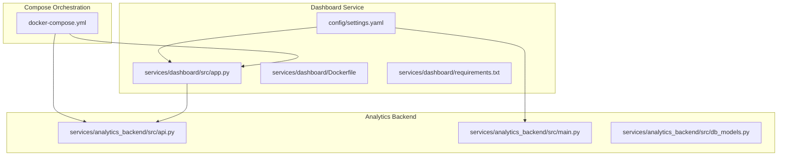
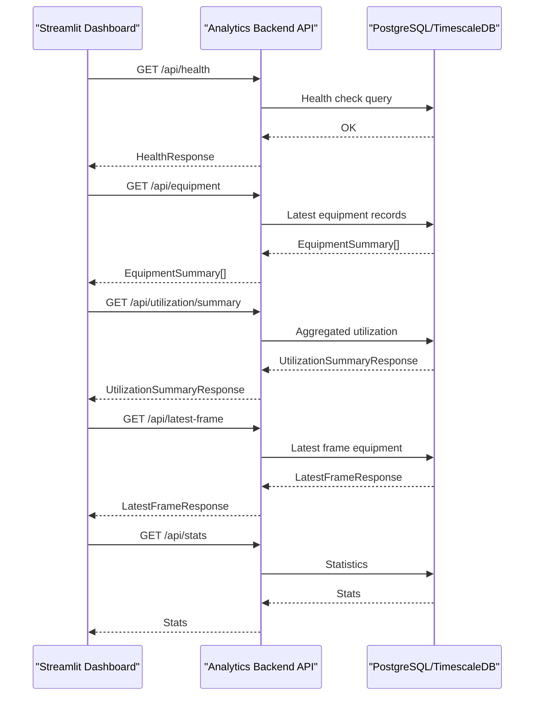
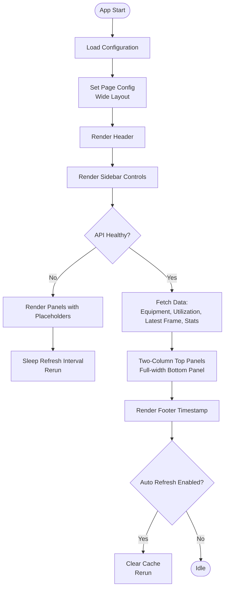
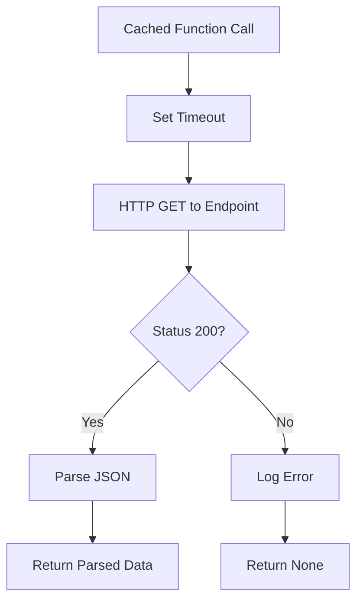
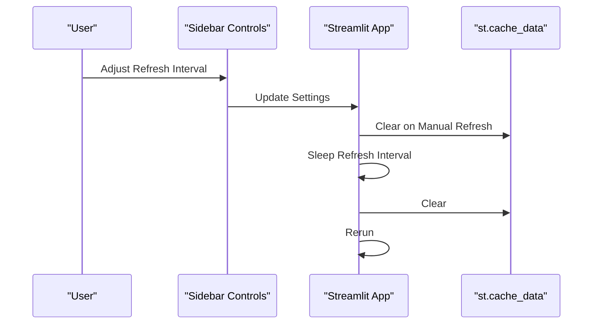
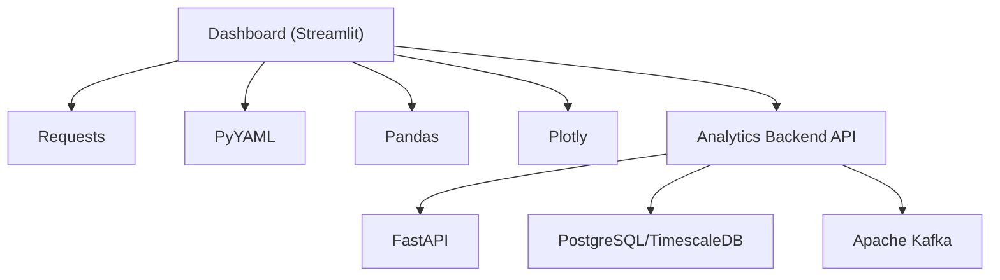

# Dashboard Service

<cite>
**Referenced Files in This Document**
- [app.py](file://services/dashboard/src/app.py)
- [settings.yaml](file://config/settings.yaml)
- [docker-compose.yml](file://docker-compose.yml)
- [Dockerfile](file://services/dashboard/Dockerfile)
- [requirements.txt](file://services/dashboard/requirements.txt)
- [api.py](file://services/analytics_backend/src/api.py)
- [main.py](file://services/analytics_backend/src/main.py)
- [db_models.py](file://services/analytics_backend/src/db_models.py)
- [README.md](file://README.md)
</cite>

## Table of Contents
1. [Introduction](#introduction)
2. [Project Structure](#project-structure)
3. [Core Components](#core-components)
4. [Architecture Overview](#architecture-overview)
5. [Detailed Component Analysis](#detailed-component-analysis)
6. [Dependency Analysis](#dependency-analysis)
7. [Performance Considerations](#performance-considerations)
8. [Troubleshooting Guide](#troubleshooting-guide)
9. [Conclusion](#conclusion)

## Introduction
The Dashboard Service is a real-time monitoring interface built with Streamlit that visualizes equipment activity and utilization metrics produced by the Analytics Backend API. It provides live insights into equipment states (ACTIVE/INACTIVE), activity classifications (DIGGING, SWINGING_LOADING, DUMPING, WAITING), and utilization statistics. The dashboard offers interactive controls for filtering equipment, adjusting refresh intervals, and manual refresh capabilities, while maintaining a responsive layout suitable for wide-screen monitoring.

## Project Structure
The Dashboard Service resides under services/dashboard and consists of:
- Streamlit application entry point (app.py)
- Docker packaging (Dockerfile)
- Python dependencies (requirements.txt)
- Shared configuration (config/settings.yaml)

**Diagram sources**
- [app.py](file://services/dashboard/src/app.py)
- [api.py](file://services/analytics_backend/src/api.py)
- [docker-compose.yml](file://docker-compose.yml)
- [settings.yaml](file://config/settings.yaml)

**Section sources**
- [app.py](file://services/dashboard/src/app.py)
- [docker-compose.yml](file://docker-compose.yml)
- [settings.yaml](file://config/settings.yaml)

## Core Components
- Configuration loader: Loads dashboard settings from YAML, including API URL, refresh interval, and page title.
- API communication layer: Implements cached HTTP clients for health checks, equipment lists, utilization summaries, latest frame data, and general statistics.
- UI rendering: Builds the Streamlit interface with sidebar controls, video feed panel, live equipment status table, and utilization dashboard.
- State management: Uses Streamlit’s caching and rerun mechanisms to manage refresh cycles and user-selected filters.

Key responsibilities:
- Data fetching: Requests to Analytics Backend endpoints with timeouts and error logging.
- Presentation: Renders HTML/CSS tables, metrics, progress bars, and cards with color-coded indicators.
- Interactivity: Sidebar controls for refresh interval, auto/manual refresh, equipment filtering, and database stats.

**Section sources**
- [app.py](file://services/dashboard/src/app.py)
- [settings.yaml](file://config/settings.yaml)

## Architecture Overview
The dashboard integrates with the Analytics Backend API to present real-time equipment insights. The backend exposes REST endpoints for health, equipment lists, utilization summaries, latest frame data, and statistics. The dashboard caches responses to optimize performance and reduce network overhead.

**Diagram sources**
- [app.py](file://services/dashboard/src/app.py)
- [api.py](file://services/analytics_backend/src/api.py)

## Detailed Component Analysis

### Streamlit Application Architecture
The Streamlit app is structured around a main entrypoint that configures the page, renders sidebar controls, and orchestrates three primary panels:
- Video Feed Status panel: Displays current frame and detected equipment with color-coded overlays.
- Live Equipment Status panel: Presents a styled HTML table and an optional DataFrame view.
- Utilization Dashboard: Shows summary metrics, progress bars, and per-equipment cards with working/idle times and utilization percentages.

Sidebar controls include:
- Connection status indicator (health check)
- Refresh interval slider and auto-refresh toggle
- Manual refresh button
- Equipment filter selectbox
- Database statistics display

**Diagram sources**
- [app.py](file://services/dashboard/src/app.py)

**Section sources**
- [app.py](file://services/dashboard/src/app.py)

### Data Fetching Mechanisms
The dashboard implements cached HTTP clients for each endpoint:
- Health check: TTL 0.5 minutes
- Equipment list: TTL 0.8 minutes
- Utilization summary: TTL 0.8 minutes
- Latest frame: TTL 0.5 minutes
- General stats: TTL 1.0 minute

Each function performs:
- Request to the configured API URL with a timeout
- Status code verification
- JSON parsing on success
- Error logging and None fallback on failure

**Diagram sources**
- [app.py](file://services/dashboard/src/app.py)

**Section sources**
- [app.py](file://services/dashboard/src/app.py)

### Visualization Components
- Video Feed Status:
  - Shows current frame ID and detected equipment count
  - Renders equipment cards with state color borders and activity badges
  - Filters by selected equipment if specified

- Live Equipment Status:
  - HTML table with color-coded state and activity badges
  - Hover effects and responsive styling
  - Expandable DataFrame view for raw data inspection

- Utilization Dashboard:
  - Summary metrics: Total equipment, Active, Inactive, Average utilization
  - Progress bar for average utilization
  - Per-equipment cards with working time, idle time, utilization progress, and event counts

Color and styling:
- State ACTIVE: green
- State INACTIVE: red
- Activity badges: blue, teal, amber, gray based on activity type
- Metric containers with subtle borders and rounded corners
- Gradient backgrounds for equipment cards

**Section sources**
- [app.py](file://services/dashboard/src/app.py)

### Dashboard Update Mechanisms
- Automatic refresh:
  - Reads refresh interval from sidebar settings
  - Sleeps for the specified interval
  - Clears cache and triggers a rerun
- Manual refresh:
  - Button clears cache and reruns the app immediately
- Real-time data streaming:
  - Relies on periodic polling due to Streamlit’s architecture
  - Latest frame endpoint provides near-real-time snapshots

**Diagram sources**
- [app.py](file://services/dashboard/src/app.py)

**Section sources**
- [app.py](file://services/dashboard/src/app.py)

### User Interface Customization and Accessibility
- Responsive design:
  - Wide page layout for optimal viewing
  - Columns-based layout for top panels
  - Container-based cards for equipment metrics
- Visual indicators:
  - Color-coded state badges and borders
  - Progress bars for utilization metrics
  - Activity badges with contrasting text colors
- Accessibility considerations:
  - Semantic HTML and CSS for readability
  - Sufficient color contrast for state indicators
  - Text-based metrics with clear units

**Section sources**
- [app.py](file://services/dashboard/src/app.py)

## Dependency Analysis
The dashboard depends on:
- Streamlit for UI framework and caching
- Requests for HTTP communication
- PyYAML for configuration loading
- Pandas for optional DataFrame rendering
- Plotly for advanced visualizations (optional)

External dependencies:
- Analytics Backend API (FastAPI) exposing health, equipment, utilization, latest-frame, and stats endpoints
- PostgreSQL/TimescaleDB for persistent storage
- Kafka for event streaming (backend-side)

**Diagram sources**
- [app.py](file://services/dashboard/src/app.py)
- [requirements.txt](file://services/dashboard/requirements.txt)
- [api.py](file://services/analytics_backend/src/api.py)
- [db_models.py](file://services/analytics_backend/src/db_models.py)

**Section sources**
- [app.py](file://services/dashboard/src/app.py)
- [requirements.txt](file://services/dashboard/requirements.txt)
- [api.py](file://services/analytics_backend/src/api.py)
- [db_models.py](file://services/analytics_backend/src/db_models.py)

## Performance Considerations
- Caching strategy:
  - Different TTLs per endpoint to balance freshness and performance
  - Health and latest frame endpoints use shorter TTLs for timeliness
- Network efficiency:
  - Timeouts per request to prevent blocking
  - Minimal payload parsing and error handling
- Rendering optimization:
  - HTML/CSS tables with minimal JavaScript
  - Conditional rendering to avoid empty states
- Scalability:
  - Current design targets moderate-scale deployments
  - Consider pagination or virtualization for large equipment lists
  - Offload heavy computations to the backend (already implemented)

[No sources needed since this section provides general guidance]

## Troubleshooting Guide
Common issues and resolutions:
- API connectivity failures:
  - Verify Analytics Backend is running and reachable
  - Check API URL configuration in settings.yaml
  - Inspect health endpoint response
- Slow or unresponsive dashboards:
  - Reduce refresh interval or disable auto-refresh temporarily
  - Clear browser cache and reload
  - Confirm backend database is healthy
- Missing data:
  - Ensure Kafka consumer is running and consuming messages
  - Confirm database tables exist and are populated
  - Check event streaming topic for messages

Operational checks:
- Health endpoint verification
- Equipment list availability
- Latest frame presence
- Database statistics

**Section sources**
- [app.py](file://services/dashboard/src/app.py)
- [api.py](file://services/analytics_backend/src/api.py)
- [main.py](file://services/analytics_backend/src/main.py)
- [db_models.py](file://services/analytics_backend/src/db_models.py)

## Conclusion
The Dashboard Service delivers a responsive, real-time monitoring interface for equipment utilization and activity classification. Its Streamlit-based architecture enables quick iteration and deployment, while the caching and periodic refresh mechanisms balance performance and data freshness. The modular design allows for straightforward enhancements, such as adding historical trend charts, expanding visualization libraries, or integrating Plotly for richer analytics.

[No sources needed since this section summarizes without analyzing specific files]