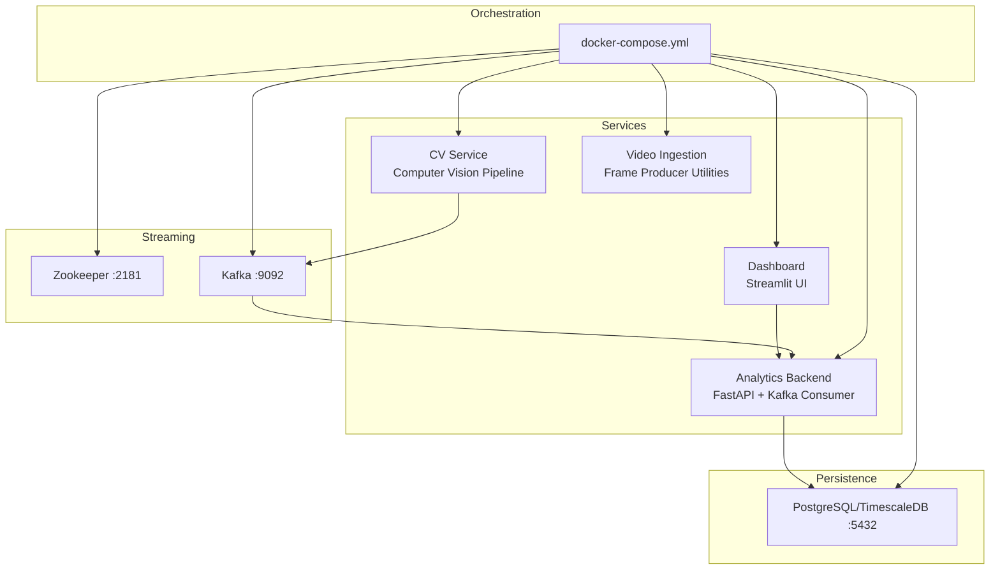
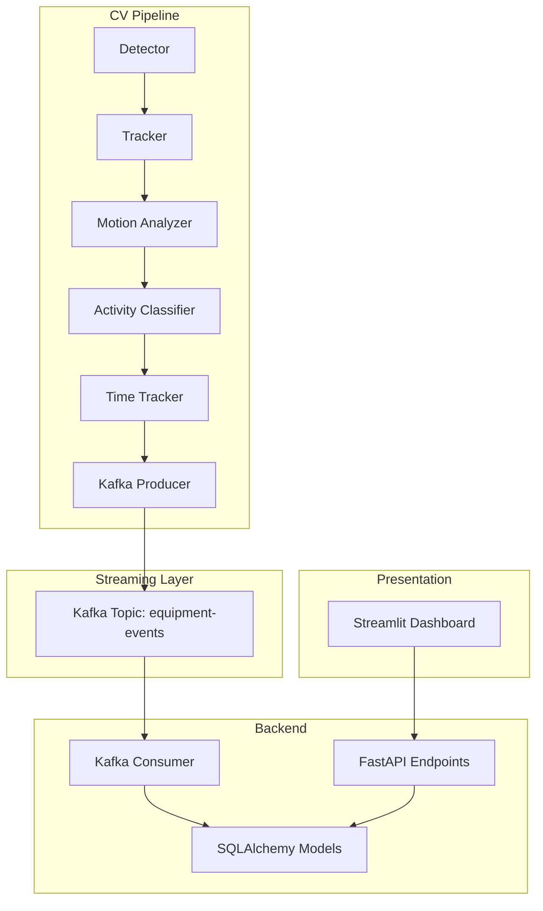
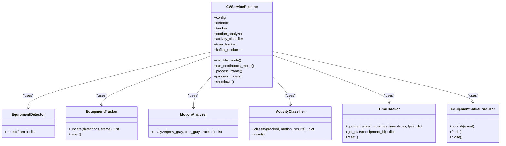
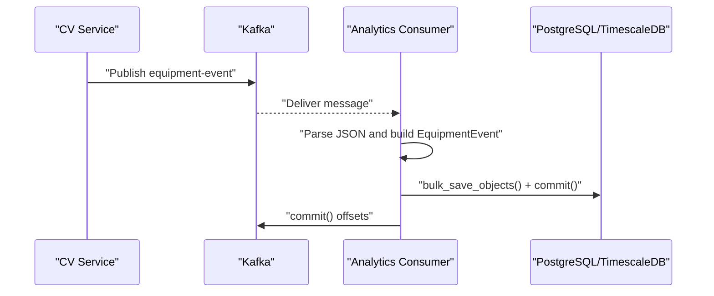
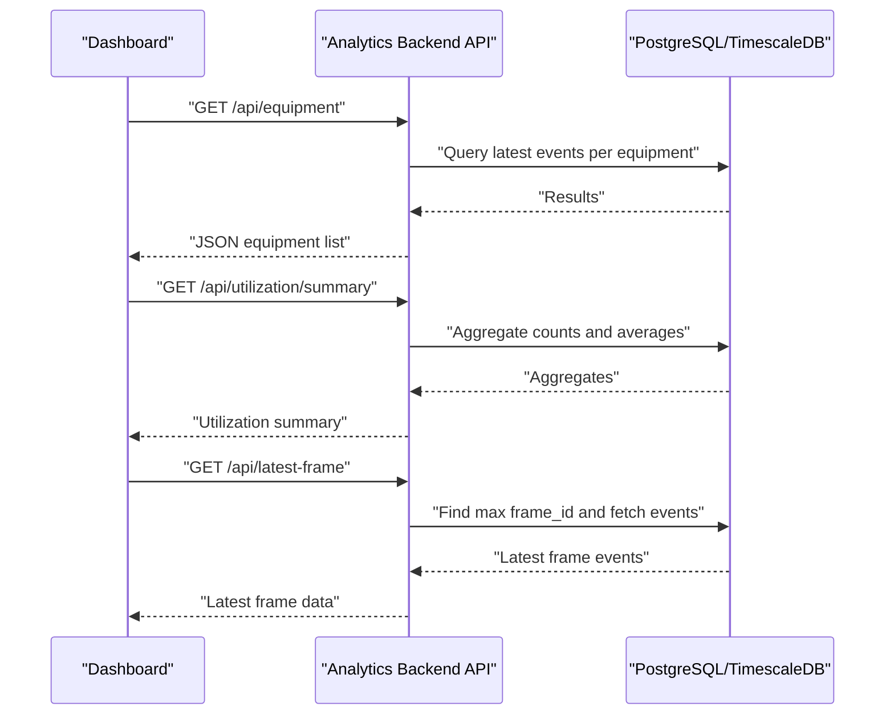
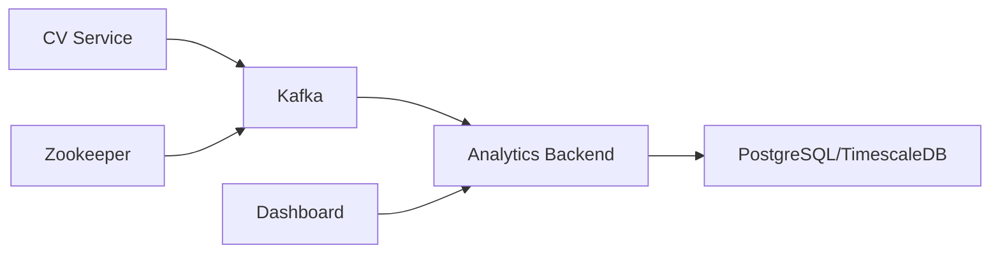

# Microservices Design

<cite>
**Referenced Files in This Document**
- [README.md](file://README.md)
- [docker-compose.yml](file://docker-compose.yml)
- [settings.yaml](file://config/settings.yaml)
- [cv_service main.py](file://services/cv_service/src/main.py)
- [detector.py](file://services/cv_service/src/detector.py)
- [tracker.py](file://services/cv_service/src/tracker.py)
- [motion_analyzer.py](file://services/cv_service/src/motion_analyzer.py)
- [activity_classifier.py](file://services/cv_service/src/activity_classifier.py)
- [time_tracker.py](file://services/cv_service/src/time_tracker.py)
- [kafka_producer.py](file://services/cv_service/src/kafka_producer.py)
- [analytics_backend main.py](file://services/analytics_backend/src/main.py)
- [api.py](file://services/analytics_backend/src/api.py)
- [consumer.py](file://services/analytics_backend/src/consumer.py)
- [db_models.py](file://services/analytics_backend/src/db_models.py)
- [dashboard app.py](file://services/dashboard/src/app.py)
- [frame_producer.py](file://services/video_ingestion/src/frame_producer.py)
</cite>

## Table of Contents
1. [Introduction](#introduction)
2. [Project Structure](#project-structure)
3. [Core Components](#core-components)
4. [Architecture Overview](#architecture-overview)
5. [Detailed Component Analysis](#detailed-component-analysis)
6. [Dependency Analysis](#dependency-analysis)
7. [Performance Considerations](#performance-considerations)
8. [Troubleshooting Guide](#troubleshooting-guide)
9. [Conclusion](#conclusion)
10. [Appendices](#appendices)

## Introduction
This document describes the microservices architecture for a real-time construction equipment monitoring pipeline. The system comprises six interconnected services:
- CV Service: Computer vision processing pipeline (object detection, tracking, motion analysis, activity classification, time tracking, and event publishing)
- Kafka: Event streaming platform decoupling producers from consumers
- PostgreSQL/TimescaleDB: Persistent time-series storage for equipment events
- Analytics Backend: FastAPI REST API and Kafka consumer for persistence and serving
- Dashboard: Streamlit real-time visualization and analytics
- Video Ingestion utilities: Frame extraction and producer utilities

The system follows event-driven architecture, with CV Service emitting equipment events to Kafka, Analytics Backend consuming and persisting them, and the Dashboard querying the API for real-time insights. Pipeline stages are implemented as modular components within CV Service, enabling maintainability and scalability.

## Project Structure
The repository organizes code by service under services/, with shared configuration in config/. Docker Compose orchestrates six containers: zookeeper, kafka, postgres (TimescaleDB), cv-service, analytics-backend, and dashboard.

**Diagram sources**
- [docker-compose.yml:1-95](file://docker-compose.yml#L1-L95)

**Section sources**
- [README.md:56-66](file://README.md#L56-L66)
- [docker-compose.yml:1-95](file://docker-compose.yml#L1-L95)

## Core Components
- CV Service orchestrates the computer vision pipeline and publishes events to Kafka. It initializes detection, tracking, motion analysis, activity classification, time tracking, and Kafka producer components from configuration.
- Analytics Backend exposes REST endpoints and consumes Kafka events to persist them into PostgreSQL/TimescaleDB.
- Dashboard queries Analytics Backend endpoints to render real-time equipment status, utilization metrics, and video frame overlays.
- Kafka provides at-least-once delivery semantics with manual commits and batching for throughput.
- PostgreSQL/TimescaleDB stores equipment events with TimescaleDB hypertable optimization for time-series data.
- Video Ingestion utilities provide reusable frame extraction and producer logic.

Key responsibilities and ownership:
- CV Service: Owns event production and pipeline stage implementations; responsible for CPU-friendly configurations and deterministic event schema.
- Analytics Backend: Owns data persistence, schema, and API contracts; ensures idempotent writes and batched commits.
- Dashboard: Owns presentation and user experience; relies on Analytics Backend API for data.
- Kafka: Owns event durability and ordering guarantees; decouples producers from consumers.
- PostgreSQL/TimescaleDB: Owns immutable event records and time-series indexing.
- Video Ingestion: Owns frame extraction utilities and reusable producer logic.

**Section sources**
- [cv_service main.py:42-142](file://services/cv_service/src/main.py#L42-L142)
- [analytics_backend main.py:64-103](file://services/analytics_backend/src/main.py#L64-L103)
- [api.py:159-444](file://services/analytics_backend/src/api.py#L159-L444)
- [consumer.py:23-78](file://services/analytics_backend/src/consumer.py#L23-L78)
- [db_models.py:22-68](file://services/analytics_backend/src/db_models.py#L22-L68)
- [dashboard app.py:100-160](file://services/dashboard/src/app.py#L100-L160)
- [frame_producer.py:144-200](file://services/video_ingestion/src/frame_producer.py#L144-L200)

## Architecture Overview
The system implements an event-driven architecture:
- CV Service emits structured events to Kafka topic “equipment-events”
- Analytics Backend consumes events asynchronously and persists to PostgreSQL/TimescaleDB
- Dashboard queries Analytics Backend REST API for live equipment status and utilization metrics

**Diagram sources**
- [cv_service main.py:323-372](file://services/cv_service/src/main.py#L323-L372)
- [consumer.py:93-142](file://services/analytics_backend/src/consumer.py#L93-L142)
- [api.py:159-444](file://services/analytics_backend/src/api.py#L159-L444)
- [dashboard app.py:110-160](file://services/dashboard/src/app.py#L110-L160)

**Section sources**
- [README.md:224-234](file://README.md#L224-L234)
- [settings.yaml:41-46](file://config/settings.yaml#L41-L46)

## Detailed Component Analysis

### CV Service Pipeline
Responsibilities:
- Orchestrates detection, tracking, motion analysis, activity classification, time tracking, and event publishing
- Supports file-mode batch processing and continuous-mode watching for new videos
- Emits structured events to Kafka with utilization and time analytics

Implementation highlights:
- Pipeline orchestration and component initialization
- Frame iteration with configurable frame skip and resize
- Event building with state derived from activity classification
- Graceful shutdown handling and signal propagation

**Diagram sources**
- [cv_service main.py:42-142](file://services/cv_service/src/main.py#L42-L142)
- [detector.py:18-84](file://services/cv_service/src/detector.py#L18-L84)
- [tracker.py:19-84](file://services/cv_service/src/tracker.py#L19-L84)
- [motion_analyzer.py:24-87](file://services/cv_service/src/motion_analyzer.py#L24-L87)
- [activity_classifier.py:23-70](file://services/cv_service/src/activity_classifier.py#L23-L70)
- [time_tracker.py:21-52](file://services/cv_service/src/time_tracker.py#L21-L52)

**Section sources**
- [cv_service main.py:42-498](file://services/cv_service/src/main.py#L42-L498)
- [detector.py:85-170](file://services/cv_service/src/detector.py#L85-L170)
- [tracker.py:159-265](file://services/cv_service/src/tracker.py#L159-L265)
- [motion_analyzer.py:88-167](file://services/cv_service/src/motion_analyzer.py#L88-L167)
- [activity_classifier.py:71-126](file://services/cv_service/src/activity_classifier.py#L71-L126)
- [time_tracker.py:53-121](file://services/cv_service/src/time_tracker.py#L53-L121)

### Analytics Backend
Responsibilities:
- Exposes REST API for equipment status, history, utilization summary, latest frame, and stats
- Consumes Kafka “equipment-events” topic and persists to PostgreSQL/TimescaleDB
- Initializes database and TimescaleDB hypertable setup

API contracts:
- GET /api/health
- GET /api/equipment
- GET /api/equipment/{id}/history
- GET /api/utilization/summary
- GET /api/latest-frame
- GET /api/stats

**Diagram sources**
- [consumer.py:143-200](file://services/analytics_backend/src/consumer.py#L143-L200)
- [db_models.py:22-68](file://services/analytics_backend/src/db_models.py#L22-L68)

**Section sources**
- [analytics_backend main.py:64-145](file://services/analytics_backend/src/main.py#L64-L145)
- [api.py:159-444](file://services/analytics_backend/src/api.py#L159-L444)
- [consumer.py:23-244](file://services/analytics_backend/src/consumer.py#L23-L244)
- [db_models.py:70-191](file://services/analytics_backend/src/db_models.py#L70-L191)

### Dashboard
Responsibilities:
- Queries Analytics Backend for equipment list, utilization summary, latest frame, and stats
- Renders real-time equipment status, utilization metrics, and video frame overlays
- Provides filtering and refresh controls

**Diagram sources**
- [dashboard app.py:110-160](file://services/dashboard/src/app.py#L110-L160)
- [api.py:179-416](file://services/analytics_backend/src/api.py#L179-L416)

**Section sources**
- [dashboard app.py:100-160](file://services/dashboard/src/app.py#L100-L160)
- [api.py:159-444](file://services/analytics_backend/src/api.py#L159-L444)

### Kafka Event Streaming
Responsibilities:
- Decouple CV Service from persistence and future consumers
- Provide replay capability and at-least-once delivery semantics
- Topic: equipment-events

Message schema:
- frame_id, equipment_id, equipment_class, timestamp
- utilization: current_state, current_activity, motion_source
- time_analytics: total_tracked_seconds, total_active_seconds, total_idle_seconds, utilization_percent

**Section sources**
- [README.md:263-285](file://README.md#L263-L285)
- [settings.yaml:41-46](file://config/settings.yaml#L41-L46)
- [cv_service main.py:270-322](file://services/cv_service/src/main.py#L270-L322)
- [consumer.py:143-190](file://services/analytics_backend/src/consumer.py#L143-L190)

### PostgreSQL/TimescaleDB Storage
Responsibilities:
- Persist equipment events with time-series characteristics
- Create TimescaleDB hypertable on equipment_events for optimized time-series queries
- Provide SQLAlchemy ORM models and session management

Schema highlights:
- EquipmentEvent table with indexes on equipment_id and created_at
- TimescaleDB hypertable creation on created_at

**Section sources**
- [db_models.py:22-68](file://services/analytics_backend/src/db_models.py#L22-L68)
- [db_models.py:103-156](file://services/analytics_backend/src/db_models.py#L103-L156)

### Video Ingestion Utilities
Responsibilities:
- Provide frame extraction with configurable frame skip and resize
- Support iteration over multiple videos and produce frame tuples
- Reusable producer logic for downstream processing

**Section sources**
- [frame_producer.py:144-325](file://services/video_ingestion/src/frame_producer.py#L144-L325)

## Dependency Analysis
Inter-service dependencies:
- CV Service depends on Kafka for event publishing
- Analytics Backend depends on Kafka for consumption and PostgreSQL/TimescaleDB for persistence
- Dashboard depends on Analytics Backend for REST API
- Kafka depends on Zookeeper for coordination
- PostgreSQL/TimescaleDB is provisioned by Docker Compose

**Diagram sources**
- [docker-compose.yml:1-95](file://docker-compose.yml#L1-L95)
- [cv_service main.py:132-135](file://services/cv_service/src/main.py#L132-L135)
- [analytics_backend main.py:95-99](file://services/analytics_backend/src/main.py#L95-L99)

**Section sources**
- [docker-compose.yml:1-95](file://docker-compose.yml#L1-L95)
- [cv_service main.py:104-106](file://services/cv_service/src/main.py#L104-L106)
- [analytics_backend main.py:95-103](file://services/analytics_backend/src/main.py#L95-L103)

## Performance Considerations
- CPU optimization strategies in CV Service:
  - Use YOLOv8n (nano) model for lightweight inference
  - Frame skipping and resizing to reduce computational load
  - Crop-based optical flow to avoid full-frame computation
- Kafka batching and manual commits:
  - Batch size and timeout tuned for throughput and latency
  - Manual commit after successful DB write to ensure idempotency
- Database pooling and TimescaleDB:
  - SQLAlchemy engine pool configuration
  - Hypertable creation for time-series optimization

Operational tuning levers:
- Reduce flickering: increase smoothing_window
- Sensitivity adjustments: lower magnitude_threshold
- CPU savings: increase frame_skip or reduce resize_width

**Section sources**
- [README.md:177-198](file://README.md#L177-L198)
- [README.md:224-234](file://README.md#L224-L234)
- [settings.yaml:3-59](file://config/settings.yaml#L3-L59)
- [consumer.py:31-34](file://services/analytics_backend/src/consumer.py#L31-L34)
- [db_models.py:85-91](file://services/analytics_backend/src/db_models.py#L85-L91)

## Troubleshooting Guide
Common issues and resolutions:
- Health checks:
  - Verify Analytics Backend /api/health endpoint for database connectivity
- Kafka connectivity:
  - Confirm topic “equipment-events” exists and consumer group is configured
  - Check consumer logs for JSON decode errors or Kafka exceptions
- Database schema:
  - Ensure TimescaleDB extension is available and hypertable created
- Dashboard connectivity:
  - Validate API URL configuration and network reachability
- Pipeline stalls:
  - Inspect CV Service logs for frame processing errors and shutdown signals

**Section sources**
- [api.py:159-177](file://services/analytics_backend/src/api.py#L159-L177)
- [consumer.py:129-142](file://services/analytics_backend/src/consumer.py#L129-L142)
- [db_models.py:103-156](file://services/analytics_backend/src/db_models.py#L103-L156)
- [dashboard app.py:100-108](file://services/dashboard/src/app.py#L100-L108)

## Conclusion
The microservices architecture employs a clean separation of concerns:
- CV Service encapsulates the computer vision pipeline and event emission
- Kafka decouples producers from consumers for scalability and resilience
- Analytics Backend centralizes persistence and API exposure
- Dashboard provides real-time observability
- PostgreSQL/TimescaleDB offers durable, time-series optimized storage
- Video Ingestion utilities enable reusable frame processing

Architectural patterns:
- Event-driven architecture with Kafka
- Pipeline pattern for processing stages within CV Service
- Factory-like component initialization via configuration

Scalability and resilience:
- Independent scaling of CV Service, Analytics Backend, and Dashboard
- Fault isolation through bounded contexts and explicit API contracts
- Idempotent persistence and batched commits for reliability

## Appendices

### API Contracts Summary
- GET /api/health: Health check with database status
- GET /api/equipment: Latest equipment states
- GET /api/equipment/{id}/history: Time-series history for equipment
- GET /api/utilization/summary: Aggregated utilization statistics
- GET /api/latest-frame: Current frame data for real-time display
- GET /api/stats: Database statistics

**Section sources**
- [README.md:236-260](file://README.md#L236-L260)
- [api.py:159-444](file://services/analytics_backend/src/api.py#L159-L444)

### Kafka Message Schema
- Topic: equipment-events
- Fields: frame_id, equipment_id, equipment_class, timestamp, utilization, time_analytics

**Section sources**
- [README.md:263-285](file://README.md#L263-L285)
- [cv_service main.py:270-322](file://services/cv_service/src/main.py#L270-L322)