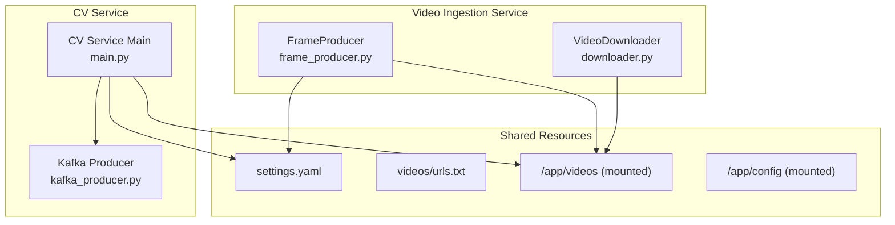
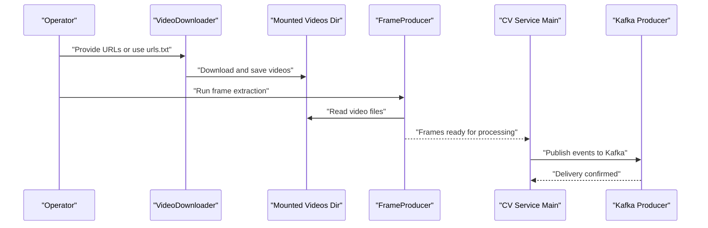
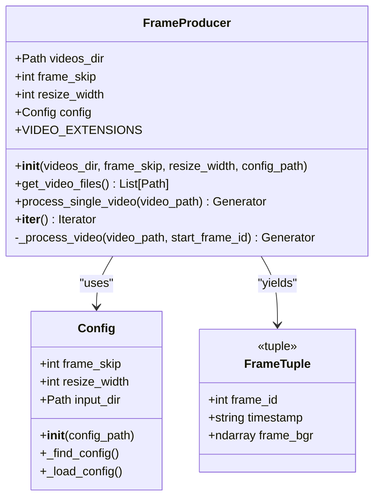
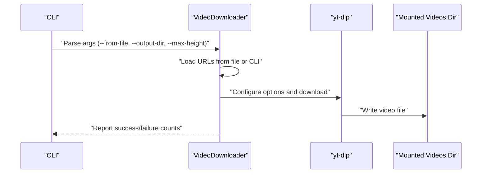
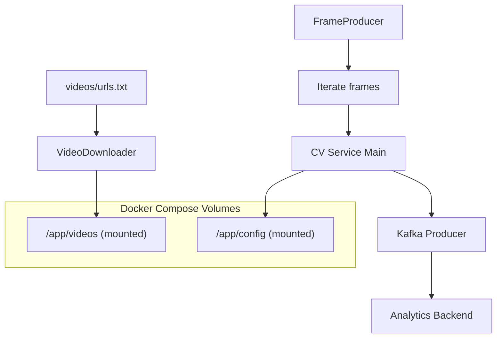
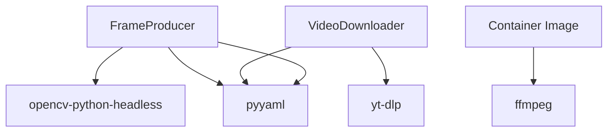

# Video Ingestion

<cite>
**Referenced Files in This Document**
- [frame_producer.py](file://services/video_ingestion/src/frame_producer.py)
- [downloader.py](file://services/video_ingestion/src/downloader.py)
- [settings.yaml](file://config/settings.yaml)
- [urls.txt](file://videos/urls.txt)
- [Dockerfile](file://services/video_ingestion/Dockerfile)
- [docker-compose.yml](file://docker-compose.yml)
- [requirements.txt](file://services/video_ingestion/requirements.txt)
- [main.py](file://services/cv_service/src/main.py)
- [kafka_producer.py](file://services/cv_service/src/kafka_producer.py)
</cite>

## Table of Contents
1. [Introduction](#introduction)
2. [Project Structure](#project-structure)
3. [Core Components](#core-components)
4. [Architecture Overview](#architecture-overview)
5. [Detailed Component Analysis](#detailed-component-analysis)
6. [Dependency Analysis](#dependency-analysis)
7. [Performance Considerations](#performance-considerations)
8. [Troubleshooting Guide](#troubleshooting-guide)
9. [Conclusion](#conclusion)
10. [Appendices](#appendices)

## Introduction
The Video Ingestion microservice prepares video data for the computer vision pipeline by:
- Fetching remote video content (primarily YouTube) and saving it locally
- Extracting individual frames from local video files with configurable frame rate control and resolution handling
- Integrating seamlessly with the CV Service pipeline through shared directories and configuration

This document explains how the FrameProducer extracts frames efficiently, how the Downloader fetches remote content, and how both components integrate into the broader analytics pipeline.

## Project Structure
The Video Ingestion service consists of two primary modules:
- FrameProducer: Extracts frames from local video files with frame skipping and resizing
- Downloader: Downloads YouTube videos using yt-dlp with progress tracking and error recovery

**Diagram sources**
- [frame_producer.py:144-325](file://services/video_ingestion/src/frame_producer.py#L144-L325)
- [downloader.py:30-148](file://services/video_ingestion/src/downloader.py#L30-L148)
- [settings.yaml:3-6](file://config/settings.yaml#L3-L6)
- [urls.txt:1-4](file://videos/urls.txt#L1-L4)
- [main.py:161-182](file://services/cv_service/src/main.py#L161-L182)
- [kafka_producer.py:17-69](file://services/cv_service/src/kafka_producer.py#L17-L69)

**Section sources**
- [frame_producer.py:1-414](file://services/video_ingestion/src/frame_producer.py#L1-L414)
- [downloader.py:1-276](file://services/video_ingestion/src/downloader.py#L1-L276)
- [settings.yaml:1-59](file://config/settings.yaml#L1-L59)
- [urls.txt:1-4](file://videos/urls.txt#L1-L4)
- [docker-compose.yml:51-62](file://docker-compose.yml#L51-L62)

## Core Components
- FrameProducer: Iterates over video files in a directory, applies frame skipping and resizing, and yields frame metadata and arrays. It reads configuration from settings.yaml and supports Docker-specific paths.
- VideoDownloader: Downloads YouTube videos using yt-dlp with configurable maximum height, progress reporting, and batch processing. It writes outputs to the videos directory and loads URLs from a text file.

Key behaviors:
- FrameProducer validates frame_skip and determines videos directory from config or defaults
- VideoDownloader creates output directories, sets yt-dlp options, and handles errors gracefully
- Both components rely on shared configuration and mounted volumes for persistence

**Section sources**
- [frame_producer.py:144-325](file://services/video_ingestion/src/frame_producer.py#L144-L325)
- [downloader.py:30-148](file://services/video_ingestion/src/downloader.py#L30-L148)
- [settings.yaml:3-6](file://config/settings.yaml#L3-L6)

## Architecture Overview
The ingestion pipeline integrates with the CV Service through shared directories and configuration:

**Diagram sources**
- [downloader.py:107-148](file://services/video_ingestion/src/downloader.py#L107-L148)
- [frame_producer.py:201-324](file://services/video_ingestion/src/frame_producer.py#L201-L324)
- [main.py:374-421](file://services/cv_service/src/main.py#L374-L421)
- [kafka_producer.py:91-169](file://services/cv_service/src/kafka_producer.py#L91-L169)

## Detailed Component Analysis

### FrameProducer
FrameProducer extracts frames from video files with configurable frame skipping and resizing. It:
- Loads configuration from settings.yaml (frame_skip, resize_width, input_dir)
- Scans the videos directory for supported video extensions
- Processes each video, yielding tuples of (frame_id, timestamp, frame_bgr)
- Maintains a monotonically increasing frame_id across videos

**Diagram sources**
- [frame_producer.py:34-93](file://services/video_ingestion/src/frame_producer.py#L34-L93)
- [frame_producer.py:144-325](file://services/video_ingestion/src/frame_producer.py#L144-L325)

Key implementation notes:
- Frame skipping reduces computational load by processing every Nth frame
- Resizing maintains aspect ratio and uses appropriate interpolation
- Timestamp calculation converts frame indices to human-readable format
- Video discovery supports common container formats

**Section sources**
- [frame_producer.py:144-325](file://services/video_ingestion/src/frame_producer.py#L144-L325)
- [settings.yaml:3-6](file://config/settings.yaml#L3-L6)

### Downloader Utility
The Downloader fetches remote video content using yt-dlp with:
- Configurable maximum height for CPU-friendly processing
- Progress hooks for real-time feedback
- Batch processing from CLI arguments or urls.txt
- Error recovery and non-overwrite behavior

**Diagram sources**
- [downloader.py:177-221](file://services/video_ingestion/src/downloader.py#L177-L221)
- [downloader.py:107-148](file://services/video_ingestion/src/downloader.py#L107-L148)
- [downloader.py:151-174](file://services/video_ingestion/src/downloader.py#L151-L174)

Operational highlights:
- Output directory creation and Docker-aware path resolution
- Format selection prioritizes MP4 with audio merging
- Progress reporting and logging for transparency
- Graceful handling of failures in batch mode

**Section sources**
- [downloader.py:30-148](file://services/video_ingestion/src/downloader.py#L30-L148)
- [urls.txt:1-4](file://videos/urls.txt#L1-L4)

### Integration with CV Service Pipeline
The CV Service consumes frames produced by FrameProducer and publishes events to Kafka. Integration points:
- Shared videos directory mounted by docker-compose
- Shared configuration loaded by both services
- FrameProducer and CV Service both use settings.yaml for frame_skip and resize_width

**Diagram sources**
- [docker-compose.yml:59-60](file://docker-compose.yml#L59-L60)
- [main.py:161-182](file://services/cv_service/src/main.py#L161-L182)
- [kafka_producer.py:17-69](file://services/cv_service/src/kafka_producer.py#L17-L69)

**Section sources**
- [docker-compose.yml:51-62](file://docker-compose.yml#L51-L62)
- [main.py:137-142](file://services/cv_service/src/main.py#L137-L142)
- [kafka_producer.py:17-69](file://services/cv_service/src/kafka_producer.py#L17-L69)

## Dependency Analysis
External dependencies and runtime requirements:
- OpenCV (headless) for frame capture and resizing
- yt-dlp for YouTube downloads
- PyYAML for configuration parsing
- FFmpeg installed in the container for video decoding

**Diagram sources**
- [requirements.txt:1-4](file://services/video_ingestion/requirements.txt#L1-L4)
- [Dockerfile:5-6](file://services/video_ingestion/Dockerfile#L5-L6)

**Section sources**
- [requirements.txt:1-4](file://services/video_ingestion/requirements.txt#L1-L4)
- [Dockerfile:1-19](file://services/video_ingestion/Dockerfile#L1-L19)

## Performance Considerations
- Frame skipping: Reduce CPU load by processing every Nth frame; tune via settings.yaml
- Resolution handling: Resize frames to a target width while preserving aspect ratio
- Interpolation strategy: Uses area downsampling or linear upsampling depending on scale direction
- Batch processing: FrameProducer yields frames incrementally to minimize memory footprint
- Disk I/O: Mounted volumes reduce I/O overhead compared to copying files
- Container runtime: Headless OpenCV avoids GUI dependencies; FFmpeg enables broad codec support

[No sources needed since this section provides general guidance]

## Troubleshooting Guide
Common issues and resolutions:
- Configuration file not found: FrameProducer searches Docker-specific path first, then default path; ensure /app/config/settings.yaml is mounted
- No video files discovered: Verify videos directory exists and contains supported extensions (.mp4, .avi, .mov, .mkv, .webm, .m4v)
- Download failures: yt-dlp ignores errors by default; check logs for specific failures and network connectivity
- Progress reporting: Progress hooks require stdout; ensure terminal supports progress display
- Kafka connectivity: CV Service Kafka producer requires a healthy Kafka cluster; verify bootstrap servers and topic configuration

**Section sources**
- [frame_producer.py:54-75](file://services/video_ingestion/src/frame_producer.py#L54-L75)
- [frame_producer.py:201-220](file://services/video_ingestion/src/frame_producer.py#L201-L220)
- [downloader.py:107-124](file://services/video_ingestion/src/downloader.py#L107-L124)
- [downloader.py:136-148](file://services/video_ingestion/src/downloader.py#L136-L148)
- [kafka_producer.py:39-53](file://services/cv_service/src/kafka_producer.py#L39-L53)

## Conclusion
The Video Ingestion microservice provides robust capabilities for preparing video data for the computer vision pipeline:
- Efficient frame extraction with configurable frame skipping and resizing
- Reliable remote video downloading with progress tracking and error recovery
- Seamless integration with the CV Service through shared directories and configuration
- Scalable performance characteristics suitable for large video files and batch processing

[No sources needed since this section summarizes without analyzing specific files]

## Appendices

### Configuration Options
- Frame extraction parameters:
  - frame_skip: Integer; process every Nth frame
  - resize_width: Integer; target width for frames
  - input_dir: String; directory containing video files
- Video quality settings:
  - max_height: Integer; maximum height for downloaded videos (default 720)
- Storage optimization:
  - Mounted volumes for persistent storage and cross-service sharing

**Section sources**
- [settings.yaml:3-6](file://config/settings.yaml#L3-L6)
- [downloader.py:39-54](file://services/video_ingestion/src/downloader.py#L39-L54)

### File Format Support
- FrameProducer supports: .mp4, .avi, .mov, .mkv, .webm, .m4v
- CV Service supports: .mp4, .avi, .mov, .mkv, .webm

**Section sources**
- [frame_producer.py:158-159](file://services/video_ingestion/src/frame_producer.py#L158-L159)
- [main.py:173-179](file://services/cv_service/src/main.py#L173-L179)

### Directory Management and Automated Discovery
- Videos directory is mounted at /app/videos in containers
- URLs file: videos/urls.txt for batch downloads
- Automatic discovery: FrameProducer scans input_dir for supported extensions

**Section sources**
- [docker-compose.yml:59-60](file://docker-compose.yml#L59-L60)
- [urls.txt:1-4](file://videos/urls.txt#L1-L4)
- [frame_producer.py:201-220](file://services/video_ingestion/src/frame_producer.py#L201-L220)

### Memory Management and Concurrent Processing
- Incremental frame yielding minimizes memory usage
- FrameProducer releases video captures after processing
- CV Service processes frames incrementally and flushes Kafka events

**Section sources**
- [frame_producer.py:293-324](file://services/video_ingestion/src/frame_producer.py#L293-L324)
- [main.py:374-421](file://services/cv_service/src/main.py#L374-L421)

### File System Permissions and Cleanup
- Mounted volumes: Ensure write permissions to /app/videos and /app/config
- Cleanup: Remove temporary files after processing; monitor disk usage
- Logs: Streamed to stdout for container orchestration visibility

**Section sources**
- [Dockerfile:15-18](file://services/video_ingestion/Dockerfile#L15-L18)
- [downloader.py:53-54](file://services/video_ingestion/src/downloader.py#L53-L54)