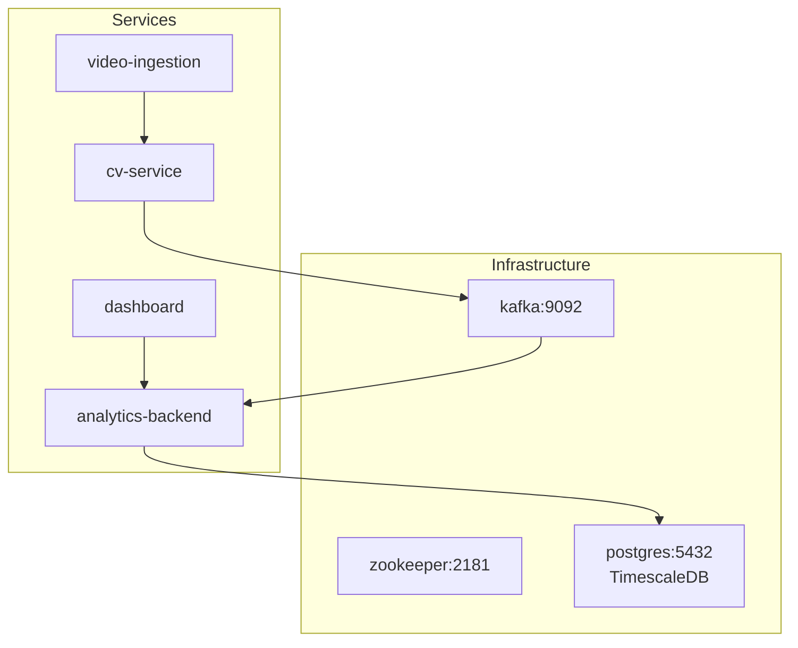
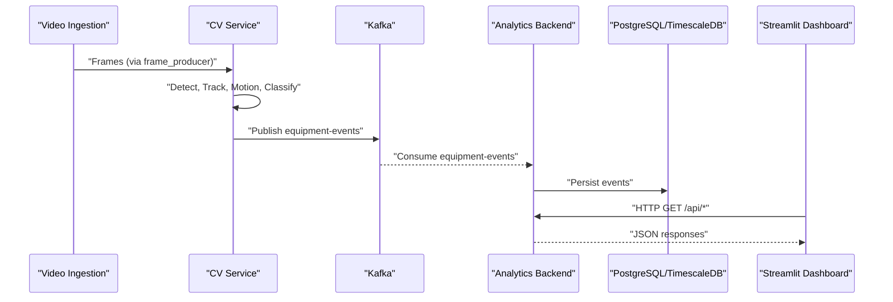
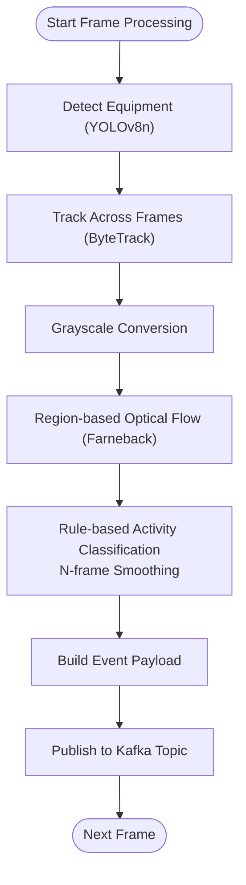
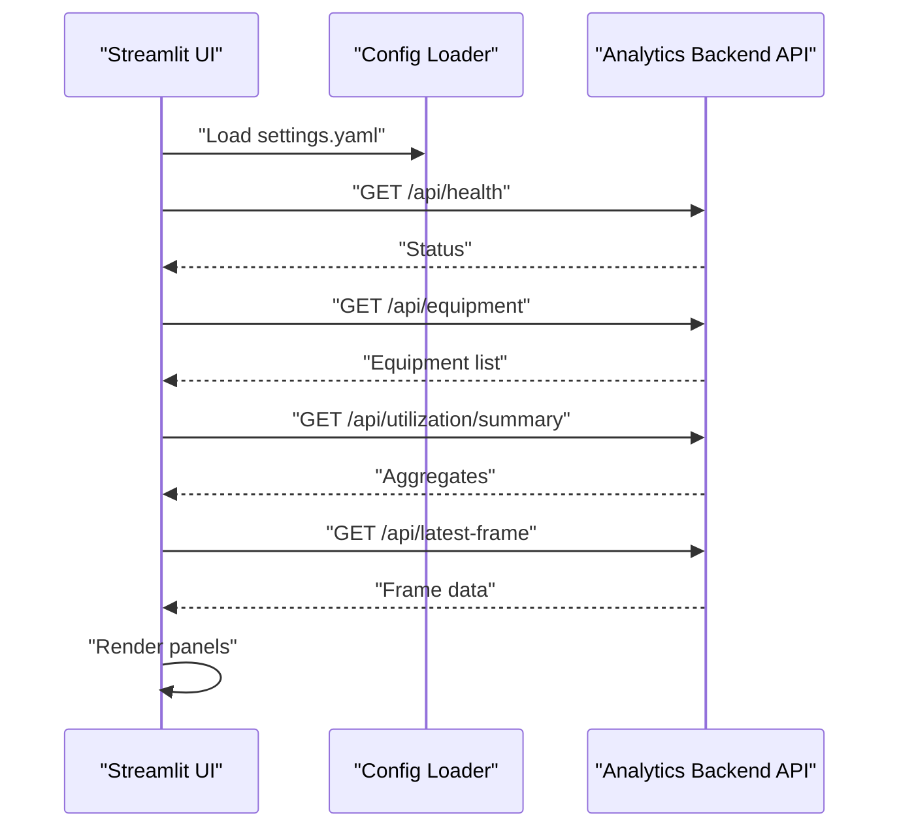
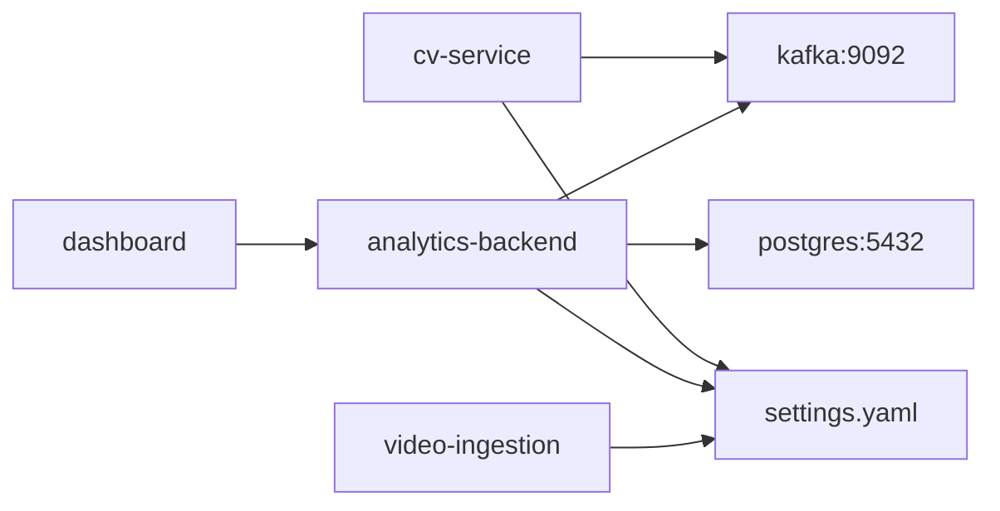
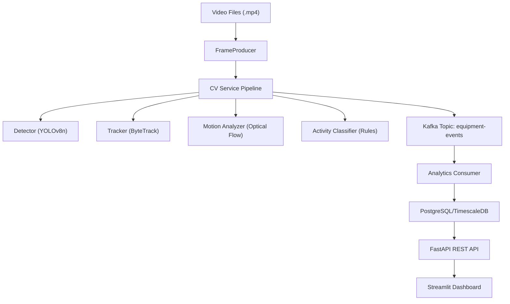

# System Architecture

<cite>
**Referenced Files in This Document**
- [README.md](file://README.md)
- [docker-compose.yml](file://docker-compose.yml)
- [settings.yaml](file://config/settings.yaml)
- [cv_service main.py](file://services/cv_service/src/main.py)
- [cv_service kafka_producer.py](file://services/cv_service/src/kafka_producer.py)
- [cv_service detector.py](file://services/cv_service/src/detector.py)
- [cv_service tracker.py](file://services/cv_service/src/tracker.py)
- [cv_service motion_analyzer.py](file://services/cv_service/src/motion_analyzer.py)
- [cv_service activity_classifier.py](file://services/cv_service/src/activity_classifier.py)
- [analytics_backend main.py](file://services/analytics_backend/src/main.py)
- [analytics_backend consumer.py](file://services/analytics_backend/src/consumer.py)
- [analytics_backend api.py](file://services/analytics_backend/src/api.py)
- [analytics_backend db_models.py](file://services/analytics_backend/src/db_models.py)
- [dashboard app.py](file://services/dashboard/src/app.py)
- [video_ingestion frame_producer.py](file://services/video_ingestion/src/frame_producer.py)
</cite>

## Table of Contents
1. [Introduction](#introduction)
2. [Project Structure](#project-structure)
3. [Core Components](#core-components)
4. [Architecture Overview](#architecture-overview)
5. [Detailed Component Analysis](#detailed-component-analysis)
6. [Dependency Analysis](#dependency-analysis)
7. [Performance Considerations](#performance-considerations)
8. [Troubleshooting Guide](#troubleshooting-guide)
9. [Conclusion](#conclusion)
10. [Appendices](#appendices)

## Introduction
This document describes the microservices-based equipment monitoring system that performs real-time detection, tracking, motion analysis, and activity classification of construction equipment from video feeds. The pipeline streams events through Apache Kafka to a backend service that persists data to PostgreSQL/TimescaleDB, and a Streamlit dashboard visualizes live utilization metrics. The system emphasizes CPU-centric optimizations, region-based optical flow for articulated motion, rule-based activity classification, and a decoupled event-driven architecture.

## Project Structure
The system is organized into six interconnected services orchestrated by Docker Compose:
- zookeeper: Kafka coordination
- kafka: event streaming broker
- postgres: time-series data storage (with TimescaleDB support)
- cv-service: computer vision pipeline (detector, tracker, motion analyzer, activity classifier, Kafka producer)
- analytics-backend: Kafka consumer, FastAPI REST endpoints, and database persistence
- dashboard: Streamlit UI querying the backend API
- video-ingestion: utilities for frame extraction and video preparation



**Diagram sources**
- [docker-compose.yml:1-97](file://docker-compose.yml#L1-L97)
- [README.md:7-54](file://README.md#L7-L54)

**Section sources**
- [README.md:56-66](file://README.md#L56-L66)
- [docker-compose.yml:1-97](file://docker-compose.yml#L1-L97)

## Core Components
- CV Service orchestrates the computer vision pipeline, publishing structured events to Kafka.
- Analytics Backend consumes Kafka events, persists them to PostgreSQL/TimescaleDB, and exposes a FastAPI REST API.
- Kafka serves as the event bus for decoupling producers and consumers.
- PostgreSQL/TimescaleDB stores time-series event data with automatic hypertable setup.
- Streamlit Dashboard queries the backend API to render real-time equipment status and utilization.
- Video Ingestion provides frame extraction utilities for batch processing.

Key configuration is centralized in settings.yaml, enabling tuning of detection, tracking, motion analysis, activity classification, Kafka, and database parameters.

**Section sources**
- [settings.yaml:1-59](file://config/settings.yaml#L1-L59)
- [cv_service main.py:42-498](file://services/cv_service/src/main.py#L42-L498)
- [analytics_backend main.py:64-149](file://services/analytics_backend/src/main.py#L64-L149)
- [analytics_backend api.py:159-444](file://services/analytics_backend/src/api.py#L159-L444)
- [analytics_backend db_models.py:22-191](file://services/analytics_backend/src/db_models.py#L22-L191)
- [dashboard app.py:26-621](file://services/dashboard/src/app.py#L26-L621)
- [video_ingestion frame_producer.py:144-414](file://services/video_ingestion/src/frame_producer.py#L144-L414)

## Architecture Overview
The system follows a real-time event streaming architecture:
- Video ingestion produces frames (or uses existing video files).
- CV Service runs detection, tracking, motion analysis, and activity classification, then publishes events to Kafka.
- Analytics Backend consumes events, persists to PostgreSQL/TimescaleDB, and serves them via FastAPI.
- Dashboard pulls data from the backend to visualize equipment status and utilization.



**Diagram sources**
- [cv_service main.py:323-421](file://services/cv_service/src/main.py#L323-L421)
- [cv_service kafka_producer.py:91-169](file://services/cv_service/src/kafka_producer.py#L91-L169)
- [analytics_backend consumer.py:143-200](file://services/analytics_backend/src/consumer.py#L143-L200)
- [analytics_backend api.py:159-444](file://services/analytics_backend/src/api.py#L159-L444)
- [dashboard app.py:110-160](file://services/dashboard/src/app.py#L110-L160)

## Detailed Component Analysis

### CV Service Pipeline
The CV Service is the orchestrator that coordinates:
- EquipmentDetector: YOLOv8 nano for lightweight CPU detection.
- EquipmentTracker: ByteTrack via supervision for multi-object tracking with persistent IDs.
- MotionAnalyzer: Region-based optical flow (upper/lower regions) using Farneback.
- ActivityClassifier: Rule-based classification with N-frame smoothing.
- EquipmentKafkaProducer: Publishes structured events to Kafka topic.



**Diagram sources**
- [cv_service main.py:323-372](file://services/cv_service/src/main.py#L323-L372)
- [cv_service detector.py:85-170](file://services/cv_service/src/detector.py#L85-L170)
- [cv_service tracker.py:159-264](file://services/cv_service/src/tracker.py#L159-L264)
- [cv_service motion_analyzer.py:88-166](file://services/cv_service/src/motion_analyzer.py#L88-L166)
- [cv_service activity_classifier.py:71-125](file://services/cv_service/src/activity_classifier.py#L71-L125)
- [cv_service kafka_producer.py:91-169](file://services/cv_service/src/kafka_producer.py#L91-L169)

**Section sources**
- [cv_service main.py:42-498](file://services/cv_service/src/main.py#L42-L498)
- [cv_service detector.py:18-170](file://services/cv_service/src/detector.py#L18-L170)
- [cv_service tracker.py:19-341](file://services/cv_service/src/tracker.py#L19-L341)
- [cv_service motion_analyzer.py:24-442](file://services/cv_service/src/motion_analyzer.py#L24-L442)
- [cv_service activity_classifier.py:23-306](file://services/cv_service/src/activity_classifier.py#L23-L306)
- [cv_service kafka_producer.py:17-228](file://services/cv_service/src/kafka_producer.py#L17-L228)

### Analytics Backend
The backend composes:
- Kafka Consumer: Reads equipment-events, batches writes, commits offsets.
- FastAPI REST API: Health checks, equipment list, history, utilization summary, latest frame, stats.
- SQLAlchemy/TimescaleDB Models: Persistent schema with optional hypertable optimization.

```mermaid
classDiagram
class AnalyticsConsumer {
+start(blocking)
+process_message(message)
+stop()
+is_running() bool
}
class EquipmentEvent {
+int id
+int frame_id
+string equipment_id
+string equipment_class
+string timestamp
+string current_state
+string current_activity
+string motion_source
+float total_tracked_seconds
+float total_active_seconds
+float total_idle_seconds
+float utilization_percent
+datetime created_at
}
class EquipmentKafkaProducer {
+publish(event)
+flush(timeout) int
+close()
}
class API {
+GET /api/health
+GET /api/equipment
+GET /api/equipment/{id}/history
+GET /api/utilization/summary
+GET /api/latest-frame
+GET /api/stats
}
AnalyticsConsumer --> EquipmentEvent : "writes"
API --> EquipmentEvent : "queries"
EquipmentKafkaProducer --> AnalyticsConsumer : "consumes"
```

**Diagram sources**
- [analytics_backend consumer.py:23-244](file://services/analytics_backend/src/consumer.py#L23-L244)
- [analytics_backend db_models.py:22-68](file://services/analytics_backend/src/db_models.py#L22-L68)
- [analytics_backend api.py:159-444](file://services/analytics_backend/src/api.py#L159-L444)
- [cv_service kafka_producer.py:17-228](file://services/cv_service/src/kafka_producer.py#L17-L228)

**Section sources**
- [analytics_backend main.py:64-149](file://services/analytics_backend/src/main.py#L64-L149)
- [analytics_backend consumer.py:23-268](file://services/analytics_backend/src/consumer.py#L23-L268)
- [analytics_backend api.py:159-444](file://services/analytics_backend/src/api.py#L159-L444)
- [analytics_backend db_models.py:70-191](file://services/analytics_backend/src/db_models.py#L70-L191)

### Streamlit Dashboard
The dashboard:
- Loads configuration for backend API URL and refresh intervals.
- Polls backend endpoints for health, equipment list, utilization summary, latest frame, and stats.
- Renders live equipment status, utilization metrics, and per-equipment cards.



**Diagram sources**
- [dashboard app.py:26-160](file://services/dashboard/src/app.py#L26-L160)
- [dashboard app.py:518-621](file://services/dashboard/src/app.py#L518-L621)

**Section sources**
- [dashboard app.py:26-621](file://services/dashboard/src/app.py#L26-L621)

### Video Ingestion Utilities
The video ingestion module provides:
- FrameProducer: Iterates over video files, applies frame skipping and resizing, yields frame tuples.
- Supports configurable parameters from settings.yaml.

**Section sources**
- [video_ingestion frame_producer.py:144-414](file://services/video_ingestion/src/frame_producer.py#L144-L414)

## Dependency Analysis
Service dependencies and runtime relationships:
- CV Service depends on Kafka (producer) and reads configuration from settings.yaml.
- Analytics Backend depends on Kafka (consumer) and PostgreSQL/TimescaleDB.
- Dashboard depends on Analytics Backend API.
- Docker Compose defines service health checks and interdependencies.



**Diagram sources**
- [docker-compose.yml:1-97](file://docker-compose.yml#L1-L97)
- [settings.yaml:1-59](file://config/settings.yaml#L1-L59)

**Section sources**
- [docker-compose.yml:1-97](file://docker-compose.yml#L1-L97)
- [settings.yaml:1-59](file://config/settings.yaml#L1-L59)

## Performance Considerations
- CPU-first design:
  - YOLOv8 nano model for detection.
  - Frame skipping and resizing to reduce inference cost.
  - Crop-based optical flow to avoid full-frame computation.
- Kafka tuning:
  - Producer acks=all, small linger.ms, batch.size for throughput.
  - Consumer manual commits with batched writes and timeouts.
- Database optimization:
  - TimescaleDB hypertable on created_at for time-series efficiency.
  - SQLAlchemy pooling and pre-ping for stability.
- Dashboard responsiveness:
  - Caching and short TTLs for frequent endpoints.
  - Adjustable refresh intervals.

**Section sources**
- [README.md:177-187](file://README.md#L177-L187)
- [cv_service kafka_producer.py:39-53](file://services/cv_service/src/kafka_producer.py#L39-L53)
- [analytics_backend consumer.py:31-34](file://services/analytics_backend/src/consumer.py#L31-L34)
- [analytics_backend db_models.py:103-156](file://services/analytics_backend/src/db_models.py#L103-L156)
- [dashboard app.py:100-160](file://services/dashboard/src/app.py#L100-L160)

## Troubleshooting Guide
- Kafka connectivity:
  - Verify zookeeper and kafka health checks in docker-compose.
  - Confirm topic creation and consumer group configuration.
- Database readiness:
  - Ensure PostgreSQL is healthy and TimescaleDB extension is available.
  - Check table creation and hypertable setup logs.
- API availability:
  - Use /api/health to confirm backend and DB connectivity.
  - Inspect FastAPI logs for SQL exceptions or session errors.
- Dashboard connectivity:
  - Validate API URL in settings.yaml.
  - Confirm network routes between dashboard and backend.

**Section sources**
- [docker-compose.yml:11-15](file://docker-compose.yml#L11-L15)
- [docker-compose.yml:30-35](file://docker-compose.yml#L30-L35)
- [docker-compose.yml:47-51](file://docker-compose.yml#L47-L51)
- [analytics_backend api.py:159-177](file://services/analytics_backend/src/api.py#L159-L177)
- [analytics_backend db_models.py:103-156](file://services/analytics_backend/src/db_models.py#L103-L156)
- [dashboard app.py:100-108](file://services/dashboard/src/app.py#L100-L108)

## Conclusion
The system employs a clean, decoupled architecture leveraging Apache Kafka for event streaming, PostgreSQL/TimescaleDB for durable time-series storage, and a Streamlit dashboard for real-time visualization. CPU-centric optimizations and region-based optical flow enable practical, low-resource operation while maintaining accurate activity classification. The modular design supports scalability, fault tolerance, and straightforward deployment via Docker Compose.

## Appendices

### System Context Diagram
End-to-end workflow from video ingestion to real-time visualization.



**Diagram sources**
- [README.md:7-54](file://README.md#L7-L54)
- [video_ingestion frame_producer.py:144-414](file://services/video_ingestion/src/frame_producer.py#L144-L414)
- [cv_service main.py:323-421](file://services/cv_service/src/main.py#L323-L421)
- [cv_service kafka_producer.py:91-169](file://services/cv_service/src/kafka_producer.py#L91-L169)
- [analytics_backend consumer.py:143-200](file://services/analytics_backend/src/consumer.py#L143-L200)
- [analytics_backend api.py:159-444](file://services/analytics_backend/src/api.py#L159-L444)
- [dashboard app.py:26-621](file://services/dashboard/src/app.py#L26-L621)

### API Endpoints
- GET /api/health: Health check with database status.
- GET /api/equipment: Latest equipment states.
- GET /api/equipment/{id}/history: Time-series history.
- GET /api/utilization/summary: Aggregated utilization metrics.
- GET /api/latest-frame: Current frame data for visualization.
- GET /api/stats: Database statistics.

**Section sources**
- [README.md:236-246](file://README.md#L236-L246)
- [analytics_backend api.py:159-444](file://services/analytics_backend/src/api.py#L159-L444)

### Kafka Message Schema
- Topic: equipment-events
- Fields include frame_id, equipment_id/class, timestamp, utilization (state, activity, motion_source), and time_analytics (tracked, active, idle, utilization percent).

**Section sources**
- [README.md:263-285](file://README.md#L263-L285)
- [cv_service kafka_producer.py:95-112](file://services/cv_service/src/kafka_producer.py#L95-L112)
- [analytics_backend consumer.py:147-167](file://services/analytics_backend/src/consumer.py#L147-L167)

### Configuration Reference
- Centralized parameters in settings.yaml: video (frame_skip, resize_width, input_dir), detection (model, confidence_threshold, device, input_size, target_classes, class_names), tracking (track_thresh, track_buffer, match_thresh, equipment_id_prefix), motion (magnitude_threshold, upper_region_ratio, flow_method), activity (smoothing_window, vertical_flow_threshold, horizontal_flow_threshold), kafka (bootstrap_servers, topic, client_id, consumer_group), database (host, port, name, user, password, uri), dashboard (api_url, refresh_interval, page_title).

**Section sources**
- [settings.yaml:3-59](file://config/settings.yaml#L3-L59)