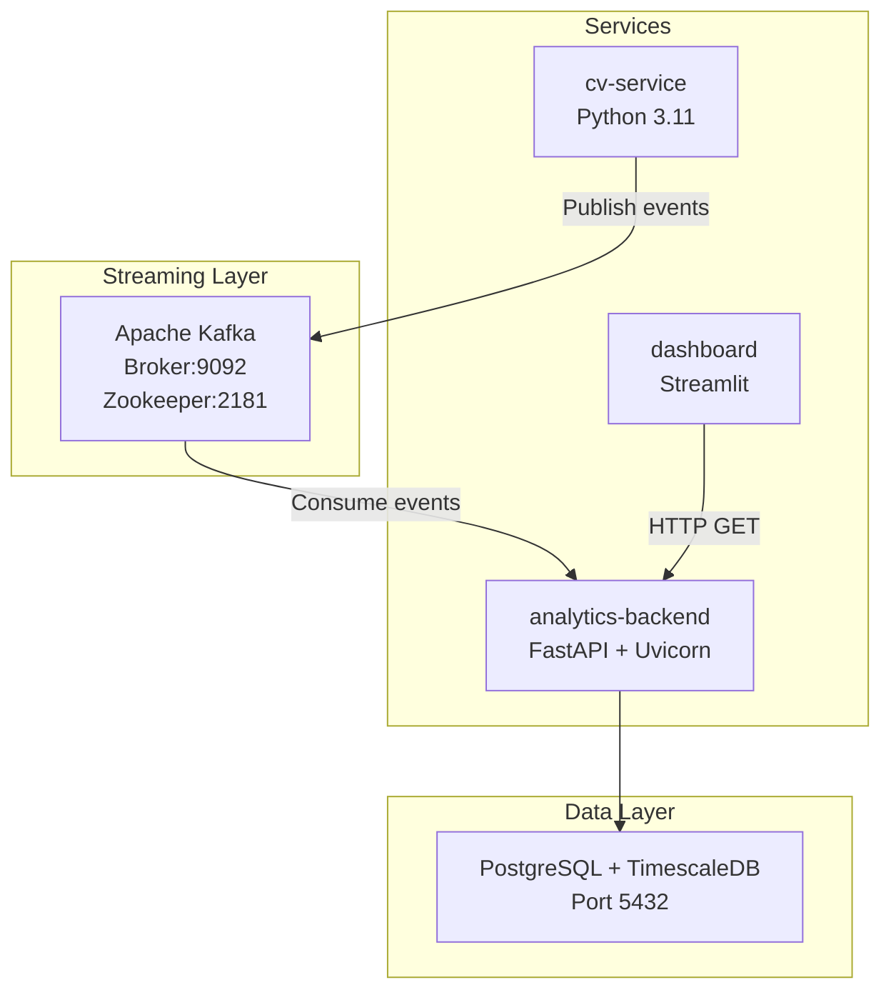
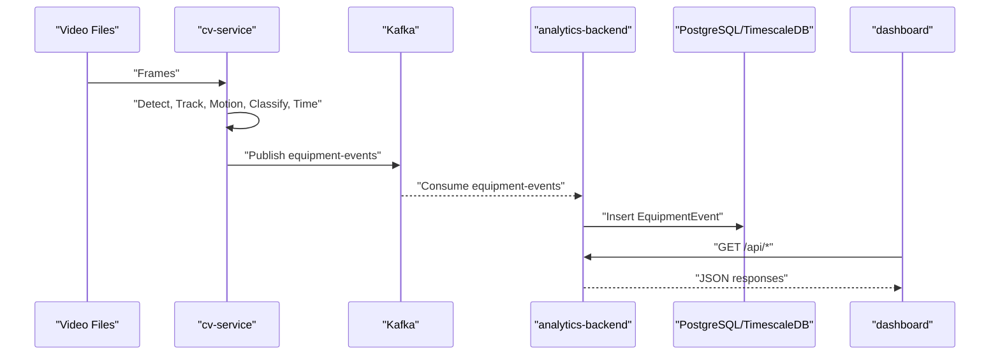
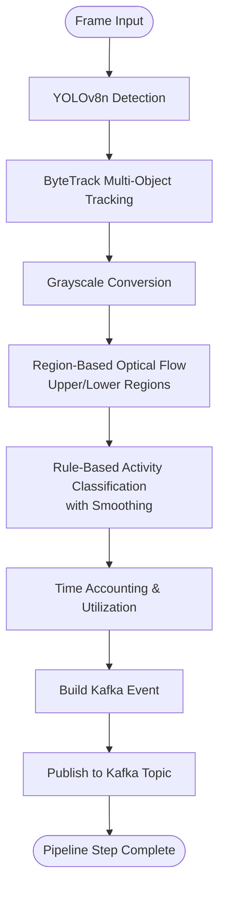
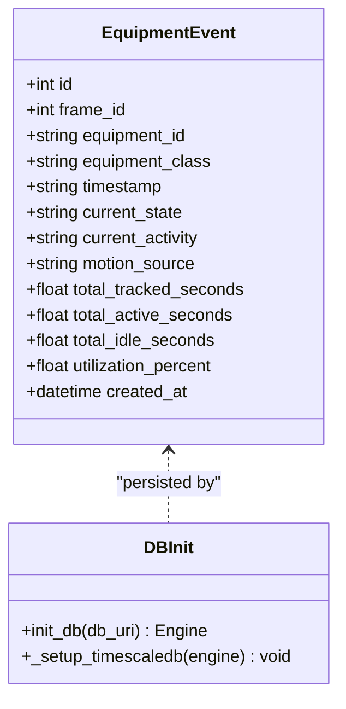
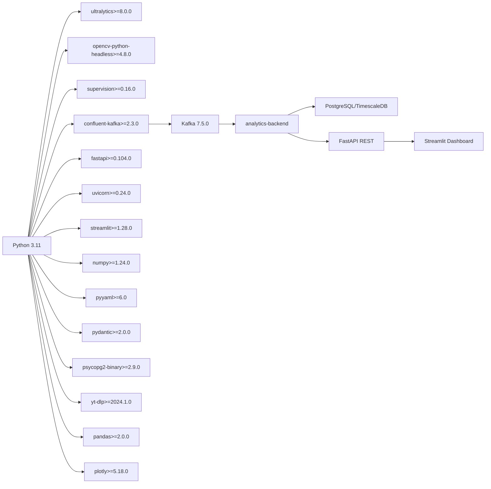

# Technology Stack

<cite>
**Referenced Files in This Document**
- [README.md](file://README.md)
- [docker-compose.yml](file://docker-compose.yml)
- [settings.yaml](file://config/settings.yaml)
- [cv_service Dockerfile](file://services/cv_service/Dockerfile)
- [analytics_backend Dockerfile](file://services/analytics_backend/Dockerfile)
- [dashboard Dockerfile](file://services/dashboard/Dockerfile)
- [video_ingestion Dockerfile](file://services/video_ingestion/Dockerfile)
- [cv_service requirements.txt](file://services/cv_service/requirements.txt)
- [analytics_backend requirements.txt](file://services/analytics_backend/requirements.txt)
- [dashboard requirements.txt](file://services/dashboard/requirements.txt)
- [video_ingestion requirements.txt](file://services/video_ingestion/requirements.txt)
- [cv_service main.py](file://services/cv_service/src/main.py)
- [cv_service detector.py](file://services/cv_service/src/detector.py)
- [cv_service motion_analyzer.py](file://services/cv_service/src/motion_analyzer.py)
- [cv_service activity_classifier.py](file://services/cv_service/src/activity_classifier.py)
- [analytics_backend main.py](file://services/analytics_backend/src/main.py)
- [analytics_backend api.py](file://services/analytics_backend/src/api.py)
- [analytics_backend db_models.py](file://services/analytics_backend/src/db_models.py)
- [dashboard app.py](file://services/dashboard/src/app.py)
</cite>

## Table of Contents
1. [Introduction](#introduction)
2. [Project Structure](#project-structure)
3. [Core Components](#core-components)
4. [Architecture Overview](#architecture-overview)
5. [Detailed Component Analysis](#detailed-component-analysis)
6. [Dependency Analysis](#dependency-analysis)
7. [Performance Considerations](#performance-considerations)
8. [Troubleshooting Guide](#troubleshooting-guide)
9. [Conclusion](#conclusion)
10. [Appendices](#appendices)

## Introduction
This document explains the technology stack and framework selection for the equipment monitoring pipeline. It covers Python-based microservices, Ultralytics YOLOv8 for object detection, OpenCV for video processing, Apache Kafka for event streaming, FastAPI for REST APIs, Streamlit for dashboards, PostgreSQL/TimescaleDB for database, and Docker for containerization. For each technology, we describe rationale, performance characteristics, integration benefits, version compatibility, and upgrade considerations. Licensing, maintenance, and long-term sustainability are addressed alongside practical guidance for upgrades and operational stability.

## Project Structure
The system is organized as a multi-service Docker Compose application with six services:
- zookeeper: Kafka coordination
- kafka: event broker
- postgres: TimescaleDB for time-series storage
- cv-service: computer vision pipeline (object detection, tracking, motion analysis, activity classification, time tracking, Kafka publishing)
- analytics-backend: FastAPI REST API + Kafka consumer + database persistence
- dashboard: Streamlit real-time monitoring UI

**Diagram sources**
- [docker-compose.yml:1-95](file://docker-compose.yml#L1-L95)
- [cv_service main.py:323-421](file://services/cv_service/src/main.py#L323-L421)
- [analytics_backend api.py:159-444](file://services/analytics_backend/src/api.py#L159-L444)
- [analytics_backend db_models.py:70-101](file://services/analytics_backend/src/db_models.py#L70-L101)
- [dashboard app.py:100-160](file://services/dashboard/src/app.py#L100-L160)

**Section sources**
- [README.md:56-66](file://README.md#L56-L66)
- [docker-compose.yml:1-95](file://docker-compose.yml#L1-L95)

## Core Components
- Python 3.11 across all services for consistent runtime and modern language features
- Containerization with slim base images and explicit system dependencies
- Microservices architecture:
  - cv-service: CPU-optimized computer vision pipeline
  - analytics-backend: event-driven API and persistence
  - dashboard: real-time UI consuming the API

**Section sources**
- [cv_service Dockerfile:1-27](file://services/cv_service/Dockerfile#L1-L27)
- [analytics_backend Dockerfile:1-23](file://services/analytics_backend/Dockerfile#L1-L23)
- [dashboard Dockerfile:1-17](file://services/dashboard/Dockerfile#L1-L17)
- [video_ingestion Dockerfile:1-19](file://services/video_ingestion/Dockerfile#L1-L19)

## Architecture Overview
The end-to-end pipeline:
- Video ingestion and frame extraction
- Detection with YOLOv8n (CPU-optimized)
- Tracking with ByteTrack
- Region-based motion analysis using OpenCV Farneback optical flow
- Rule-based activity classification with smoothing
- Time accounting and utilization metrics
- Kafka event publishing
- Analytics backend consumes events, persists to PostgreSQL/TimescaleDB, exposes REST API
- Streamlit dashboard queries the API for live visualization

**Diagram sources**
- [cv_service main.py:323-421](file://services/cv_service/src/main.py#L323-L421)
- [analytics_backend api.py:159-444](file://services/analytics_backend/src/api.py#L159-L444)
- [analytics_backend db_models.py:22-68](file://services/analytics_backend/src/db_models.py#L22-L68)
- [dashboard app.py:100-160](file://services/dashboard/src/app.py#L100-L160)

## Detailed Component Analysis

### Computer Vision Pipeline (cv-service)
- Object Detection: YOLOv8n (nano) for lightweight CPU inference
- Object Tracking: ByteTrack for multi-object tracking with ID persistence
- Motion Analysis: Region-based optical flow using OpenCV Farneback
- Activity Classification: Rule-based state machine with N-frame smoothing
- Time Tracking: Accumulates active/idle durations per equipment
- Kafka Producer: Publishes structured events to equipment-events topic

**Diagram sources**
- [cv_service main.py:323-373](file://services/cv_service/src/main.py#L323-L373)
- [cv_service detector.py:85-170](file://services/cv_service/src/detector.py#L85-L170)
- [cv_service motion_analyzer.py:88-167](file://services/cv_service/src/motion_analyzer.py#L88-L167)
- [cv_service activity_classifier.py:71-126](file://services/cv_service/src/activity_classifier.py#L71-L126)

**Section sources**
- [cv_service main.py:42-142](file://services/cv_service/src/main.py#L42-L142)
- [cv_service detector.py:18-84](file://services/cv_service/src/detector.py#L18-L84)
- [cv_service motion_analyzer.py:24-87](file://services/cv_service/src/motion_analyzer.py#L24-L87)
- [cv_service activity_classifier.py:23-70](file://services/cv_service/src/activity_classifier.py#L23-L70)

### Analytics Backend (FastAPI + Kafka Consumer + PostgreSQL/TimescaleDB)
- FastAPI REST endpoints for health, equipment list, history, utilization summary, latest frame, and stats
- Kafka consumer processes equipment-events and inserts into database
- SQLAlchemy models define EquipmentEvent table; TimescaleDB hypertable creation attempted automatically
- Uvicorn ASGI server for high-performance async serving

**Diagram sources**
- [analytics_backend db_models.py:22-68](file://services/analytics_backend/src/db_models.py#L22-L68)
- [analytics_backend db_models.py:70-101](file://services/analytics_backend/src/db_models.py#L70-L101)

**Section sources**
- [analytics_backend api.py:159-444](file://services/analytics_backend/src/api.py#L159-L444)
- [analytics_backend db_models.py:22-68](file://services/analytics_backend/src/db_models.py#L22-L68)
- [analytics_backend main.py:64-145](file://services/analytics_backend/src/main.py#L64-L145)

### Dashboard (Streamlit)
- Real-time monitoring UI that queries analytics-backend endpoints
- Displays equipment status, activity badges, utilization metrics, and database stats
- Configurable refresh interval and equipment filtering

**Section sources**
- [dashboard app.py:100-160](file://services/dashboard/src/app.py#L100-L160)
- [dashboard app.py:236-394](file://services/dashboard/src/app.py#L236-L394)
- [dashboard app.py:396-512](file://services/dashboard/src/app.py#L396-L512)

### Video Ingestion (Optional)
- Downloads YouTube videos and extracts frames for offline processing
- Uses yt-dlp and OpenCV headless

**Section sources**
- [video_ingestion Dockerfile:1-19](file://services/video_ingestion/Dockerfile#L1-L19)
- [video_ingestion requirements.txt:1-4](file://services/video_ingestion/requirements.txt#L1-L4)

## Dependency Analysis
Technology stack and version compatibility derived from the repository:

- Python 3.11
  - Base image for all services
  - Ensures compatibility with modern packages and performance characteristics

- Ultralytics YOLOv8
  - Version constraint: >=8.0.0
  - Used for detection; configured with yolov8n.pt for CPU optimization
  - Integrated with supervision for bounding box utilities

- OpenCV
  - opencv-python-headless >=4.8.0 (cv-service), >=4.8.0 (video-ingestion)
  - Used for grayscale conversion, optical flow, and frame processing

- Supervision
  - >=0.16.0
  - Provides utilities for bounding boxes and trackers

- Apache Kafka
  - Confluent images: cp-zookeeper 7.5.0, cp-kafka 7.5.0
  - Topics: equipment-events
  - Producer/consumer configured in settings

- PostgreSQL + TimescaleDB
  - timescaledb: latest-pg15
  - Automatic hypertable creation for equipment_events on created_at
  - SQLAlchemy ORM with session management

- FastAPI + Uvicorn
  - FastAPI >=0.104.0, Uvicorn >=0.24.0
  - Async-first web framework with automatic OpenAPI docs

- Streamlit
  - >=1.28.0
  - Real-time dashboard with caching and responsive UI

- NumPy
  - >=1.24.0
  - Required by OpenCV and YOLOv8

- PyYAML
  - >=6.0
  - Configuration parsing across services

- Pydantic
  - >=2.0.0
  - Data validation and serialization for FastAPI models

- psycopg2-binary
  - >=2.9.0
  - PostgreSQL adapter for SQLAlchemy

- yt-dlp
  - >=2024.1.0
  - Video download utility

- pandas, plotly
  - >=2.0.0, >=5.18.0
  - Data processing and plotting for dashboard

**Diagram sources**
- [cv_service requirements.txt:1-7](file://services/cv_service/requirements.txt#L1-L7)
- [analytics_backend requirements.txt:1-8](file://services/analytics_backend/requirements.txt#L1-L8)
- [dashboard requirements.txt:1-6](file://services/dashboard/requirements.txt#L1-L6)
- [video_ingestion requirements.txt:1-4](file://services/video_ingestion/requirements.txt#L1-L4)
- [docker-compose.yml:3-33](file://docker-compose.yml#L3-L33)

**Section sources**
- [cv_service requirements.txt:1-7](file://services/cv_service/requirements.txt#L1-L7)
- [analytics_backend requirements.txt:1-8](file://services/analytics_backend/requirements.txt#L1-L8)
- [dashboard requirements.txt:1-6](file://services/dashboard/requirements.txt#L1-L6)
- [video_ingestion requirements.txt:1-4](file://services/video_ingestion/requirements.txt#L1-L4)
- [docker-compose.yml:3-33](file://docker-compose.yml#L3-L33)

## Performance Considerations
- CPU-optimized inference
  - YOLOv8n (nano) with input size 640 and frame skip 3 reduces compute cost
  - Resize width 640 minimizes pixel count while preserving detection quality
  - Headless OpenCV avoids GUI overhead

- Streaming decoupling
  - Kafka at-least-once delivery with consumer-side idempotency via database constraints prevents backpressure on CV service

- Database optimization
  - TimescaleDB hypertable on created_at improves time-series query performance
  - SQLAlchemy connection pooling and pre-ping for reliability

- API responsiveness
  - FastAPI + Uvicorn async stack with caching in dashboard reduces latency

- Dashboard UX
  - Streamlit caching with short TTLs balances freshness and performance

**Section sources**
- [README.md:177-198](file://README.md#L177-L198)
- [settings.yaml:3-20](file://config/settings.yaml#L3-L20)
- [analytics_backend db_models.py:103-156](file://services/analytics_backend/src/db_models.py#L103-L156)
- [dashboard app.py:100-160](file://services/dashboard/src/app.py#L100-L160)

## Troubleshooting Guide
- Kafka connectivity
  - Verify zookeeper and kafka health checks in docker-compose
  - Confirm bootstrap servers and topic name in settings

- Database readiness
  - Postgres health check and TimescaleDB extension availability
  - SQLAlchemy engine creation and table creation on startup

- API health
  - /api/health endpoint validates database connectivity
  - CORS enabled for dashboard access

- Dashboard connectivity
  - API URL configuration and cache clearing on manual refresh
  - Connection status indicators and fallback UI

**Section sources**
- [docker-compose.yml:9-33](file://docker-compose.yml#L9-L33)
- [docker-compose.yml:45-49](file://docker-compose.yml#L45-L49)
- [analytics_backend api.py:159-177](file://services/analytics_backend/src/api.py#L159-L177)
- [analytics_backend main.py:95-103](file://services/analytics_backend/src/main.py#L95-L103)
- [dashboard app.py:100-108](file://services/dashboard/src/app.py#L100-L108)

## Conclusion
The technology stack balances performance, maintainability, and scalability:
- Python 3.11 provides a modern, efficient runtime
- YOLOv8n and OpenCV enable robust CPU-only CV processing
- Kafka decouples producers from consumers for resilience
- FastAPI delivers a high-performance, developer-friendly API
- PostgreSQL/TimescaleDB supports time-series analytics
- Streamlit offers a quick, interactive dashboard
- Docker ensures reproducible deployments across environments

Upgrade considerations emphasize pinning major versions, validating dependency compatibility, and testing end-to-end after changes.

## Appendices

### Version Compatibility Matrix
- Python: 3.11 (base for all services)
- Ultralytics YOLOv8: >=8.0.0
- OpenCV: >=4.8.0
- Supervision: >=0.16.0
- Kafka (Confluent): zookeeper 7.5.0, kafka 7.5.0
- PostgreSQL/TimescaleDB: timescaledb latest-pg15
- FastAPI: >=0.104.0
- Uvicorn: >=0.24.0
- Streamlit: >=1.28.0
- NumPy: >=1.24.0
- PyYAML: >=6.0
- Pydantic: >=2.0.0
- psycopg2-binary: >=2.9.0
- yt-dlp: >=2024.1.0
- pandas: >=2.0.0
- plotly: >=5.18.0

**Section sources**
- [cv_service requirements.txt:1-7](file://services/cv_service/requirements.txt#L1-L7)
- [analytics_backend requirements.txt:1-8](file://services/analytics_backend/requirements.txt#L1-L8)
- [dashboard requirements.txt:1-6](file://services/dashboard/requirements.txt#L1-L6)
- [video_ingestion requirements.txt:1-4](file://services/video_ingestion/requirements.txt#L1-L4)
- [docker-compose.yml:3-33](file://docker-compose.yml#L3-L33)

### Upgrade Guidance
- Pin major versions in requirements.txt and Dockerfiles
- Test CV accuracy and latency after upgrading YOLOv8 or OpenCV
- Validate Kafka consumer idempotency and database migrations after upgrading FastAPI/SQLAlchemy
- Rebuild containers and re-run health checks after dependency changes
- Keep TimescaleDB extension enabled and monitor hypertable performance

### Licensing, Maintenance, and Sustainability
- Ultralytics YOLOv8: open-source license suitable for research and commercial use; check upstream license for production terms
- OpenCV: BSD license; widely used and actively maintained
- Kafka: Apache 2.0; enterprise-grade streaming platform
- PostgreSQL/TimescaleDB: PostgreSQL license; TimescaleDB Community Edition included; consider commercial licenses for advanced features
- FastAPI/Uvicorn: MIT license; strong community and corporate backing
- Streamlit: MIT license; growing ecosystem
- Python: PSF license; long-term sustainability

[No sources needed since this section provides general guidance]