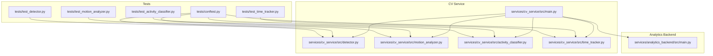
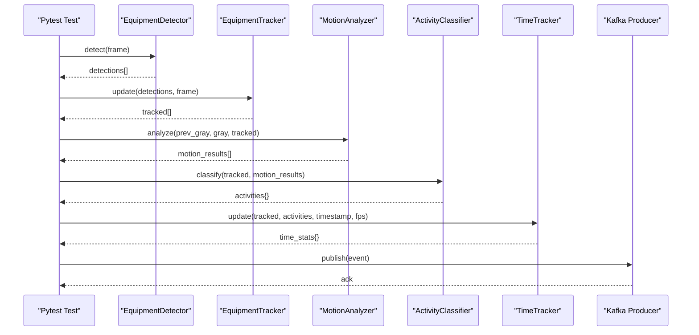
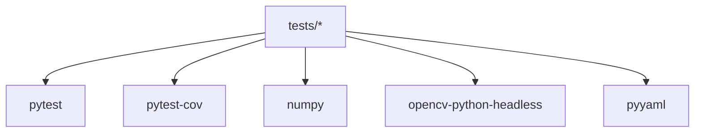

# Testing Strategy

<cite>
**Referenced Files in This Document**
- [README.md](file://README.md)
- [config/settings.yaml](file://config/settings.yaml)
- [tests/conftest.py](file://tests/conftest.py)
- [tests/test_activity_classifier.py](file://tests/test_activity_classifier.py)
- [tests/test_detector.py](file://tests/test_detector.py)
- [tests/test_motion_analyzer.py](file://tests/test_motion_analyzer.py)
- [tests/test_time_tracker.py](file://tests/test_time_tracker.py)
- [tests/requirements.txt](file://tests/requirements.txt)
- [services/cv_service/src/activity_classifier.py](file://services/cv_service/src/activity_classifier.py)
- [services/cv_service/src/detector.py](file://services/cv_service/src/detector.py)
- [services/cv_service/src/motion_analyzer.py](file://services/cv_service/src/motion_analyzer.py)
- [services/cv_service/src/time_tracker.py](file://services/cv_service/src/time_tracker.py)
- [services/cv_service/src/main.py](file://services/cv_service/src/main.py)
- [services/analytics_backend/src/main.py](file://services/analytics_backend/src/main.py)
</cite>

## Table of Contents
1. [Introduction](#introduction)
2. [Project Structure](#project-structure)
3. [Core Components](#core-components)
4. [Architecture Overview](#architecture-overview)
5. [Detailed Component Analysis](#detailed-component-analysis)
6. [Dependency Analysis](#dependency-analysis)
7. [Performance Considerations](#performance-considerations)
8. [Troubleshooting Guide](#troubleshooting-guide)
9. [Conclusion](#conclusion)
10. [Appendices](#appendices)

## Introduction
This document outlines the testing framework and quality assurance approach for the equipment monitoring system. The project is a real-time microservices pipeline that detects, tracks, and classifies construction equipment activity states from video feeds, streaming events via Apache Kafka, and exposing analytics through a FastAPI backend and a Streamlit dashboard. The testing strategy is centered around pytest, organized by feature modules, and employs extensive mocking for computer vision components to ensure fast, deterministic, and isolated tests. It covers unit testing patterns, integration testing approaches, continuous integration considerations, test data management, and best practices for event streaming, database operations, and API endpoints.

## Project Structure
The repository is organized into:
- config: Centralized configuration (YAML)
- services: Microservices (cv_service, analytics_backend, dashboard, video_ingestion)
- tests: Pytest-based unit and integration tests
- videos: Placeholder for video URLs and downloaded assets
- docker-compose.yml: Multi-service orchestration

**Diagram sources**
- [tests/test_detector.py:1-249](file://tests/test_detector.py#L1-L249)
- [tests/test_motion_analyzer.py:1-411](file://tests/test_motion_analyzer.py#L1-L411)
- [tests/test_activity_classifier.py:1-543](file://tests/test_activity_classifier.py#L1-L543)
- [tests/test_time_tracker.py:1-482](file://tests/test_time_tracker.py#L1-L482)
- [tests/conftest.py:1-164](file://tests/conftest.py#L1-L164)
- [services/cv_service/src/detector.py:1-170](file://services/cv_service/src/detector.py#L1-L170)
- [services/cv_service/src/motion_analyzer.py:1-442](file://services/cv_service/src/motion_analyzer.py#L1-L442)
- [services/cv_service/src/activity_classifier.py:1-306](file://services/cv_service/src/activity_classifier.py#L1-L306)
- [services/cv_service/src/time_tracker.py:1-265](file://services/cv_service/src/time_tracker.py#L1-L265)
- [services/cv_service/src/main.py:1-571](file://services/cv_service/src/main.py#L1-L571)
- [services/analytics_backend/src/main.py:1-149](file://services/analytics_backend/src/main.py#L1-L149)

**Section sources**
- [README.md:340-384](file://README.md#L340-L384)

## Core Components
The testing framework focuses on four core pipeline components:
- EquipmentDetector: Validates detection logic and mocks the YOLO model
- MotionAnalyzer: Validates region-based optical flow and motion classification
- ActivityClassifier: Validates rule-based activity classification and N-frame smoothing
- TimeTracker: Validates time accounting and utilization metrics

Key testing patterns:
- Shared fixtures for configuration and synthetic data
- Mocking external dependencies (YOLO model, Kafka producer)
- Deterministic synthetic frames and motion patterns
- Edge-case coverage for invalid inputs and boundary conditions

**Section sources**
- [tests/conftest.py:1-164](file://tests/conftest.py#L1-L164)
- [tests/test_detector.py:1-249](file://tests/test_detector.py#L1-L249)
- [tests/test_motion_analyzer.py:1-411](file://tests/test_motion_analyzer.py#L1-L411)
- [tests/test_activity_classifier.py:1-543](file://tests/test_activity_classifier.py#L1-L543)
- [tests/test_time_tracker.py:1-482](file://tests/test_time_tracker.py#L1-L482)

## Architecture Overview
The testing strategy aligns with the overall pipeline architecture:
- CV Service orchestrates detection, tracking, motion analysis, activity classification, time tracking, and Kafka publishing
- Analytics Backend consumes Kafka events, persists to PostgreSQL/TimescaleDB, and exposes REST API
- Tests validate each component in isolation and in integration scenarios

**Diagram sources**
- [services/cv_service/src/main.py:323-372](file://services/cv_service/src/main.py#L323-L372)
- [services/cv_service/src/detector.py:85-169](file://services/cv_service/src/detector.py#L85-L169)
- [services/cv_service/src/motion_analyzer.py:88-166](file://services/cv_service/src/motion_analyzer.py#L88-L166)
- [services/cv_service/src/activity_classifier.py:71-125](file://services/cv_service/src/activity_classifier.py#L71-L125)
- [services/cv_service/src/time_tracker.py:53-120](file://services/cv_service/src/time_tracker.py#L53-L120)

## Detailed Component Analysis

### EquipmentDetector Testing Strategy
- Initialization validation: Ensures required configuration keys are present and model loads successfully
- Error handling: Tests missing keys, model load failures, and inference exceptions
- Output correctness: Validates detection dictionary format, filtering by confidence and class, and class name mapping
- Robustness: Handles empty frames, None inputs, and unexpected shapes

Mocking approach:
- Uses unittest.mock.patch to replace the YOLO constructor and model instance
- Mocks YOLO result objects to simulate bounding boxes, confidences, and class IDs
- Avoids actual model loading to keep tests fast and deterministic

Best practices:
- Use pytest fixtures to inject detection configuration
- Create synthetic frames with distinct textures to trigger detections
- Validate return types and key presence for each detection

**Section sources**
- [tests/test_detector.py:1-249](file://tests/test_detector.py#L1-L249)
- [services/cv_service/src/detector.py:35-83](file://services/cv_service/src/detector.py#L35-L83)
- [services/cv_service/src/detector.py:85-169](file://services/cv_service/src/detector.py#L85-L169)

### MotionAnalyzer Testing Strategy
- Initialization validation: Ensures configuration values are valid and raises ValueError for invalid ratios
- Optical flow computation: Validates Farneback parameters and error handling
- Region splitting: Tests upper/lower region extraction and clipping logic
- Motion classification: Validates full_body, arm_only, and none classification based on magnitude thresholds
- Dominant direction computation: Tests direction detection logic using flow vectors
- Edge cases: Handles invalid bounding boxes, too-small regions, and frame boundaries

Mocking approach:
- Uses synthetic grayscale frames with controlled motion patterns
- Creates textured regions to produce meaningful optical flow magnitudes
- Validates helper methods (_clip_bbox, _create_empty_result) independently

Best practices:
- Use fixtures for motion configuration and sample frames
- Design test frames with clear motion directions to validate direction detection
- Test boundary conditions for magnitude thresholds and region ratios

**Section sources**
- [tests/test_motion_analyzer.py:1-411](file://tests/test_motion_analyzer.py#L1-L411)
- [services/cv_service/src/motion_analyzer.py:59-86](file://services/cv_service/src/motion_analyzer.py#L59-L86)
- [services/cv_service/src/motion_analyzer.py:192-251](file://services/cv_service/src/motion_analyzer.py#L192-L251)
- [services/cv_service/src/motion_analyzer.py:324-355](file://services/cv_service/src/motion_analyzer.py#L324-L355)
- [services/cv_service/src/motion_analyzer.py:357-417](file://services/cv_service/src/motion_analyzer.py#L357-L417)

### ActivityClassifier Testing Strategy
- Initialization validation: Ensures default values are applied when keys are missing
- Classification rules: Validates rule-based logic for DIGGING, DUMPING, SWINGING_LOADING, and WAITING
- N-frame smoothing: Tests mode-based smoothing to prevent flickering and validates buffer filling
- Result formatting: Ensures consistent output structure and aliasing of activity field
- Edge cases: Handles missing motion data and dict-format motion results

Mocking approach:
- Uses synthetic motion results with controlled flow vectors
- Resets classifier between tests to isolate stateful behavior
- Validates internal methods (e.g., _get_mode) for deterministic behavior

Best practices:
- Use smoothing window fixtures to control test timing
- Provide explicit motion vectors to validate direction-dependent rules
- Test both list and dict motion result formats

**Section sources**
- [tests/test_activity_classifier.py:1-543](file://tests/test_activity_classifier.py#L1-L543)
- [services/cv_service/src/activity_classifier.py:46-69](file://services/cv_service/src/activity_classifier.py#L46-L69)
- [services/cv_service/src/activity_classifier.py:166-231](file://services/cv_service/src/activity_classifier.py#L166-L231)
- [services/cv_service/src/activity_classifier.py:233-286](file://services/cv_service/src/activity_classifier.py#L233-L286)

### TimeTracker Testing Strategy
- Initialization and state management: Validates empty statistics and reset behavior
- Time accumulation: Tests active and idle time increments based on frame updates
- Utilization calculation: Validates percentage computation and division-by-zero protection
- Multi-equipment tracking: Ensures independent statistics per equipment ID
- Persistence across disappearances: Validates that stats persist when equipment leaves and reappears
- Edge cases: Tests FPS handling, missing state defaults, and extreme FPS values

Mocking approach:
- Uses controlled activity states and timestamps to simulate frame processing
- Validates aggregation functions (get_total_utilization) with known datasets

Best practices:
- Use realistic FPS values to simulate production conditions
- Test both ACTIVE and INACTIVE states to validate time accumulation
- Validate edge cases like zero tracked time and missing current_state

**Section sources**
- [tests/test_time_tracker.py:1-482](file://tests/test_time_tracker.py#L1-L482)
- [services/cv_service/src/time_tracker.py:37-51](file://services/cv_service/src/time_tracker.py#L37-L51)
- [services/cv_service/src/time_tracker.py:53-120](file://services/cv_service/src/time_tracker.py#L53-L120)
- [services/cv_service/src/time_tracker.py:221-264](file://services/cv_service/src/time_tracker.py#L221-L264)

### Integration Testing Approaches
- End-to-end pipeline validation: Tests the CVServicePipeline process_frame method to ensure components integrate correctly
- Event building and publishing: Validates event construction and Kafka publishing flow
- Continuous mode: Tests directory polling and video processing loop behavior
- Analytics backend integration: Validates Kafka consumer and database persistence

Mocking approach:
- Mocks Kafka producer to capture events without requiring a broker
- Uses synthetic frames and motion results to drive the pipeline deterministically
- Validates event schema alignment with backend expectations

**Section sources**
- [services/cv_service/src/main.py:323-421](file://services/cv_service/src/main.py#L323-L421)
- [services/analytics_backend/src/main.py:104-122](file://services/analytics_backend/src/main.py#L104-L122)

## Dependency Analysis
The testing framework relies on:
- pytest for test discovery and execution
- pytest-cov for coverage reporting
- numpy and opencv-python-headless for synthetic frames and optical flow
- pyyaml for configuration loading in tests

**Diagram sources**
- [tests/requirements.txt:1-13](file://tests/requirements.txt#L1-L13)

**Section sources**
- [tests/requirements.txt:1-13](file://tests/requirements.txt#L1-L13)

## Performance Considerations
- CPU optimization strategies are reflected in configuration (frame skip, resize) and validated in tests
- Synthetic frames minimize computational overhead while enabling comprehensive coverage
- Mocking external dependencies ensures tests remain fast and deterministic
- Coverage reporting helps identify hotspots for potential optimization

[No sources needed since this section provides general guidance]

## Troubleshooting Guide
Common issues and resolutions:
- Missing configuration keys: Tests validate ValueError is raised; ensure settings.yaml includes required keys
- Model load failures: Tests simulate exceptions; verify model path and availability
- Optical flow computation errors: Tests handle cv2 errors; validate frame sizes and types
- Division by zero in utilization: Tests protect against zero tracked time; ensure time accumulation logic is sound
- Kafka connectivity: Tests mock producer; verify broker configuration in CI environments

**Section sources**
- [tests/test_detector.py:52-62](file://tests/test_detector.py#L52-L62)
- [tests/test_motion_analyzer.py:289-292](file://tests/test_motion_analyzer.py#L289-L292)
- [tests/test_time_tracker.py:187-193](file://tests/test_time_tracker.py#L187-L193)

## Conclusion
The testing strategy leverages pytest fixtures, deterministic synthetic data, and targeted mocking to validate each pipeline component thoroughly. Unit tests cover initialization, behavior, and edge cases; integration tests validate end-to-end flows and event streaming. Configuration-driven thresholds enable tunable behavior validated across tests. The approach balances comprehensiveness with performance, ensuring reliable operation in production while maintaining fast feedback cycles.

[No sources needed since this section summarizes without analyzing specific files]

## Appendices

### Test Organization by Feature Modules
- tests/test_detector.py: Detection logic and YOLO model mocking
- tests/test_motion_analyzer.py: Optical flow and motion classification
- tests/test_activity_classifier.py: Rule-based activity classification and smoothing
- tests/test_time_tracker.py: Time accounting and utilization metrics

**Section sources**
- [tests/test_detector.py:1-249](file://tests/test_detector.py#L1-L249)
- [tests/test_motion_analyzer.py:1-411](file://tests/test_motion_analyzer.py#L1-L411)
- [tests/test_activity_classifier.py:1-543](file://tests/test_activity_classifier.py#L1-L543)
- [tests/test_time_tracker.py:1-482](file://tests/test_time_tracker.py#L1-L482)

### Configuration-Driven Testing
- settings.yaml drives thresholds and parameters for motion, activity, and video processing
- Tests validate default values and error handling for invalid configurations

**Section sources**
- [config/settings.yaml:31-39](file://config/settings.yaml#L31-L39)
- [config/settings.yaml:8-19](file://config/settings.yaml#L8-L19)
- [config/settings.yaml:41-53](file://config/settings.yaml#L41-L53)

### Practical Examples and Best Practices
- Writing tests for new functionality:
  - Add fixtures for configuration and synthetic data
  - Use unittest.mock.patch for external dependencies
  - Validate return formats and edge cases
- Mocking external dependencies:
  - Patch constructors and methods to return controlled results
  - Isolate stateful components with reset or fixture-based initialization
- Validating system behavior:
  - Use deterministic synthetic frames for optical flow
  - Validate event schema alignment with backend expectations
  - Test continuous mode and graceful shutdown handling

[No sources needed since this section provides general guidance]