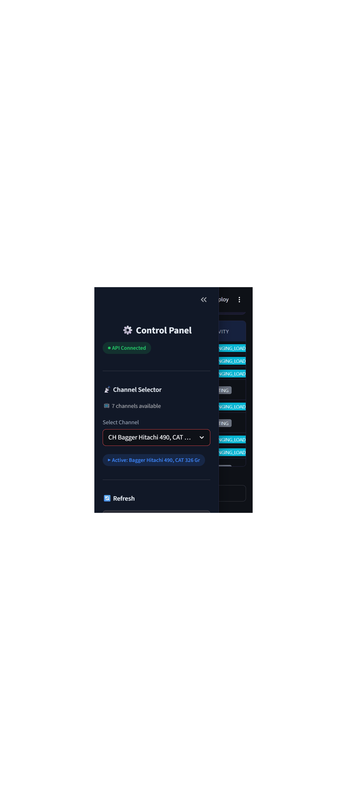

# Technical Construction Equipment Tracking and Monitoring System

A real-time microservices pipeline for construction equipment monitoring using computer vision, Apache Kafka event streaming, and a Streamlit dashboard. This prototype detects, tracks, and classifies equipment activity states (DIGGING, SWINGING_LOADING, DUMPING, WAITING) from video feeds, providing live utilization metrics.

## Demo



*The dashboard shows live MJPEG video feed with bounding box annotations, equipment status tracking, and utilization metrics updating in real-time.*

---

## Architecture Overview

```
┌─────────────────────────────────────────────────────────────────────────────────┐
│                        Equipment Monitoring Pipeline                             │
└─────────────────────────────────────────────────────────────────────────────────┘

┌──────────────┐    ┌──────────────────────────────────────────────────────────┐
│              │    │                      CV Service                           │
│  Video Files │───▶│  ┌──────────┐  ┌─────────┐  ┌────────────┐  ┌──────────┐ │
│  (.mp4)      │    │  │ YOLOv8n  │─▶│ByteTrack│─▶│  Optical   │─▶│ Activity │ │
│              │    │  │ Detector │  │ Tracker │  │   Flow     │  │Classifier│ │
└──────────────┘    │  └──────────┘  └─────────┘  └────────────┘  └──────────┘ │
                    └────────────────────────────────┬─────────────────────────┘
                                                     │
                                                     ▼
                    ┌────────────────────────────────────────────────────────┐
                    │                     Apache Kafka                        │
                    │              Topic: equipment-events                    │
                    │  ┌─────────────┐                    ┌────────────────┐  │
                    │  │  Zookeeper  │◀──────────────────▶│  Kafka Broker  │  │
                    │  │   :2181     │                    │     :9092      │  │
                    │  └─────────────┘                    └────────────────┘  │
                    └────────────────────────────────┬───────────────────────┘
                                                     │
                                                     ▼
                    ┌────────────────────────────────────────────────────────┐
                    │                 Analytics Backend                       │
                    │  ┌────────────────┐         ┌─────────────────────┐    │
                    │  │ Kafka Consumer │────────▶│ PostgreSQL/Timescale│    │
                    │  │                │         │    :5432            │    │
                    │  └────────────────┘         └─────────────────────┘    │
                    │  ┌────────────────┐                     │              │
                    │  │  FastAPI       │◀────────────────────┘              │
                    │  │    :8000       │                                    │
                    │  └────────────────┘                                    │
                    └────────────────────────────────┬───────────────────────┘
                                                     │
                                                     ▼
                    ┌────────────────────────────────────────────────────────┐
                    │                 Streamlit Dashboard                     │
                    │                      :8501                              │
                    │  ┌─────────────┐  ┌──────────────┐  ┌───────────────┐  │
                    │  │ Video Feed  │  │  Equipment   │  │  Utilization  │  │
                    │  │   Panel     │  │    Status    │  │   Metrics     │  │
                    │  └─────────────┘  └──────────────┘  └───────────────┘  │
                    └────────────────────────────────────────────────────────┘
```

### Docker Services (6 containers)

| Service | Port | Description |
|---------|------|-------------|
| `zookeeper` | 2181 | Kafka coordination |
| `kafka` | 9092 | Event message broker |
| `postgres` | 5432 | TimescaleDB for time-series storage |
| `cv-service` | - | Computer vision processing pipeline |
| `analytics-backend` | 8000 | FastAPI REST API + Kafka consumer |
| `dashboard` | 8501 | Streamlit real-time monitoring UI |

---

## Technology Stack

| Component | Technology | Purpose |
|-----------|------------|---------|
| **Object Detection** | YOLOv8n (nano) | Lightweight CPU-optimized detection (~6.2M params) |
| **Object Tracking** | ByteTrack | Multi-object tracking with ID persistence |
| **Motion Analysis** | OpenCV Farneback | Dense optical flow for articulated motion |
| **Message Queue** | Apache Kafka | Real-time event streaming |
| **Database** | PostgreSQL + TimescaleDB | Time-series data storage |
| **REST API** | FastAPI | High-performance async API |
| **Dashboard** | Streamlit | Interactive real-time monitoring |
| **Containerization** | Docker Compose | Multi-service orchestration |

---

## Quick Start

### Prerequisites
- Docker & Docker Compose
- 8GB+ RAM recommended (for CV processing)

### 1. Clone the Repository
```bash
git clone https://github.com/Azzoz-189/construction-equipment-monitoring.git
cd construction-equipment-monitoring
```

### 2. Add Video URLs
```bash
echo "https://youtube.com/watch?v=YOUR_VIDEO_ID" >> videos/urls.txt
```

### 3. Download Videos
```bash
docker compose run --rm cv-service python -m src.downloader
```

### 4. Start All Services
```bash
docker compose up --build
```

### 5. Open Dashboard
Navigate to: **http://localhost:8501**

### Stopping Services
```bash
docker compose down
```

---

## Core Technical Decisions and Trade-offs

This section documents the key engineering decisions made during development, explaining the rationale and trade-offs for each approach.

### 1. Articulated Motion Detection (Region-Based Optical Flow)

**Challenge:** Detecting ACTIVE state when only part of the machine moves (e.g., excavator arm digging while tracks are stationary). Traditional whole-body motion detection would miss this critical operational state.

**Solution:** Region-based motion analysis — divide each equipment bounding box into upper (arm/boom) and lower (tracks/base) regions, compute Farneback optical flow independently per region.

```
┌─────────────────────┐
│   UPPER REGION      │ ← Arm/boom motion detection
│   (50% of bbox)     │   Detects: DIGGING, DUMPING, SWINGING
├─────────────────────┤
│   LOWER REGION      │ ← Base/tracks motion detection
│   (50% of bbox)     │   Detects: TRAVELING, stationary base
└─────────────────────┘
```

**Motion Classification Logic:**
- `full_body`: Both regions moving → Vehicle traveling
- `arm_only`: Only upper region moving → Articulated work (dig/dump/swing)
- `none`: Neither region moving → WAITING/idle

**Trade-offs:**
- ✅ Zero-shot approach: Works without training data for construction equipment
- ✅ Detects articulated motion that whole-body tracking would miss
- ⚠️ Region splitting is heuristic (50/50 split) — works well for standard equipment poses but may need tuning for unusual camera angles
- ⚠️ Not as accurate as keypoint-based tracking for specific joint movements

**Why not keypoint tracking:** Would require labeled training data for construction equipment keypoints (arm joints, bucket, cab). Optical flow provides a zero-shot solution that works immediately.

### 2. Activity Classification (Rule-Based State Machine vs ML)

**Choice:** Rule-based classifier using motion direction vectors with N-frame smoothing.

**Activity Rules:**
| Activity | Motion Source | Direction | Threshold |
|----------|--------------|-----------|-----------|
| DIGGING | arm_only | vertical down (dy > 0) | `vertical_flow_threshold` |
| DUMPING | arm_only | vertical up (dy < 0) | `vertical_flow_threshold` |
| SWINGING_LOADING | arm_only or full_body | horizontal | `horizontal_flow_threshold` |
| WAITING | none | - | No motion |

**N-Frame Smoothing:** Uses a sliding window (default 5 frames) with mode-based voting to prevent rapid state flickering from noisy detections.

**Trade-offs:**
- ✅ No training data required — critical for rapid prototyping
- ✅ Rules are interpretable and easily tunable via `settings.yaml`
- ✅ Fast inference with minimal computational overhead
- ⚠️ Less accurate than a trained temporal model (e.g., LSTM on pose sequences)
- ⚠️ May misclassify complex combined movements

**Future Improvement:** A trained TCN (Temporal Convolutional Network) or LSTM on labeled activity sequences would improve accuracy but requires dataset collection.

### 3. CPU Optimization Strategies

The pipeline is designed to run on CPU-only infrastructure (no GPU required):

| Strategy | Implementation | Impact |
|----------|---------------|--------|
| **YOLOv8n (nano)** | Smallest YOLO variant, ~6.2M parameters | 3-5x faster than YOLOv8s |
| **Frame skipping** | Process every Nth frame (default: 3) | 3x reduction in processing |
| **Resize** | 640px frame width | Reduced pixel count, minimal accuracy loss |
| **Crop-based flow** | Optical flow only within bounding boxes | Avoids full-frame computation |

**Configuration in `settings.yaml`:**
```yaml
video:
  frame_skip: 3              # Process every 3rd frame
  resize_width: 640          # Resize for inference

detection:
  model: "yolov8n.pt"        # Nano model for CPU
  input_size: 640
```

### 4. COCO Class Mapping for Construction Equipment

**Challenge:** YOLOv8 with COCO weights doesn't include "excavator", "bulldozer", or other construction equipment classes.

**Mitigation Strategy:**
1. Map similar COCO classes as proxy detections
2. Provide configurable class mapping layer for easy extension

**Current Mapping:**
```yaml
detection:
  target_classes: [2, 5, 7]    # car, bus, truck
  class_names:
    2: "car"
    5: "bus"
    7: "truck"
```

**Trade-offs:**
- ✅ Works immediately with pre-trained weights
- ✅ Configurable — can add custom model later
- ⚠️ Limited to COCO vehicle classes until fine-tuned model is available

**Recommended Improvement:** Fine-tune YOLOv8 on a construction equipment dataset (e.g., OpenImages construction subset) for domain-specific detection.

### 5. Event Streaming Architecture (Kafka)

**Why Kafka over direct database writes:**
- Decouples CV processing from persistence
- Handles bursts without backpressure on CV service
- Enables future consumers (alerts, analytics, ML training)
- Provides replay capability for debugging

**Message delivery:** At-least-once semantics. Consumer handles idempotency via database constraints.

### 6. MJPEG Streaming Architecture

**Challenge:** Deliver real-time annotated video to the Streamlit dashboard without excessive CPU/memory usage or stale connections.

**Solution:** A file-based frame relay with MJPEG streaming:

```
┌────────────┐    ┌─────────────────┐    ┌──────────────────┐    ┌──────────────┐
│ CV Service │───▶│ Shared Volume   │───▶│ FastAPI MJPEG    │───▶│  Streamlit   │
│ (annotate  │    │ /app/frames/    │    │ StreamingResponse│    │  <iframe>    │
│  frames)   │    │ latest_frame.jpg│    │ /api/stream/mjpeg│    │  embed       │
└────────────┘    └─────────────────┘    └──────────────────┘    └──────────────┘
```

**How it works:**
1. **CV Service** writes each annotated frame as `latest_frame.jpg` to a shared Docker volume
2. **FastAPI** polls the file at ~10 Hz, detects `mtime` changes, and pushes new frames as `multipart/x-mixed-replace` MJPEG chunks
3. **Streamlit** embeds the MJPEG endpoint in an `<iframe>` — the browser handles decoding natively
4. Streams auto-close after 60 seconds; client-side JavaScript reconnects automatically to prevent stale connection pile-up

**Trade-offs:**
- ✅ Zero additional dependencies — browsers support MJPEG natively
- ✅ File-based decoupling — CV service and API server are independent
- ✅ Fragment-based refresh in Streamlit — video stream never interrupts when data tables update
- ⚠️ MJPEG bandwidth is higher than H.264/WebRTC (no inter-frame compression)
- ⚠️ Single-file relay means only the latest frame is available (acceptable for monitoring use case)

### 7. Per-Channel Architecture (Multi-Video Support)

**Design:** Each video file acts as an independent monitoring channel. The system supports dynamic channel switching from the dashboard.

**Key mechanisms:**
- `video_source` field on every Kafka event and database record enables per-channel filtering
- Channel switch via `POST /api/videos/select` writes a control file; the CV service detects it and resets its pipeline (tracker state, frame counter)
- Dashboard uses Streamlit's fragment-based refresh (`@st.fragment`) — channel switch updates the data tables and video feed independently without full page reload
- All API endpoints accept an optional `?channel=filename.mp4` query parameter to filter results per video source

**Trade-offs:**
- ✅ Clean separation of data per video source
- ✅ Hot-switching without restarting containers
- ⚠️ Only one video processed at a time (single CV pipeline instance)

### 8. Why Streamlit for the Dashboard

**Choice:** Streamlit was selected over alternatives (Dash, Gradio, custom React app) for rapid prototyping.

**Rationale:**
- Built-in widgets (tables, metrics, selectbox) match the dashboard requirements exactly
- Fragment-based partial refresh (`@st.fragment`) enables updating video and data independently
- Dark theme support for CCTV-style monitoring aesthetic
- Single Python file — no frontend build toolchain required
- Native Docker support with simple `streamlit run` entrypoint

---

## API Endpoints

| Method | Endpoint | Description |
|--------|----------|-------------|
| `GET` | `/api/health` | Health check with database connection status |
| `GET` | `/api/equipment` | List all equipment with latest state (supports `?channel=`) |
| `GET` | `/api/equipment/{id}/history` | Time-series history for specific equipment |
| `GET` | `/api/utilization/summary` | Aggregate utilization statistics (supports `?channel=`) |
| `GET` | `/api/latest-frame` | Current frame equipment data for real-time display (supports `?channel=`) |
| `GET` | `/api/latest-frame-image` | Latest annotated frame as JPEG image |
| `GET` | `/api/stream/mjpeg` | MJPEG live video stream (multipart/x-mixed-replace) |
| `GET` | `/api/videos` | List available video channels with current selection |
| `POST` | `/api/videos/select` | Select active video channel `{"filename": "video.mp4"}` |
| `GET` | `/api/frame/{frame_id}` | Retrieve a specific historical frame image by ID |
| `GET` | `/api/stats` | Database event statistics (supports `?channel=`) |
| `GET` | `/docs` | FastAPI auto-generated interactive API documentation |

### Example Response: `/api/equipment`
```json
[
  {
    "equipment_id": "DT-001",
    "equipment_class": "truck",
    "current_state": "ACTIVE",
    "current_activity": "DIGGING",
    "utilization_percent": 73.5,
    "last_seen": "2024-01-15T14:32:45.123Z"
  }
]
```

---

## Kafka Message Schema

Topic: `equipment-events`

```json
{
  "frame_id": 142,
  "equipment_id": "DT-001",
  "equipment_class": "truck",
  "timestamp": "00:00:14.200",
  "video_source": "excavator_video.mp4",
  "utilization": {
    "current_state": "ACTIVE",
    "current_activity": "DIGGING",
    "motion_source": "arm_only"
  },
  "time_analytics": {
    "total_tracked_seconds": 14.2,
    "total_active_seconds": 10.4,
    "total_idle_seconds": 3.8,
    "utilization_percent": 73.24
  }
}
```

---

## Configuration

All tunable parameters are centralized in `config/settings.yaml`:

### Key Parameters

| Section | Parameter | Default | Description |
|---------|-----------|---------|-------------|
| `video` | `frame_skip` | 3 | Process every Nth frame |
| `video` | `resize_width` | 640 | Frame resize for inference |
| `detection` | `model` | yolov8n.pt | YOLO model variant |
| `detection` | `confidence_threshold` | 0.4 | Detection confidence cutoff |
| `motion` | `magnitude_threshold` | 2.0 | Optical flow magnitude for "moving" |
| `motion` | `upper_region_ratio` | 0.5 | Fraction for upper/lower region split |
| `activity` | `smoothing_window` | 5 | N-frame smoothing buffer size |
| `activity` | `vertical_flow_threshold` | 1.5 | Vertical motion threshold |
| `activity` | `horizontal_flow_threshold` | 1.5 | Horizontal motion threshold |

### Tuning Guidelines

- **Reduce flickering:** Increase `smoothing_window` (e.g., 7-10)
- **More sensitive motion:** Lower `magnitude_threshold` (e.g., 1.5)
- **CPU savings:** Increase `frame_skip` (e.g., 5) or reduce `resize_width` (e.g., 480)

---

## Running Tests

### Install Test Dependencies
```bash
pip install -r tests/requirements.txt
```

### Run All Tests
```bash
pytest tests/ -v
```

### Run Specific Test Module
```bash
pytest tests/test_motion_analyzer.py -v
pytest tests/test_activity_classifier.py -v
```

### Run with Coverage
```bash
pytest tests/ -v --cov=services --cov-report=html
```

---

## Project Structure

```
.
├── config/
│   └── settings.yaml              # Centralized configuration
├── services/
│   ├── cv_service/
│   │   ├── src/
│   │   │   ├── main.py            # Pipeline orchestrator
│   │   │   ├── detector.py        # YOLOv8 equipment detection
│   │   │   ├── tracker.py         # ByteTrack multi-object tracking
│   │   │   ├── motion_analyzer.py # Region-based optical flow
│   │   │   ├── activity_classifier.py  # Rule-based classification
│   │   │   ├── time_tracker.py    # Utilization time accounting
│   │   │   └── kafka_producer.py  # Event publishing
│   │   ├── Dockerfile
│   │   └── requirements.txt
│   ├── analytics_backend/
│   │   ├── src/
│   │   │   ├── api.py             # FastAPI REST endpoints
│   │   │   ├── consumer.py        # Kafka event consumer
│   │   │   ├── db_models.py       # SQLAlchemy/TimescaleDB models
│   │   │   └── main.py            # Backend entry point
│   │   ├── Dockerfile
│   │   └── requirements.txt
│   ├── dashboard/
│   │   ├── src/
│   │   │   └── app.py             # Streamlit dashboard
│   │   ├── Dockerfile
│   │   └── requirements.txt
│   └── video_ingestion/
│       └── src/
│           ├── downloader.py      # YouTube video downloader
│           └── frame_producer.py  # Frame extraction utility
├── tests/
│   ├── test_activity_classifier.py
│   ├── test_detector.py
│   ├── test_motion_analyzer.py
│   └── test_time_tracker.py
├── videos/
│   └── urls.txt                   # Video source URLs
├── docker-compose.yml             # Multi-service orchestration
└── README.md
```

---

## Evaluation & Verification Guide

This section provides step-by-step instructions for evaluators to verify that all assessment requirements have been met.

### Prerequisites

- Docker and Docker Compose installed
- At least 8 GB RAM available
- YouTube video files placed in `./videos/` directory (or use `yt-dlp` to download from `Youtube_urls.txt`)

### Quick Start

```bash
# 1. Build all service images
docker compose build

# 2. Start all 6 services in detached mode
docker compose up -d

# 3. Wait ~2 minutes for all services to initialize (Kafka, DB migrations, model loading)

# 4. Open the monitoring dashboard
#    → http://localhost:8501

# 5. Open the interactive API documentation
#    → http://localhost:8000/docs
```

### Verifying Each Requirement

#### 1. Equipment Detection (YOLOv8n)
- Dashboard shows detected equipment with bounding boxes overlaid on the live video feed
- Equipment IDs (e.g., `DT-001`, `VH-003`) appear as labels on each detected object
- **Verify via API:**
  ```bash
  curl http://localhost:8000/api/equipment
  ```

#### 2. Multi-Object Tracking (ByteTrack)
- Equipment IDs persist across frames — the same piece of equipment keeps the same ID
- Track a specific equipment across multiple consecutive frames in the dashboard
- **Verify via API:**
  ```bash
  curl http://localhost:8000/api/equipment/DT-001/history?limit=20
  ```

#### 3. Articulated Motion Analysis (Optical Flow)
- Region-based motion detection distinguishes `arm_only` vs `full_body` vs `none`
- Visible in the equipment status table under the **motion_source** column
- Equipment performing digging shows `arm_only` motion (upper region only)
- **Verify via API** — check the `motion_source` field in equipment history responses

#### 4. Activity Classification
- Four activity states visible: **DIGGING**, **DUMPING**, **SWINGING_LOADING**, **WAITING**
- `ACTIVE` state (green indicators) for DIGGING / DUMPING / SWINGING_LOADING
- `INACTIVE` state (red indicators) for WAITING
- N-frame smoothing (default 5 frames) prevents flickering between states

#### 5. Time Tracking & Utilization
- Utilization percentage shown per equipment in the dashboard
- Formula: `Active Time / Total Tracked Time × 100 = Utilization %`
- **Verify summary statistics:**
  ```bash
  curl http://localhost:8000/api/utilization/summary
  ```

#### 6. Kafka Event Streaming
- Events published to the `equipment-events` topic
- Payload includes `frame_id`, `equipment_id`, `utilization`, `time_analytics`, `video_source`
- **Verify by consuming messages directly:**
  ```bash
  docker exec -it kafka kafka-console-consumer \
    --bootstrap-server localhost:9092 \
    --topic equipment-events \
    --from-beginning --max-messages 5
  ```

#### 7. Database Persistence (PostgreSQL / TimescaleDB)
- All events are persisted in TimescaleDB for time-series querying
- **Verify:**
  ```bash
  curl http://localhost:8000/api/stats
  ```
- Time-series data available per equipment via the history endpoint

#### 8. REST API Endpoints
- Full interactive API documentation: [http://localhost:8000/docs](http://localhost:8000/docs)
- **Quick tests:**
  ```bash
  curl http://localhost:8000/api/health
  curl http://localhost:8000/api/equipment
  curl http://localhost:8000/api/utilization/summary
  curl "http://localhost:8000/api/equipment?channel=filename.mp4"
  ```

#### 9. Dashboard (Real-Time Monitoring UI)
- CCTV-style dark theme layout
- Live MJPEG video feed with bounding box annotations
- Channel selector dropdown (each video file = separate monitoring channel)
- Scrollable equipment status table with per-equipment metrics
- Utilization summary metrics (total equipment, active/inactive counts, avg utilization)
- Per-channel statistics — select different channels and observe stats update dynamically
- Fragment-based refresh — video stream is never interrupted when data tables refresh

#### 10. Docker Compose Orchestration
- All 6 services start with a single command: `docker compose up -d`
- Health checks configured for all services
- Proper dependency ordering: Zookeeper → Kafka → CV Service, PostgreSQL → Analytics Backend
- Shared volumes for frame relay between CV Service and Analytics Backend

---

## License

This project is developed as a technical assessment prototype.
